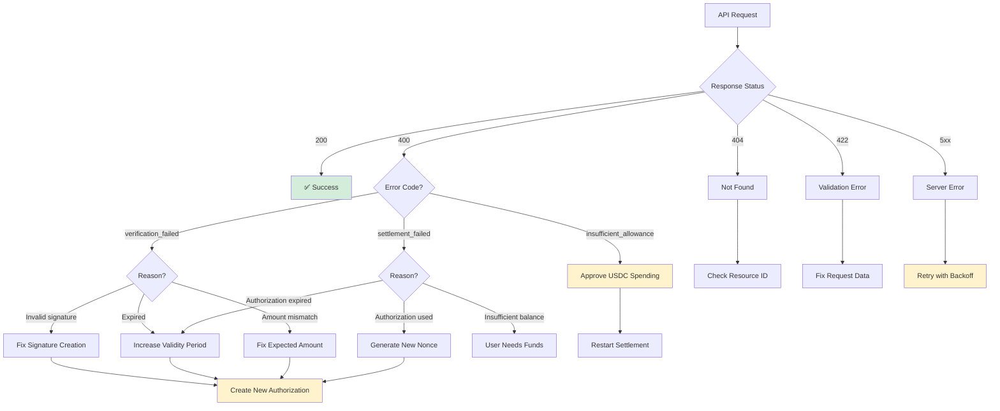

## Error Response Format

All errors follow a consistent format:

```json
{
  "error": {
    "code": "error_code",
    "message": "Human-readable error message",
    "details": {
      "additional": "context"
    }
  }
}
```

## HTTP Status Codes

<ResponseField name="200" type="success">
  Success - Request completed successfully
</ResponseField>

<ResponseField name="400" type="error">
  Bad Request - Invalid request or business logic error
</ResponseField>

<ResponseField name="404" type="error">
  Not Found - Resource doesn't exist
</ResponseField>

<ResponseField name="422" type="error">
  Validation Error - Request data failed validation
</ResponseField>

<ResponseField name="500" type="error">
  Internal Error - Something went wrong on our end
</ResponseField>

<ResponseField name="502" type="error">
  Upstream Error - Error from upstream provider
</ResponseField>

<ResponseField name="504" type="error">
  Timeout - Request took too long
</ResponseField>

## Error Codes

### Client Errors (4xx)

<AccordionGroup>
  <Accordion title="invalid_request">
    **Status**: 400
    
    Request data is malformed or invalid.
    
    ```json
    {
      "error": {
        "code": "invalid_request",
        "message": "Transaction hash must be a valid hex string",
        "details": {
          "field": "transaction_hash",
          "provided": "invalid_hash"
        }
      }
    }
    ```
    
    **Common causes:**
    
    - Missing required fields
    - Invalid address format
    - Malformed transaction hash
    - Invalid chain identifier
  </Accordion>

  <Accordion title="not_found">
    **Status**: 404
    
    Requested resource doesn't exist.
    
    ```json
    {
      "error": {
        "code": "not_found",
        "message": "Verification not found: vrf_invalid123"
      }
    }
    ```
    
    **Common causes:**
    
    - Invalid verification_id
    - Invalid settlement_id
    - Resource was deleted
  </Accordion>

  <Accordion title="verification_failed">
    **Status**: 400
    
    Payment verification failed validation.
    
    ```json
    {
      "error": {
        "code": "verification_failed",
        "message": "Invalid EIP-3009 signature",
        "details": {
          "reason": "Signature verification failed",
          "recovered_address": "0x...",
          "expected_address": "0x..."
        }
      }
    }
    ```
    
    **Common causes:**
    
    - Invalid signature
    - Wrong signer address
    - Amount mismatch
    - Token address mismatch
    - Authorization expired
  </Accordion>

  <Accordion title="insufficient_allowance">
    **Status**: 400
    
    Merchant hasn't approved USDC spending for fee collection.
    
    ```json
    {
      "error": {
        "code": "insufficient_allowance",
        "message": "Merchant has not approved USDC spending for fee collection",
        "details": {
          "required_approval": "0.001",
          "current_allowance": "0",
          "treasury_address": "0xa92560dcaf2fb556dfee4d2599f021a511b94aae",
          "merchant_address": "0xa821f428ef8cc9f54a9915336a82220853059090"
        }
      }
    }
    ```
    
    **Solution:**
    
    ```bash
    # Approve USDC spending
    python -m app.merchant_approval --network base-sepolia --amount 1000
    ```
  </Accordion>

  <Accordion title="settlement_failed">
    **Status**: 400
    
    Settlement execution failed.
    
    ```json
    {
      "error": {
        "code": "settlement_failed",
        "message": "FiatTokenV2: authorization is expired",
        "details": {
          "reason": "Authorization validBefore timestamp has passed",
          "validBefore": "1735689600",
          "currentTime": "1735780000"
        }
      }
    }
    ```
    
    **Common causes:**
    
    - Authorization expired
    - Authorization already used
    - Insufficient customer balance
    - Invalid authorization parameters
  </Accordion>

  <Accordion title="validation_error">
    **Status**: 422
    
    Request data failed validation.
    
    ```json
    {
      "error": {
        "code": "validation_error",
        "message": "Validation failed",
        "details": {
          "field": "expected_amount",
          "error": "Must be a positive integer string"
        }
      }
    }
    ```
  </Accordion>
</AccordionGroup>

### Server Errors (5xx)

<AccordionGroup>
  <Accordion title="internal_error">
    **Status**: 500
    
    Internal server error.
    
    ```json
    {
      "error": {
        "code": "internal_error",
        "message": "An internal error occurred"
      }
    }
    ```
    
    **Action:** Retry the request after a short delay.
  </Accordion>

  <Accordion title="upstream_error">
    **Status**: 502
    
    Error from upstream provider.
    
    ```json
    {
      "error": {
        "code": "upstream_error",
        "message": "API unavailable",
        "details": {
          "upstream_status": 503
        }
      }
    }
    ```
    
    **Action:** Retry with exponential backoff.
  </Accordion>

  <Accordion title="timeout">
    **Status**: 504
    
    Request timeout.
    
    ```json
    {
      "error": {
        "code": "timeout",
        "message": "Request timeout after 30 seconds"
      }
    }
    ```
    
    **Action:** Retry the request.
  </Accordion>
</AccordionGroup>

## EIP-3009 Specific Errors

### Authorization Expired

```json
{
  "error": {
    "code": "settlement_failed",
    "message": "FiatTokenV2: authorization is expired",
    "details": {
      "reason": "Authorization validBefore timestamp has passed",
      "validBefore": "1735689600",
      "currentTime": "1735780000"
    }
  }
}
```

**Solution:** User must create new authorization with longer validity:

```javascript
// ❌ Bad: 1 hour validity
validBefore: String(Math.floor(Date.now() / 1000) + 3600);

// ✅ Good: 24 hour validity
validBefore: String(Math.floor(Date.now() / 1000) + 86400);
```

### Authorization Already Used

```json
{
  "error": {
    "code": "settlement_failed",
    "message": "FiatTokenV2: authorization is used or canceled",
    "details": {
      "reason": "This nonce has already been used",
      "nonce": "0xee232e308a6647938a68aee1ae355b85a262e4e450b7fde55cd4e729e6444ce9"
    }
  }
}
```

**Solution:** Generate unique nonce for each payment:

```javascript
// ✅ Generate unique nonce
const nonceBytes = new Uint8Array(32);
window.crypto.getRandomValues(nonceBytes);
const nonce =
  "0x" +
  Array.from(nonceBytes)
    .map((b) => b.toString(16).padStart(2, "0"))
    .join("");
```

### Invalid Signature

```json
{
  "error": {
    "code": "verification_failed",
    "message": "Invalid EIP-3009 signature",
    "details": {
      "reason": "Recovered signer does not match from address",
      "recovered": "0x1234...",
      "expected": "0x5678..."
    }
  }
}
```

**Solution:** Ensure signature is created correctly:

```javascript
// Use eth_signTypedData_v4 for EIP-712
const signature = await window.ethereum.request({
  method: "eth_signTypedData_v4",
  params: [userAddress, JSON.stringify(typedData)],
});
```

## Error Handling Flow



## Error Handling Best Practices

<CodeGroup>

```javascript JavaScript
async function handlePayment(authorization, signature) {
  try {
    // 1. Verify payment
    const verifyResponse = await fetch(
      "https://facilitator.0xmeta.ai/v1/verify",
      {
        method: "POST",
        headers: { "Content-Type": "application/json" },
        body: JSON.stringify({
          transaction_hash: authorization.nonce,
          chain: "base-sepolia",
          seller_address: merchantAddress,
          expected_amount: authorization.value,
          expected_token: authorization.token,
          metadata: {
            source: "my_app",
            paymentPayload: {
              x402Version: 1,
              scheme: "exact",
              network: "base-sepolia",
              payload: { authorization, signature },
            },
          },
        }),
      }
    );

    if (!verifyResponse.ok) {
      const error = await verifyResponse.json();
      handleVerificationError(error);
      return;
    }

    const { verification_id } = await verifyResponse.json();

    // 2. Settle payment
    const settleResponse = await fetch(
      "https://facilitator.0xmeta.ai/v1/settle",
      {
        method: "POST",
        headers: { "Content-Type": "application/json" },
        body: JSON.stringify({
          verification_id,
          destination_address: merchantAddress,
        }),
      }
    );

    if (!settleResponse.ok) {
      const error = await settleResponse.json();
      handleSettlementError(error);
      return;
    }

    const settlement = await settleResponse.json();
    console.log("Settlement initiated:", settlement.settlement_id);
  } catch (error) {
    console.error("Network error:", error);
    // Retry logic here
  }
}

function handleVerificationError(error) {
  switch (error.error.code) {
    case "verification_failed":
      if (error.error.details?.reason?.includes("expired")) {
        alert("Authorization expired. Please try again.");
      } else if (error.error.details?.reason?.includes("signature")) {
        alert("Invalid signature. Please reconnect your wallet.");
      }
      break;

    case "invalid_request":
      console.error("Invalid request:", error.error.details);
      break;

    default:
      alert("Verification failed: " + error.error.message);
  }
}

function handleSettlementError(error) {
  switch (error.error.code) {
    case "insufficient_allowance":
      alert(
        "Merchant setup required. Please contact support.\n\n" +
          "Treasury: " +
          error.error.details.treasury_address
      );
      break;

    case "settlement_failed":
      if (error.error.message.includes("expired")) {
        alert("Payment authorization expired. Please try again.");
      } else if (error.error.message.includes("used or canceled")) {
        alert("This payment has already been processed.");
      }
      break;

    case "not_found":
      alert("Verification not found. Please start over.");
      break;

    default:
      alert("Settlement failed: " + error.error.message);
  }
}
```

```python Python
import requests
import time

def handle_payment(authorization, signature, merchant_address):
    try:
        # 1. Verify payment
        verify_response = requests.post(
            'https://facilitator.0xmeta.ai/v1/verify',
            json={
                'transaction_hash': authorization['nonce'],
                'chain': 'base-sepolia',
                'seller_address': merchant_address,
                'expected_amount': authorization['value'],
                'expected_token': authorization['token'],
                'metadata': {
                    'source': 'my_app',
                    'paymentPayload': {
                        'x402Version': 1,
                        'scheme': 'exact',
                        'network': 'base-sepolia',
                        'payload': {
                            'authorization': authorization,
                            'signature': signature
                        }
                    }
                }
            }
        )

        if not verify_response.ok:
            handle_verification_error(verify_response.json())
            return

        verification_id = verify_response.json()['verification_id']

        # 2. Settle payment
        settle_response = requests.post(
            'https://facilitator.0xmeta.ai/v1/settle',
            json={
                'verification_id': verification_id,
                'destination_address': merchant_address
            }
        )

        if not settle_response.ok:
            handle_settlement_error(settle_response.json())
            return

        settlement = settle_response.json()
        print(f"Settlement initiated: {settlement['settlement_id']}")

    except requests.exceptions.RequestException as e:
        print(f"Network error: {e}")
        # Retry logic here

def handle_verification_error(error):
    error_code = error['error']['code']

    if error_code == 'verification_failed':
        reason = error['error'].get('details', {}).get('reason', '')
        if 'expired' in reason:
            print('Authorization expired. Please try again.')
        elif 'signature' in reason:
            print('Invalid signature.')
    elif error_code == 'invalid_request':
        print(f"Invalid request: {error['error']['details']}")
    else:
        print(f"Verification failed: {error['error']['message']}")

def handle_settlement_error(error):
    error_code = error['error']['code']

    if error_code == 'insufficient_allowance':
        details = error['error']['details']
        print(f"Merchant setup required.")
        print(f"Treasury: {details['treasury_address']}")
    elif error_code == 'settlement_failed':
        message = error['error']['message']
        if 'expired' in message:
            print('Payment authorization expired.')
        elif 'used or canceled' in message:
            print('Payment already processed.')
    elif error_code == 'not_found':
        print('Verification not found.')
    else:
        print(f"Settlement failed: {error['error']['message']}")
```

</CodeGroup>

## Retry Strategy

For transient errors (5xx, network errors), implement exponential backoff:

```javascript
async function retryRequest(fn, maxRetries = 3) {
  for (let attempt = 0; attempt < maxRetries; attempt++) {
    try {
      return await fn();
    } catch (error) {
      const shouldRetry =
        error.status >= 500 ||
        error.code === "upstream_error" ||
        error.code === "timeout" ||
        error.code === "ETIMEDOUT";

      if (!shouldRetry || attempt === maxRetries - 1) {
        throw error;
      }

      // Exponential backoff: 1s, 2s, 4s
      const delay = Math.pow(2, attempt) * 1000;
      console.log(`Retry attempt ${attempt + 1} after ${delay}ms`);
      await new Promise((resolve) => setTimeout(resolve, delay));
    }
  }
}

// Usage
try {
  const result = await retryRequest(() => verifyPayment(data));
} catch (error) {
  console.error("All retry attempts failed:", error);
}
```

<Warning>
  **Don't retry on 4xx errors** (except possibly `insufficient_allowance` after
  fixing). These indicate problems with your request that won't be fixed by
  retrying.
</Warning>

## Error Prevention Checklist

<Steps>
  <Step title="Before Verification">
    - ✅ Generate unique random nonce
    - ✅ Set validBefore to 24+ hours
    - ✅ Use correct token address for network
    - ✅ Format amounts correctly (no decimals in amount string)
    - ✅ Include complete paymentPayload in metadata
  </Step>

{" "}
<Step title="Before Settlement">
  - ✅ Merchant has approved USDC spending - ✅ Verification status is
  "verified" - ✅ Authorization hasn't expired - ✅ Nonce hasn't been used
  before
</Step>

  <Step title="Error Handling">
    - ✅ Catch and handle all error codes
    - ✅ Show user-friendly error messages
    - ✅ Log errors for debugging
    - ✅ Implement retry logic for 5xx errors
    - ✅ Don't retry 4xx errors automatically
  </Step>
</Steps>

## Common Error Scenarios

| Scenario              | Error Code                   | Solution                      |
| --------------------- | ---------------------------- | ----------------------------- |
| Merchant not approved | `insufficient_allowance`     | Run approval setup            |
| Authorization expired | `settlement_failed`          | Create new authorization      |
| Nonce reused          | `settlement_failed`          | Generate new unique nonce     |
| Invalid signature     | `verification_failed`        | Fix signature creation        |
| Wrong amount          | `verification_failed`        | Match expected_amount exactly |
| Network issues        | `upstream_error` / `timeout` | Retry with backoff            |

<Info>
  Most errors are preventable! Follow best practices for nonce generation,
  authorization validity, and merchant setup.
</Info>

<Tip>
  Log all errors with full context (verification_id, settlement_id, timestamps)
  to help with debugging and support requests.
</Tip>
