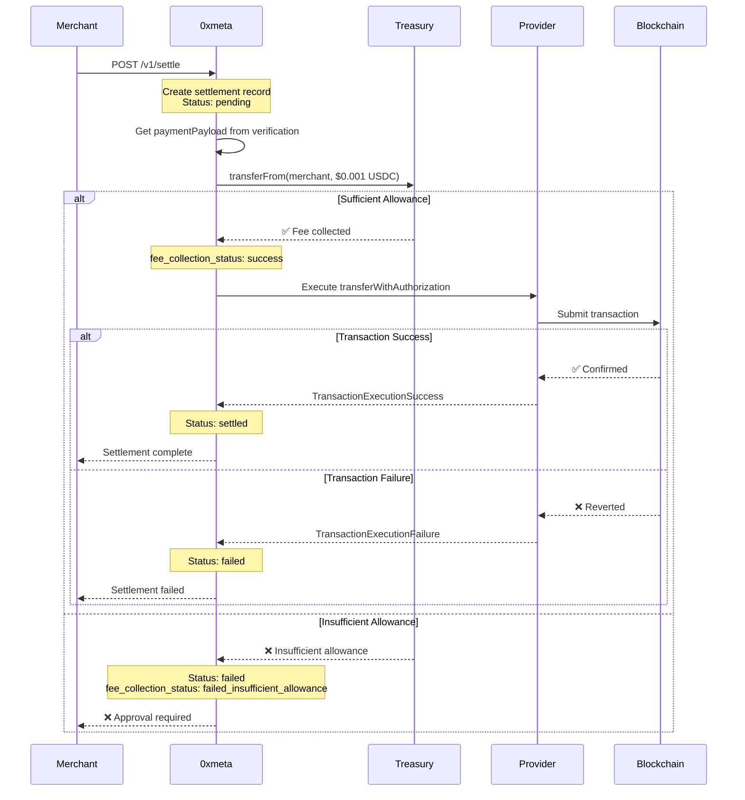
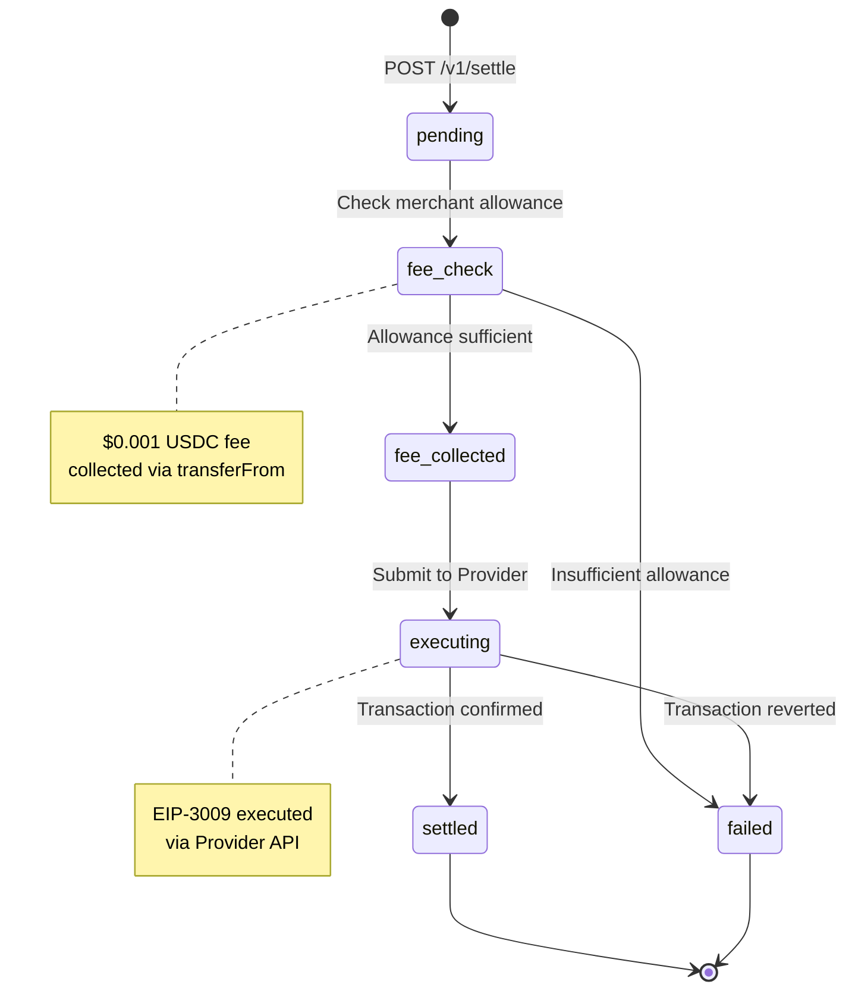

## Endpoint

Initiate settlement of a verified payment. This executes the transferWithAuthorization on-chain.

<ParamField path="verification_id" type="string" required>
  The verification ID from a successful payment verification Example:
  `vrf_b183c9692fac4481`
</ParamField>

<ParamField path="destination_address" type="string" required>
  Merchant's address to receive the funds (42 characters, must start with 0x)
  Example: `0xa821f428ef8cc9f54a9915336a82220853059090`
</ParamField>

<RequestExample>

```bash cURL
curl -X POST https://facilitator.0xmeta.ai/v1/settle \
  -H "Content-Type: application/json" \
  -d '{
    "verification_id": "vrf_b183c9692fac4481",
    "destination_address": "0xa821f428ef8cc9f54a9915336a82220853059090"
  }'
```

```javascript JavaScript
const response = await fetch("https://facilitator.0xmeta.ai/v1/settle", {
  method: "POST",
  headers: {
    "Content-Type": "application/json",
  },
  body: JSON.stringify({
    verification_id: "vrf_b183c9692fac4481",
    destination_address: "0xa821f428ef8cc9f54a9915336a82220853059090",
  }),
});

const data = await response.json();
console.log(data.settlement_id);
```

```python Python
import requests

response = requests.post(
    'https://facilitator.0xmeta.ai/v1/settle',
    headers={'Content-Type': 'application/json'},
    json={
        'verification_id': 'vrf_b183c9692fac4481',
        'destination_address': '0xa821f428ef8cc9f54a9915336a82220853059090'
    }
)

data = response.json()
print(data['settlement_id'])
```

</RequestExample>

<ResponseExample>

```json Pending Response (200 OK)
{
  "settlement_id": "stl_a47920cbc2dc45c5",
  "verification_id": "vrf_b183c9692fac4481",
  "status": "pending",
  "settlement_tx_hash": null,
  "settled_amount": "10000",
  "settled_at": null,
  "destination_address": "0xa821f428ef8cc9f54a9915336a82220853059090",
  "upstream_settlement_id": "574e56cd-a679-41c9-8aa3-90a4dcf42a03",
  "fee_collection_status": "pending",
  "created_at": "2025-11-24T07:43:04Z"
}
```

```json Completed Response (200 OK)
{
  "settlement_id": "stl_edd93707df714b41",
  "verification_id": "vrf_97617f0da9a241ab",
  "status": "settled",
  "settlement_tx_hash": "0x795d83089672d51148e7f53a65b9ac2e43e7ca9113f986dfca4cb1096248bf2b",
  "settled_amount": "10000",
  "settled_at": "2025-11-24T07:44:43Z",
  "destination_address": "0xa821f428ef8cc9f54a9915336a82220853059090",
  "upstream_settlement_id": "e221bdd2-0014-4a3c-890a-086f9b1c20b7",
  "fee_collection_status": "success",
  "fee_tx_hash": "0x...",
  "created_at": "2025-11-24T07:44:35Z"
}
```

```json Verification Not Found (404)
{
  "error": {
    "code": "not_found",
    "message": "Verification not found: vrf_invalid123"
  }
}
```

```json Insufficient Allowance (400)
{
  "error": {
    "code": "insufficient_allowance",
    "message": "Merchant has not approved USDC spending for fee collection",
    "details": {
      "required_approval": "0.001",
      "current_allowance": "0",
      "treasury_address": "0xa92560dcaf2fb556dfee4d2599f021a511b94aae"
    }
  }
}
```

```json Authorization Expired (400)
{
  "error": {
    "code": "settlement_failed",
    "message": "FiatTokenV2: authorization is expired",
    "details": {
      "reason": "Authorization validBefore timestamp has passed"
    }
  }
}
```

```json Authorization Already Used (400)
{
  "error": {
    "code": "settlement_failed",
    "message": "FiatTokenV2: authorization is used or canceled",
    "details": {
      "reason": "This nonce has already been used in a previous settlement"
    }
  }
}
```

</ResponseExample>

## Response Fields

<ResponseField name="settlement_id" type="string" required>
  Unique identifier for this settlement
</ResponseField>

<ResponseField name="verification_id" type="string" required>
  The associated verification ID
</ResponseField>

<ResponseField name="status" type="string" required>
  Settlement status: `pending`, `settled`, or `failed`
</ResponseField>

<ResponseField name="settlement_tx_hash" type="string">
  On-chain transaction hash (available when settled)
</ResponseField>

<ResponseField name="settled_amount" type="string">
  Amount settled in token's smallest unit
</ResponseField>

<ResponseField name="settled_at" type="string">
  ISO 8601 timestamp when settlement completed
</ResponseField>

<ResponseField name="destination_address" type="string">
  Merchant's receiving address
</ResponseField>

<ResponseField name="upstream_settlement_id" type="string">
  Provider transaction execution ID
</ResponseField>

<ResponseField name="fee_collection_status" type="string">
  Fee collection status: `pending`, `success`, `failed_insufficient_allowance`,
  `failed_insufficient_balance`, or `failed`
</ResponseField>

<ResponseField name="fee_tx_hash" type="string">
  Transaction hash of fee collection (if separate from settlement)
</ResponseField>

## Settlement Process



## Settlement States



## Fee Collection

Before settlement can proceed, 0xmeta collects a **$0.001 flat fee** via USDC `transferFrom`:

<Steps>
  <Step title="One-Time Approval Required">
    Merchant must approve 0xmeta treasury to spend USDC:
    
    ```javascript
    const USDC = "0x036CbD53842c5426634e7929541eC2318f3dCF7e"; // Base Sepolia
    const TREASURY = "0xa92560dcaf2fb556dfee4d2599f021a511b94aae";
    
    await usdcContract.approve(
      TREASURY,
      ethers.parseUnits("10", 6) // $10 = 10,000 settlements
    );
    ```
  </Step>

{" "}

<Step title="Fee Collection">
  When settlement is initiated: ```solidity USDC.transferFrom(merchant,
  treasury, 1000); // $0.001 (6 decimals) ```
</Step>

  <Step title="Settlement Execution">
    After fee collection, the EIP-3009 authorization is executed via Provider
  </Step>
</Steps>

<Warning>
  **Without USDC approval, settlements will fail!** You must approve the
  treasury address before your first settlement.
</Warning>

## Handling Settlement Status

### Polling for Status

```javascript
async function waitForSettlement(settlementId) {
  const maxAttempts = 60; // 5 minutes

  for (let attempt = 0; attempt < maxAttempts; attempt++) {
    const response = await fetch(
      `https://facilitator.0xmeta.ai/v1/settlements/${settlementId}`
    );

    const settlement = await response.json();

    if (settlement.status === "settled") {
      console.log("✅ Settlement complete:", settlement.settlement_tx_hash);
      return settlement;
    }

    if (settlement.status === "failed") {
      console.error("❌ Settlement failed:", settlement.fee_collection_status);
      throw new Error("Settlement failed");
    }

    // Wait 5 seconds before next check
    await new Promise((resolve) => setTimeout(resolve, 5000));
  }

  throw new Error("Settlement timeout");
}
```

### Fee Collection Status Values

| Status                          | Description                            |
| ------------------------------- | -------------------------------------- |
| `pending`                       | Fee collection not yet attempted       |
| `success`                       | Fee successfully collected             |
| `failed_insufficient_allowance` | Merchant hasn't approved USDC spending |
| `failed_insufficient_balance`   | Merchant has no USDC balance           |
| `failed`                        | Other error during fee collection      |

## Common Issues

<AccordionGroup>
  <Accordion title="Insufficient Allowance">
    **Error:** `fee_collection_status: failed_insufficient_allowance`
    
    **Solution:** Approve USDC spending:
    ```bash
    # Run merchant approval setup
    python -m app.merchant_approval --network base-sepolia --amount 1000
    ```
  </Accordion>

{" "}

<Accordion title="Authorization Expired">
  **Error:** `FiatTokenV2: authorization is expired` **Solution:** User needs to
  create a new authorization with longer `validBefore`: ```javascript
  validBefore: String(Math.floor(Date.now() / 1000) + 86400) // 24 hours ```
</Accordion>

{" "}

<Accordion title="Authorization Already Used">
  **Error:** `FiatTokenV2: authorization is used or canceled` **Solution:**
  Generate a new unique nonce for each payment: ```javascript const nonceBytes =
  new Uint8Array(32); window.crypto.getRandomValues(nonceBytes); const nonce =
  "0x" + Array.from(nonceBytes) .map(b => b.toString(16).padStart(2, "0"))
  .join(""); ```
</Accordion>

  <Accordion title="Settlement Takes Long">
    Settlements typically complete in 30-60 seconds. Delays can occur due to:
    - Network congestion
    - Provider API processing time
    - RPC endpoint issues
    
    **Solution:** Implement proper polling with timeouts (max 5 minutes)
  </Accordion>
</AccordionGroup>

## Settlement Timing

| Stage                 | Typical Duration  |
| --------------------- | ----------------- |
| Fee Collection        | < 5 seconds       |
| Provider Submission   | 5-15 seconds      |
| On-chain Confirmation | 15-45 seconds     |
| **Total**             | **30-60 seconds** |

<Info>
  Settlement typically completes in **30-60 seconds** on Base network. Use
  polling or webhooks to track status.
</Info>

<Tip>
  Save the `settlement_id` immediately and track it in your database. You'll
  need it to check status and handle any issues.
</Tip>

<Check>
  **Fee:** $0.001 flat fee per successful settlement (collected before
  execution).
</Check>
