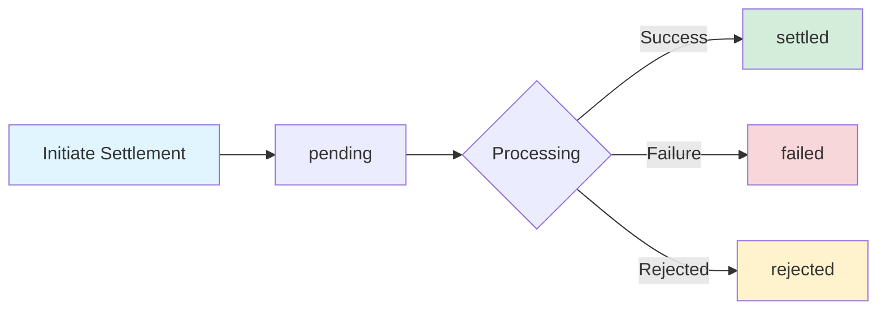

## Endpoint

Initiate settlement to transfer verified funds to a destination address.

<ParamField path="verification_id" type="string" required>
  The verification ID from a successful payment verification Example:
  `ver_abc123def456`
</ParamField>

<ParamField path="destination_address" type="string" required>
  Blockchain address to receive the funds (42 characters, must start with 0x)
  Example: `0x742d35cc6634c0532925a3b844bc9e7595f0beb0`
</ParamField>

<ParamField path="amount" type="string">
  Amount to settle in wei. If `null`, settles the full verified amount. Example:
  `"500000000000000000"` (0.5 ETH)
</ParamField>

<ParamField path="metadata" type="object">
  Additional metadata for the settlement
  
  ```json
  {
    "payout_id": "PAYOUT-789",
    "notes": "Monthly payout"
  }
  ```
</ParamField>

## Headers

<ParamField header="X-API-Key" type="string" required>
  Your API key for authentication
</ParamField>

<ParamField header="Idempotency-Key" type="string" recommended>
  Unique key to prevent duplicate settlements. Valid for 24 hours.
</ParamField>

<RequestExample>

```bash cURL
curl -X POST https://facilitator.api.0xmeta.ai/v1/settle \
  -H "Content-Type: application/json" \
  -H "X-API-Key: your_api_key" \
  -H "Idempotency-Key: settle_$(date +%s)" \
  -d '{
    "verification_id": "ver_abc123def456",
    "destination_address": "0x742d35cc6634c0532925a3b844bc9e7595f0beb0",
    "amount": null,
    "metadata": {
      "payout_id": "PAYOUT-789"
    }
  }'
```

```javascript JavaScript
const response = await fetch("https://facilitator.api.0xmeta.ai/v1/settle", {
  method: "POST",
  headers: {
    "Content-Type": "application/json",
    "X-API-Key": "your_api_key",
    "Idempotency-Key": `settle_${Date.now()}`,
  },
  body: JSON.stringify({
    verification_id: "ver_abc123def456",
    destination_address: "0x742d35cc6634c0532925a3b844bc9e7595f0beb0",
    amount: null,
    metadata: {
      payout_id: "PAYOUT-789",
    },
  }),
});

const data = await response.json();
console.log(data.settlement_id);
```

```python Python
import requests
import time

response = requests.post(
    'https://facilitator.api.0xmeta.ai/v1/settle',
    headers={
        'Content-Type': 'application/json',
        'X-API-Key': 'your_api_key',
        'Idempotency-Key': f'settle_{int(time.time())}'
    },
    json={
        'verification_id': 'ver_abc123def456',
        'destination_address': '0x742d35cc6634c0532925a3b844bc9e7595f0beb0',
        'amount': None,
        'metadata': {
            'payout_id': 'PAYOUT-789'
        }
    }
)

data = response.json()
print(data['settlement_id'])
```

</RequestExample>

<ResponseExample>

```json Success Response (200 OK)
{
  "settlement_id": "set_xyz789ghi012",
  "verification_id": "ver_abc123def456",
  "status": "pending",
  "settlement_tx_hash": null,
  "settled_amount": null,
  "settled_at": null,
  "details": {
    "estimated_time": 300
  }
}
```

```json Completed Immediately (200 OK)
{
  "settlement_id": "set_xyz789ghi012",
  "verification_id": "ver_abc123def456",
  "status": "settled",
  "settlement_tx_hash": "0xabcdef1234567890abcdef1234567890abcdef1234567890abcdef1234567890",
  "settled_amount": "1000000000000000000",
  "settled_at": "2025-01-15T10:35:00Z",
  "details": {
    "fee": "50000000000000000",
    "gas_used": "65000"
  }
}
```

```json Verification Not Found (404)
{
  "error": {
    "code": "not_found",
    "message": "Verification not found: ver_invalid123"
  }
}
```

```json Verification Not Ready (400)
{
  "error": {
    "code": "settlement_failed",
    "message": "Cannot settle payment with status: pending",
    "details": {
      "verification_id": "ver_abc123def456",
      "current_status": "pending"
    }
  }
}
```

</ResponseExample>

## Response Fields

<ResponseField name="settlement_id" type="string" required>
  Unique identifier for this settlement
</ResponseField>

<ResponseField name="verification_id" type="string" required>
  The associated verification ID
</ResponseField>

<ResponseField name="status" type="string" required>
  Settlement status: `pending`, `settled`, `failed`, or `rejected`
</ResponseField>

<ResponseField name="settlement_tx_hash" type="string">
  Transaction hash of the settlement (available when settled)
</ResponseField>

<ResponseField name="settled_amount" type="string">
  Amount settled in wei (available when settled)
</ResponseField>

<ResponseField name="settled_at" type="string">
  ISO 8601 timestamp when settlement completed
</ResponseField>

<ResponseField name="details" type="object">
  Additional settlement details (fees, gas, estimated time)
</ResponseField>

## Settlement Process

<Steps>
  <Step title="Initiate Settlement">
    Call the settle endpoint with verification_id
  </Step>

  <Step title="Background Processing">
    Settlement is processed asynchronously by background workers
  </Step>

  <Step title="Automatic Polling">
    Status is automatically polled every 5 seconds
  </Step>

  <Step title="Webhook Notification">
    You receive a webhook when settlement completes (if webhook_url was provided
    during verification)
  </Step>
</Steps>

## Settlement States



<AccordionGroup>
  <Accordion title="Full Amount Settlement">
    ```json
    {
      "verification_id": "ver_abc123",
      "destination_address": "0x...",
      "amount": null  // Settles full verified amount
    }
    ```
  </Accordion>

  <Accordion title="Partial Amount Settlement">
    ```json
    {
      "verification_id": "ver_abc123",
      "destination_address": "0x...",
      "amount": "500000000000000000"  // Settle 0.5 ETH
    }
    ```
  </Accordion>

  <Accordion title="With Metadata">
    ```json
    {
      "verification_id": "ver_abc123",
      "destination_address": "0x...",
      "metadata": {
        "payout_batch": "2025-01-15",
        "recipient_id": "USER-123"
      }
    }
    ```
  </Accordion>
</AccordionGroup>

<Info>
  Settlement typically completes in 1-5 minutes depending on network congestion.
</Info>

<Warning>
  Only verified payments can be settled. The verification status must be
  `verified`.
</Warning>

<Tip>
  Use webhooks to get notified when settlement completes instead of polling.
</Tip>
