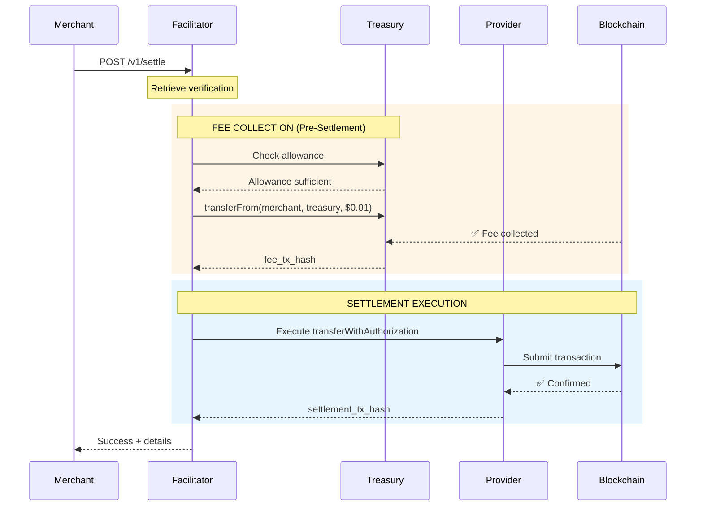
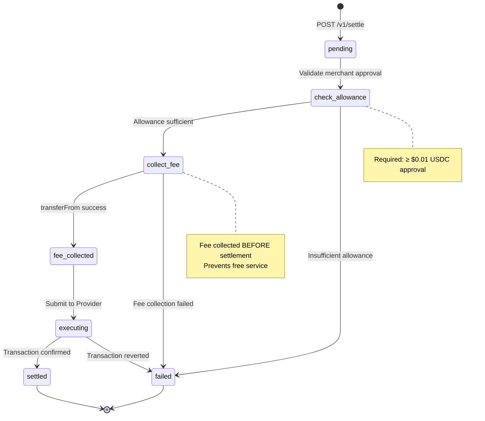

## Endpoint

Initiate settlement of a verified payment. The facilitator will:
1. Collect $0.01 fee from merchant's approved USDC balance
2. Execute customer → merchant payment via 1Shot API

<Note>
**Fee Collection:** The $0.01 fee is collected from the merchant's pre-approved USDC balance BEFORE settlement execution.
</Note>

---

## Request Parameters

<ParamField path="payment" type="object" required>
  Same payment payload used in verification
</ParamField>

<ParamField path="requirements" type="object" required>
  Same payment requirements used in verification
</ParamField>

---

## Request Examples

<CodeGroup>

```bash cURL
curl -X POST https://facilitator.0xmeta.ai/v1/settle \
  -H "Content-Type: application/json" \
  -d '{
    "payment": {
      "x402Version": 2,
      "payload": {
        "authorization": {
          "from": "0x78b6b8c55d5ea96be6ca8213e61b0fa53e862480",
          "to": "0xA821f428Ef8cC9f54A9915336A82220853059090",
          "value": "20000",
          ...
        },
        "signature": "0x..."
      }
    },
    "requirements": {
      "scheme": "exact",
      "price": "$0.02",
      "network": "eip155:84532",
      "payTo": "0xA821f428Ef8cC9f54A9915336A82220853059090"
    }
  }'
```

```javascript JavaScript
const response = await fetch("https://facilitator.0xmeta.ai/v1/settle", {
  method: "POST",
  headers: {
    "Content-Type": "application/json",
  },
  body: JSON.stringify({
    payment: paymentPayload,      // From verification
    requirements: requirements    // From verification
  })
});

const data = await response.json();
console.log(data.success);        // true
console.log(data.details.settlement_id);
```

```python Python
response = requests.post(
    'https://facilitator.0xmeta.ai/v1/settle',
    headers={'Content-Type': 'application/json'},
    json={
        'payment': payment_payload,
        'requirements': requirements
    }
)

data = response.json()
print(data['success'])
print(data['details']['settlement_id'])
```

</CodeGroup>

---

## Response Examples

<ResponseExample>

```json Success (200 OK)
{
  "success": true,
  "transaction": null,
  "message": "Settlement completed successfully",
  "details": {
    "settlement_id": "stl_xyz789",
    "verification_id": "vrf_abc123",
    "settled_amount": "20000",
    "merchant_received": 20000,
    "fee_amount_wei": 10000,
    "fee_collection_status": "collected",
    "fee_tx_hash": "0x8f3e7d2a1b9c4e5f6a7b8c9d0e1f2a3b4c5d6e7f8a9b0c1d2e3f4a5b6c7d8e9f",
    "settlement_tx_hash": "0x1a2b3c4d5e6f7a8b9c0d1e2f3a4b5c6d7e8f9a0b1c2d3e4f5a6b7c8d9e0f1a2b",
    "fee_collected_first": true,
    "pricing_model": "flat_rate",
    "description": "$0.01 USDC fee collected from merchant's approved balance before settlement"
  }
}
```

```json Insufficient Allowance (400)
{
  "error": {
    "code": "insufficient_allowance",
    "message": "Merchant must approve facilitator for USDC spending",
    "details": {
      "required": "10000",
      "available": "0",
      "merchant": "0xA821f428Ef8cC9f54A9915336A82220853059090",
      "treasury": "0x5D791e3554D0e83f171126905Bda1640Bf6f9A8B",
      "approval_command": "node approve-facilitator.mjs"
    }
  }
}
```

```json Fee Collection Failed (400)
{
  "error": {
    "code": "fee_collection_failed",
    "message": "Could not collect $0.01 fee from merchant",
    "details": {
      "reason": "Insufficient USDC balance",
      "merchant_balance": "0",
      "required_fee": "10000"
    }
  }
}
```

```json Settlement Failed (400)
{
  "error": {
    "code": "settlement_failed",
    "message": "FiatTokenV2: authorization is expired",
    "details": {
      "reason": "Authorization validBefore timestamp has passed",
      "validBefore": "1735689600",
      "currentTime": "1735780000"
    }
  }
}
```

```json Verification Not Found (404)
{
  "error": {
    "code": "not_found",
    "message": "No verification found for this payment"
  }
}
```

</ResponseExample>

---

## Response Fields

<ResponseField name="success" type="boolean" required>
  Whether settlement completed successfully
</ResponseField>

<ResponseField name="transaction" type="null" required>
  Always null (maintained for x402 compatibility)
</ResponseField>

<ResponseField name="message" type="string" required>
  Human-readable settlement result
</ResponseField>

<ResponseField name="details" type="object">
  **details.settlement_id:** Unique settlement identifier
  
  **details.verification_id:** Associated verification ID
  
  **details.settled_amount:** Amount settled (customer payment)
  
  **details.merchant_received:** Amount merchant received (same as settled_amount)
  
  **details.fee_amount_wei:** Fee collected from merchant (10000 = $0.01)
  
  **details.fee_collection_status:** "collected" | "failed"
  
  **details.fee_tx_hash:** On-chain transaction hash of fee collection
  
  **details.settlement_tx_hash:** On-chain transaction hash of settlement
  
  **details.fee_collected_first:** Always true (guarantees no free service)
  
  **details.pricing_model:** "flat_rate"
  
  **details.description:** Explanation of fee collection method
</ResponseField>

---

## Settlement Process



---

## Settlement States



---

## Fee Collection Details

### Pre-Settlement Fee Collection

**Why collect fee first?**

Prevents free service exploitation. If settlement executed before fee collection, merchants could intentionally cause settlement failures to get free verification service.

**Process:**

```solidity
// 1. Check merchant approval
allowance = USDC.allowance(merchant, treasury);
require(allowance >= 10000, "Insufficient allowance");

// 2. Collect fee FIRST
USDC.transferFrom(merchant, treasury, 10000);  // $0.01

// 3. THEN execute settlement
executeSettlement(authorization, signature);
```

**If fee collection fails:**
- Settlement is blocked
- Customer is NOT charged
- Merchant receives error: `insufficient_allowance` or `fee_collection_failed`

**If settlement fails after fee:**
- Merchant paid $0.01 for the attempt
- This is intentional (prevents exploitation)

---

## Handling Settlement Status

### Polling for Completion

```javascript
async function waitForSettlement(settlementId) {
  const maxAttempts = 60;  // 5 minutes

  for (let attempt = 0; attempt < maxAttempts; attempt++) {
    const response = await fetch(
      `https://facilitator.0xmeta.ai/v1/settlements/${settlementId}`
    );

    const settlement = await response.json();

    if (settlement.success && settlement.details.settlement_tx_hash) {
      console.log("✅ Settlement complete:", settlement.details.settlement_tx_hash);
      return settlement;
    }

    // Wait 5 seconds before next check
    await new Promise(resolve => setTimeout(resolve, 5000));
  }

  throw new Error("Settlement timeout");
}
```

---

## Common Issues

<AccordionGroup>
  <Accordion title="Insufficient Allowance">
    **Error:** `fee_collection_status: insufficient_allowance`
    
    **Solution:** Merchant must approve facilitator:
    ```bash
    node approve-facilitator.mjs
    ```
  </Accordion>

  <Accordion title="Insufficient USDC Balance">
    **Error:** `fee_collection_failed: Insufficient USDC balance`
    
    **Solution:** Merchant needs to add USDC to their address
    
    **Check balance:**
    ```bash
    node check-allowance.mjs
    # Shows: USDC Balance: 0.00 USDC ← Problem
    ```
  </Accordion>

  <Accordion title="Authorization Expired">
    **Error:** `settlement_failed: authorization is expired`
    
    **Solution:** Customer needs to create new authorization with longer validity:
    ```javascript
    validBefore: String(Math.floor(Date.now() / 1000) + 86400)  // 24 hours
    ```
  </Accordion>

  <Accordion title="Authorization Already Used">
    **Error:** `settlement_failed: authorization is used or canceled`
    
    **Solution:** Generate new unique nonce for each payment:
    ```javascript
    const nonce = "0x" + Array.from(crypto.getRandomValues(new Uint8Array(32)))
      .map(b => b.toString(16).padStart(2, "0"))
      .join("");
    ```
  </Accordion>

  <Accordion title="Settlement Takes Long">
    **Normal:** 35-70 seconds
    
    **Breakdown:**
    - Fee collection: 5-10 seconds
    - Provider submission: 5-15 seconds
    - On-chain confirmation: 15-45 seconds
    
    **If longer:** Check Base network status and Provider API status
  </Accordion>
</AccordionGroup>

---

## On-Chain Verification

All transactions are publicly verifiable:

```bash
# Fee collection transaction
https://basescan.org/tx/{fee_tx_hash}

# Settlement transaction
https://basescan.org/tx/{settlement_tx_hash}

# Merchant address activity
https://basescan.org/address/{merchant_address}
```

---

## Settlement Timing

| Stage | Typical Duration |
|-------|-----------------|
| **Fee Collection** | 5-10 seconds |
| **Provider Submission** | 5-15 seconds |
| **On-chain Confirmation** | 15-45 seconds |
| **Total** | **35-70 seconds** |

<Info>
Settlement typically completes in **35-70 seconds** on Base. Use polling or webhooks to track status.
</Info>

---

## Merchant Economics

**Per settlement:**

```
Customer pays:        $0.02 (to merchant address)
Merchant receives:    $0.02 (100% of customer payment)
Fee collected:        $0.01 (from merchant's approved balance)
Net to merchant:      $0.01
```

**Example: 1000 settlements**

```
Gross revenue:        $20.00 (customer payments)
Facilitator fees:     $10.00 (collected via transferFrom)
Net revenue:          $10.00
```

---

## Best Practices

<Steps>
  <Step title="Ensure Sufficient Approval">
    Before going live, verify merchant has approved enough USDC:
    
    ```bash
    node check-allowance.mjs
    # Should show: Settlements: 10000+ ✅
    ```
  </Step>
  
  <Step title="Maintain USDC Balance">
    Ensure merchant address has USDC for fees:
    
    - Minimum: 1 USDC (100 settlements)
    - Recommended: Match approval amount
  </Step>
  
  <Step title="Handle Errors Gracefully">
    Catch and display user-friendly error messages:
    
    ```javascript
    if (error.code === "insufficient_allowance") {
      alert("Merchant setup required. Please contact support.");
    }
    ```
  </Step>
  
  <Step title="Monitor Settlements">
    Log settlement IDs and track success rates:
    
    ```javascript
    logger.info({
      settlement_id: settlement.details.settlement_id,
      fee_collected: settlement.details.fee_collection_status,
      settlement_tx: settlement.details.settlement_tx_hash
    });
    ```
  </Step>
</Steps>

---

## Next Steps

<CardGroup cols={2}>
  <Card title="Verify Payment" icon="check-circle" href="/api-reference/verify">
    Verify before settling
  </Card>
  
  <Card title="Error Handling" icon="triangle-exclamation" href="/api-reference/errors">
    Handle settlement failures
  </Card>
  
  <Card title="Webhooks" icon="webhook" href="/guides/webhooks">
    Get settlement notifications
  </Card>
  
  <Card title="Architecture" icon="diagram-project" href="/architecture">
    Understand fee collection
  </Card>
</CardGroup>

<Check>
**Settlement complete!** Customer payment delivered to merchant, fee collected from merchant's approved balance.
</Check>