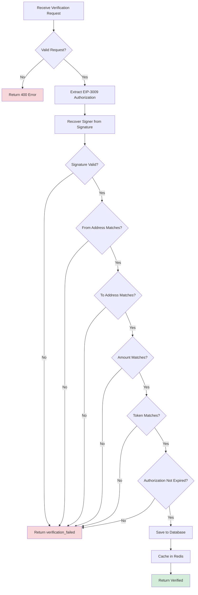

## Endpoint

Verify that an EIP-3009 transferWithAuthorization signature is valid and meets expected criteria.

<ParamField path="transaction_hash" type="string" required>
  The nonce from the EIP-3009 authorization (used as transaction reference)
  Example: `0xee232e308a6647938a68aee1ae355b85a262e4e450b7fde55cd4e729e6444ce9`
</ParamField>

<ParamField path="chain" type="string" required>
  Blockchain network: `base` or `base-sepolia`
</ParamField>

<ParamField path="seller_address" type="string" required>
  The merchant's receiving address (42 characters, must start with 0x) Example:
  `0xa821f428ef8cc9f54a9915336a82220853059090`
</ParamField>

<ParamField path="expected_amount" type="string" required>
  Expected payment amount in token's smallest unit (string to avoid precision
  loss) Example: `"10000"` (0.01 USDC with 6 decimals)
</ParamField>

<ParamField path="expected_token" type="string" required>
  Token contract address for the payment Example:
  `0x036CbD53842c5426634e7929541eC2318f3dCF7e` (USDC on Base Sepolia)
</ParamField>

<ParamField path="metadata" type="object" required>
  Payment metadata including the EIP-3009 authorization
  
  ```json
  {
    "source": "your_app_name",
    "resource": "https://your-app.com/resource",
    "paymentPayload": {
      "x402Version": 1,
      "scheme": "exact",
      "network": "base-sepolia",
      "payload": {
        "authorization": {
          "from": "0x78b6b8c55d5ea96be6ca8213e61b0fa53e862480",
          "to": "0xa821f428ef8cc9f54a9915336a82220853059090",
          "value": "10000",
          "validAfter": "0",
          "validBefore": "1735689600",
          "nonce": "0xee232e308a6647938a68aee1ae355b85a262e4e450b7fde55cd4e729e6444ce9",
          "token": "0x036CbD53842c5426634e7929541eC2318f3dCF7e"
        },
        "signature": "0x1e112204abec0856f56559b2d9a58d4e7bb5daec..."
      }
    },
    "payer": "0x78b6b8c55d5ea96be6ca8213e61b0fa53e862480"
  }
  ```
</ParamField>

<RequestExample>

```bash cURL
curl -X POST https://facilitator.0xmeta.ai/v1/verify \
  -H "Content-Type: application/json" \
  -d '{
    "transaction_hash": "0xee232e308a6647938a68aee1ae355b85a262e4e450b7fde55cd4e729e6444ce9",
    "chain": "base-sepolia",
    "seller_address": "0xa821f428ef8cc9f54a9915336a82220853059090",
    "expected_amount": "10000",
    "expected_token": "0x036CbD53842c5426634e7929541eC2318f3dCF7e",
    "metadata": {
      "source": "my_merchant_app",
      "resource": "http://localhost:8080/photos",
      "paymentPayload": {
        "x402Version": 1,
        "scheme": "exact",
        "network": "base-sepolia",
        "payload": {
          "authorization": {
            "from": "0x78b6b8c55d5ea96be6ca8213e61b0fa53e862480",
            "to": "0xa821f428ef8cc9f54a9915336a82220853059090",
            "value": "10000",
            "validAfter": "0",
            "validBefore": "1735689600",
            "nonce": "0xee232e308a6647938a68aee1ae355b85a262e4e450b7fde55cd4e729e6444ce9",
            "token": "0x036CbD53842c5426634e7929541eC2318f3dCF7e"
          },
          "signature": "0x1e112204abec0856f56559b2d9a58d4e7bb5daec70e121c0ef8a2a7acb01619d498d8b0a68a180cc80a1cf7eba9b84bbd123140600e6b199edd79dc19ad0453d1c"
        }
      },
      "payer": "0x78b6b8c55d5ea96be6ca8213e61b0fa53e862480"
    }
  }'
```

```javascript JavaScript
const response = await fetch("https://facilitator.0xmeta.ai/v1/verify", {
  method: "POST",
  headers: {
    "Content-Type": "application/json",
  },
  body: JSON.stringify({
    transaction_hash: authorization.nonce,
    chain: "base-sepolia",
    seller_address: "0xa821f428ef8cc9f54a9915336a82220853059090",
    expected_amount: "10000",
    expected_token: "0x036CbD53842c5426634e7929541eC2318f3dCF7e",
    metadata: {
      source: "my_merchant_app",
      resource: "http://localhost:8080/photos",
      paymentPayload: {
        x402Version: 1,
        scheme: "exact",
        network: "base-sepolia",
        payload: {
          authorization: authorization,
          signature: signature,
        },
      },
      payer: userAddress,
    },
  }),
});

const data = await response.json();
console.log(data.verification_id);
```

```python Python
import requests

response = requests.post(
    'https://facilitator.0xmeta.ai/v1/verify',
    headers={'Content-Type': 'application/json'},
    json={
        'transaction_hash': '0xee232e308a6647938a68aee1ae355b85a262e4e450b7fde55cd4e729e6444ce9',
        'chain': 'base-sepolia',
        'seller_address': '0xa821f428ef8cc9f54a9915336a82220853059090',
        'expected_amount': '10000',
        'expected_token': '0x036CbD53842c5426634e7929541eC2318f3dCF7e',
        'metadata': {
            'source': 'my_merchant_app',
            'paymentPayload': {
                'x402Version': 1,
                'scheme': 'exact',
                'network': 'base-sepolia',
                'payload': {
                    'authorization': authorization,
                    'signature': signature
                }
            },
            'payer': user_address
        }
    }
)

data = response.json()
print(data['verification_id'])
```

</RequestExample>

<ResponseExample>

```json Success Response (200 OK)
{
  "verification_id": "vrf_b183c9692fac4481",
  "status": "verified",
  "transaction_hash": "0xee232e308a6647938a68aee1ae355b85a262e4e450b7fde55cd4e729e6444ce9",
  "chain": "base-sepolia",
  "verified_amount": "10000",
  "verified_token": "0x036cbd53842c5426634e7929541ec2318f3dcf7e",
  "seller_address": "0xa821f428ef8cc9f54a9915336a82220853059090",
  "payer_address": "0x78b6b8c55d5ea96be6ca8213e61b0fa53e862480",
  "verified_at": "2025-11-24T07:42:40Z",
  "upstream_response": {
    "authorization": {
      "from": "0x78b6b8c55d5ea96be6ca8213e61b0fa53e862480",
      "to": "0xa821f428ef8cc9f54a9915336a82220853059090",
      "value": "10000",
      "validAfter": "0",
      "validBefore": "1735689600",
      "nonce": "0xee232e308a6647938a68aee1ae355b85a262e4e450b7fde55cd4e729e6444ce9",
      "signature": "0x1e112204abec0856f56559b2d9a58d4e7bb5daec70e121c0ef8a2a7acb01619d498d8b0a68a180cc80a1cf7eba9b84bbd123140600e6b199edd79dc19ad0453d1c",
      "valid": true
    }
  }
}
```

```json Invalid Signature (400)
{
  "error": {
    "code": "verification_failed",
    "message": "Invalid EIP-3009 signature",
    "details": {
      "reason": "Signature verification failed"
    }
  }
}
```

```json Authorization Expired (400)
{
  "error": {
    "code": "verification_failed",
    "message": "Authorization expired",
    "details": {
      "validBefore": "1735689600",
      "currentTime": "1735780000"
    }
  }
}
```

</ResponseExample>

## Response Fields

<ResponseField name="verification_id" type="string" required>
  Unique identifier for this verification. Use this for settlement.
</ResponseField>

<ResponseField name="status" type="string" required>
  Verification status: `verified`, `pending`, `failed`, or `rejected`
</ResponseField>

<ResponseField name="transaction_hash" type="string" required>
  The nonce hash used as transaction reference
</ResponseField>

<ResponseField name="chain" type="string" required>
  The blockchain network (base or base-sepolia)
</ResponseField>

<ResponseField name="verified_amount" type="string">
  Verified payment amount in token's smallest unit
</ResponseField>

<ResponseField name="verified_token" type="string">
  Verified token contract address
</ResponseField>

<ResponseField name="seller_address" type="string">
  Merchant's receiving address
</ResponseField>

<ResponseField name="payer_address" type="string">
  Customer's wallet address (from authorization)
</ResponseField>

<ResponseField name="verified_at" type="string">
  ISO 8601 timestamp when verification completed
</ResponseField>

<ResponseField name="upstream_response" type="object">
  Full authorization details including signature validation result
</ResponseField>

## Verification Process



## What Gets Verified

<Steps>
  <Step title="Signature Validation">
    EIP-712 signature is cryptographically verified using `ecrecover`
  </Step>

{" "}
<Step title="Address Matching">
  - `from` address matches recovered signer - `to` address matches expected
  seller_address
</Step>

{" "}
<Step title="Amount Validation">
  Authorization value matches expected_amount exactly
</Step>

{" "}
<Step title="Token Validation">Token address matches expected_token</Step>

{" "}
<Step title="Expiry Check">
  Current time is between `validAfter` and `validBefore`
</Step>

  <Step title="Nonce Uniqueness">
    Nonce hasn't been used in a previous settlement
  </Step>
</Steps>

## Common Use Cases

<AccordionGroup>
  <Accordion title="USDC Payment on Base Sepolia">
    ```json
    {
      "transaction_hash": "0x...",
      "chain": "base-sepolia",
      "seller_address": "0xa821f428ef8cc9f54a9915336a82220853059090",
      "expected_amount": "10000",
      "expected_token": "0x036CbD53842c5426634e7929541eC2318f3dCF7e",
      "metadata": {
        "source": "my_app",
        "paymentPayload": { /* ... */ }
      }
    }
    ```
  </Accordion>

  <Accordion title="USDC Payment on Base Mainnet">
    ```json
    {
      "transaction_hash": "0x...",
      "chain": "base",
      "seller_address": "0x...",
      "expected_amount": "1000000",
      "expected_token": "0x833589fCD6eDb6E08f4c7C32D4f71b54bdA02913",
      "metadata": {
        "source": "my_app",
        "paymentPayload": { /* ... */ }
      }
    }
    ```
  </Accordion>
</AccordionGroup>

## Important Notes

<Info>
  Verifications are processed in **under 2 seconds**. The authorization is
  validated against EIP-3009 standards without any on-chain interaction.
</Info>

<Warning>
  Each nonce can only be used **once**. Generate a unique random nonce for every
  payment to prevent conflicts.
</Warning>

<Tip>
  Cache the `verification_id` - you'll need it for settlement! Store it with
  your order/transaction record.
</Tip>

<Check>
  **Verification is FREE** - no fees charged for validating payment
  authorizations.
</Check>
