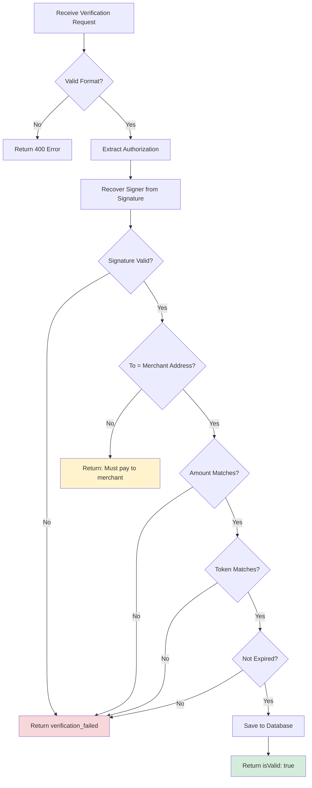

## Endpoint

Verify that an EIP-3009 `transferWithAuthorization` signature is valid and meets expected criteria.

**Key principle:** Customer authorizes payment to **merchant address** (not facilitator).

<Note>
Verification is **FREE**. Only successful settlements incur the $0.01 fee.
</Note>

---

## Request Parameters

<ParamField path="payment" type="object" required>
  Payment payload containing EIP-3009 authorization and signature
  
  **payment.payload.authorization:**
  - `from`: Customer address
  - `to`: **MERCHANT address** (where customer payment goes)
  - `value`: Payment amount in token's smallest unit
  - `validAfter`: Unix timestamp (usually "0")
  - `validBefore`: Unix timestamp (expiry)
  - `nonce`: Unique random bytes32
  
  **payment.payload.signature:** EIP-712 signature from customer
</ParamField>

<ParamField path="requirements" type="object" required>
  Payment requirements from merchant's 402 response
  
  - `scheme`: "exact"
  - `price`: "$0.02" (or atomic amount)
  - `network`: "eip155:84532" (CAIP-2 format)
  - `payTo`: **Merchant address**
  - `token`: USDC address (optional if using price)
</ParamField>

---

## Request Examples

<CodeGroup>

```bash cURL
curl -X POST https://facilitator.0xmeta.ai/v1/verify \
  -H "Content-Type: application/json" \
  -d '{
    "payment": {
      "x402Version": 2,
      "payload": {
        "authorization": {
          "from": "0x78b6b8c55d5ea96be6ca8213e61b0fa53e862480",
          "to": "0xA821f428Ef8cC9f54A9915336A82220853059090",
          "value": "20000",
          "validAfter": "0",
          "validBefore": "1735689600",
          "nonce": "0xee232e308a6647938a68aee1ae355b85a262e4e450b7fde55cd4e729e6444ce9"
        },
        "signature": "0x1e112204abec0856f56559b2d9a58d4e7bb5daec..."
      }
    },
    "requirements": {
      "scheme": "exact",
      "price": "$0.02",
      "network": "eip155:84532",
      "payTo": "0xA821f428Ef8cC9f54A9915336A82220853059090",
      "token": "0x036CbD53842c5426634e7929541eC2318f3dCF7e"
    }
  }'
```

```javascript JavaScript
const response = await fetch("https://facilitator.0xmeta.ai/v1/verify", {
  method: "POST",
  headers: { "Content-Type": "application/json" },
  body: JSON.stringify({
    payment: {
      x402Version: 2,
      payload: {
        authorization: {
          from: customerAddress,
          to: merchantAddress,  // ← YOUR address
          value: "20000",       // $0.02 USDC
          validAfter: "0",
          validBefore: String(Math.floor(Date.now() / 1000) + 86400),
          nonce: randomNonce(),
        },
        signature: signature
      }
    },
    requirements: {
      scheme: "exact",
      price: "$0.02",
      network: "eip155:84532",
      payTo: merchantAddress,  // ← YOUR address
      token: "0x036CbD53842c5426634e7929541eC2318f3dCF7e"
    }
  })
});

const data = await response.json();
console.log(data.isValid);  // true
```

```python Python
import requests

response = requests.post(
    'https://facilitator.0xmeta.ai/v1/verify',
    headers={'Content-Type': 'application/json'},
    json={
        'payment': {
            'x402Version': 2,
            'payload': {
                'authorization': {
                    'from': customer_address,
                    'to': merchant_address,  # YOUR address
                    'value': '20000',
                    'validAfter': '0',
                    'validBefore': str(int(time.time()) + 86400),
                    'nonce': random_nonce()
                },
                'signature': signature
            }
        },
        'requirements': {
            'scheme': 'exact',
            'price': '$0.02',
            'network': 'eip155:84532',
            'payTo': merchant_address,  # YOUR address
            'token': '0x036CbD53842c5426634e7929541eC2318f3dCF7e'
        }
    }
)

data = response.json()
print(data['isValid'])
```

</CodeGroup>

---

## Response Examples

<ResponseExample>

```json Success (200 OK)
{
  "isValid": true,
  "message": "Payment authorization verified successfully",
  "details": {
    "verification_id": "vrf_b183c9692fac4481",
    "verified_amount": "20000",
    "verified_token": "0x036cbd53842c5426634e7929541ec2318f3dcf7e",
    "merchant_address": "0xa821f428ef8cc9f54a9915336a82220853059090",
    "payer_address": "0x78b6b8c55d5ea96be6ca8213e61b0fa53e862480",
    "verified_at": "2025-01-23T10:42:40Z"
  }
}
```

```json Invalid Signature (400)
{
  "error": {
    "code": "verification_failed",
    "message": "Invalid EIP-3009 signature",
    "details": {
      "reason": "Signature verification failed",
      "recovered": "0x1234...",
      "expected": "0x78b6..."
    }
  }
}
```

```json Wrong Recipient (400)
{
  "error": {
    "code": "verification_failed",
    "message": "Payment must be to merchant address",
    "details": {
      "authorization_to": "0x5d79...",
      "expected_payTo": "0xA821...",
      "reason": "Customer must authorize payment to merchant, not facilitator"
    }
  }
}
```

```json Amount Mismatch (400)
{
  "error": {
    "code": "verification_failed",
    "message": "Amount mismatch",
    "details": {
      "authorization_value": "10000",
      "expected_amount": "20000"
    }
  }
}
```

```json Authorization Expired (400)
{
  "error": {
    "code": "verification_failed",
    "message": "Authorization expired",
    "details": {
      "validBefore": "1735689600",
      "currentTime": "1735780000"
    }
  }
}
```

</ResponseExample>

---

## Response Fields

<ResponseField name="isValid" type="boolean" required>
  Whether the payment authorization is valid
</ResponseField>

<ResponseField name="message" type="string" required>
  Human-readable verification result
</ResponseField>

<ResponseField name="details" type="object">
  **details.verification_id:** Use this for settlement
  
  **details.verified_amount:** Confirmed payment amount
  
  **details.merchant_address:** Merchant receiving payment
  
  **details.payer_address:** Customer making payment
  
  **details.verified_at:** ISO 8601 timestamp
</ResponseField>

---

## Verification Process



---

## What Gets Verified

<Steps>
  <Step title="Signature Validation">
    EIP-712 signature cryptographically verified using `ecrecover`
  </Step>

  <Step title="Recipient Validation">
    **Critical:** Authorization `to` address must match merchant address from `requirements.payTo`
    
    ✅ `authorization.to == requirements.payTo` (merchant address)
    
    ❌ `authorization.to == treasury_address` (wrong!)
  </Step>

  <Step title="Amount Validation">
    Authorization value matches expected amount exactly
  </Step>

  <Step title="Token Validation">
    Token address matches expected token (if specified)
  </Step>

  <Step title="Expiry Check">
    Current time is between `validAfter` and `validBefore`
  </Step>

  <Step title="Nonce Uniqueness">
    Nonce hasn't been used in a previous settlement
  </Step>
</Steps>

---

## Important Notes

<Warning>
**Customer must authorize to MERCHANT address, not facilitator.**

The facilitator will reject authorizations to the treasury address. This maintains x402 trust-minimization.
</Warning>

<Info>
**Verification is FREE** - unlimited verifications at no cost. Only successful settlements incur the $0.01 fee (collected from merchant's approved balance).
</Info>

<Tip>
Save the `verification_id` - you'll need it for settlement! Store it with your order/transaction record.
</Tip>

---

## Common Use Cases

<AccordionGroup>
  <Accordion title="USDC Payment on Base Sepolia">
    ```json
    {
      "payment": {
        "payload": {
          "authorization": {
            "to": "0xA821f428Ef8cC9f54A9915336A82220853059090",  // Merchant
            "value": "20000",  // $0.02
            ...
          }
        }
      },
      "requirements": {
        "payTo": "0xA821f428Ef8cC9f54A9915336A82220853059090",  // Same merchant
        "token": "0x036CbD53842c5426634e7929541eC2318f3dCF7e"  // USDC Sepolia
      }
    }
    ```
  </Accordion>

  <Accordion title="USDC Payment on Base Mainnet">
    ```json
    {
      "requirements": {
        "price": "$0.02",
        "network": "eip155:8453",  // Base Mainnet
        "payTo": "0x...",  // Merchant address
        "token": "0x833589fCD6eDb6E08f4c7C32D4f71b54bdA02913"  // USDC Mainnet
      }
    }
    ```
  </Accordion>
</AccordionGroup>

---

## Error Prevention

<Steps>
  <Step title="Use Merchant Address">
    Always set `authorization.to` = merchant address (not treasury)
  </Step>
  
  <Step title="Generate Unique Nonce">
    ```javascript
    const nonce = "0x" + Array.from(crypto.getRandomValues(new Uint8Array(32)))
      .map(b => b.toString(16).padStart(2, "0"))
      .join("");
    ```
  </Step>
  
  <Step title="Set Long Validity">
    ```javascript
    validBefore: String(Math.floor(Date.now() / 1000) + 86400)  // 24 hours
    ```
  </Step>
  
  <Step title="Match Amounts Exactly">
    Ensure `authorization.value` matches `requirements.price` or `amount`
  </Step>
</Steps>

---

## Next Steps

<CardGroup cols={2}>
  <Card title="Settle Payment" icon="check" href="/api-reference/settle">
    Execute settlement after verification
  </Card>
  
  <Card title="Error Handling" icon="triangle-exclamation" href="/api-reference/errors">
    Handle verification failures
  </Card>
  
  <Card title="Architecture" icon="diagram-project" href="/architecture">
    Understand payment flow
  </Card>
  
  <Card title="Integration Guide" icon="book" href="/x402-integration">
    Complete setup guide
  </Card>
</CardGroup>

<Check>
**Verification complete!** Use the `verification_id` to settle the payment.
</Check>