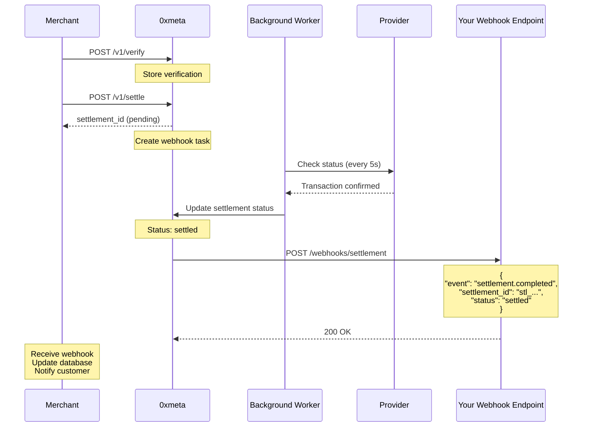
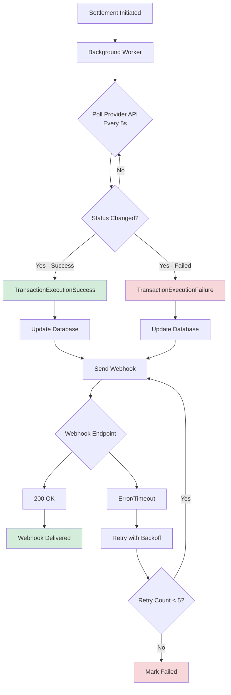

## Overview

0xmeta uses webhooks to notify you of settlement status changes in real-time. This eliminates the need for polling and provides instant updates when settlements complete.

## How Webhooks Work

When you initiate a settlement, 0xmeta's background workers monitor the transaction status and trigger webhooks when the status changes.



## Webhook Configuration

Webhooks are configured via the Provider integration. When settlement status changes, Provider sends webhooks to the configured endpoint, and 0xmeta processes them.

### Setting Up Your Webhook Endpoint

Create an endpoint to receive webhook notifications:

<CodeGroup>

```javascript Node.js + Express
import express from "express";
import crypto from "crypto";

const app = express();
app.use(express.json());

app.post("/webhook/Provider/transaction-complete", async (req, res) => {
  const payload = req.body;
  const signature = req.headers["x-webhook-signature"];

  // 1. Acknowledge receipt immediately
  res.status(200).json({ received: true });

  // 2. Verify signature (optional but recommended)
  if (signature && !verifySignature(payload, signature)) {
    console.error("Invalid webhook signature");
    return;
  }

  // 3. Process webhook asynchronously
  try {
    await processWebhook(payload);
  } catch (error) {
    console.error("Webhook processing error:", error);
  }
});

async function processWebhook(payload) {
  const { eventName, data } = payload;

  if (eventName === "TransactionExecutionSuccess") {
    // Settlement completed successfully
    const { transactionId, transactionReceipt } = data;

    console.log("✅ Settlement succeeded");
    console.log("Transaction ID:", transactionId);
    console.log("TX Hash:", transactionReceipt.hash);

    // Update your database
    await db.settlements.update({
      where: { upstream_settlement_id: transactionId },
      data: {
        status: "settled",
        settlement_tx_hash: transactionReceipt.hash,
        settled_at: new Date(),
      },
    });

    // Notify customer
    await notifyCustomer(transactionId);
  }

  if (eventName === "TransactionExecutionFailure") {
    // Settlement failed
    const { transactionId, reason, decodedData } = data;

    console.error("❌ Settlement failed");
    console.error("Transaction ID:", transactionId);
    console.error("Reason:", reason);
    console.error("Details:", decodedData);

    // Update database
    await db.settlements.update({
      where: { upstream_settlement_id: transactionId },
      data: {
        status: "failed",
        error_message: decodedData[0] || reason,
      },
    });

    // Handle failure (refund, retry, notify)
    await handleSettlementFailure(transactionId);
  }
}

function verifySignature(payload, signature) {
  const secret = process.env.WEBHOOK_SECRET;
  const hmac = crypto.createHmac("sha256", secret);
  const expected = hmac.update(JSON.stringify(payload)).digest("base64");
  return crypto.timingSafeEqual(Buffer.from(signature), Buffer.from(expected));
}

app.listen(8000, () => {
  console.log("Webhook endpoint listening on port 8000");
});
```

```python Python + FastAPI
from fastapi import FastAPI, Request, Header
from typing import Optional
import hmac
import hashlib
import json

app = FastAPI()

@app.post("/webhook/Provider/transaction-complete")
async def handle_webhook(
    request: Request,
    x_webhook_signature: Optional[str] = Header(None)
):
    # Get raw body
    body = await request.body()
    payload = json.loads(body)

    # 1. Acknowledge receipt immediately
    response = {"received": True}

    # 2. Verify signature (optional but recommended)
    if x_webhook_signature and not verify_signature(body, x_webhook_signature):
        print("Invalid webhook signature")
        return response

    # 3. Process webhook asynchronously
    try:
        await process_webhook(payload)
    except Exception as e:
        print(f"Webhook processing error: {e}")

    return response

async def process_webhook(payload):
    event_name = payload.get('eventName')
    data = payload.get('data', {})

    if event_name == 'TransactionExecutionSuccess':
        # Settlement completed successfully
        transaction_id = data.get('transactionId')
        tx_receipt = data.get('transactionReceipt', {})

        print('✅ Settlement succeeded')
        print(f'Transaction ID: {transaction_id}')
        print(f'TX Hash: {tx_receipt.get("hash")}')

        # Update database
        await db.settlements.update(
            {'upstream_settlement_id': transaction_id},
            {
                'status': 'settled',
                'settlement_tx_hash': tx_receipt.get('hash'),
                'settled_at': datetime.now()
            }
        )

        # Notify customer
        await notify_customer(transaction_id)

    elif event_name == 'TransactionExecutionFailure':
        # Settlement failed
        transaction_id = data.get('transactionId')
        reason = data.get('reason')
        decoded_data = data.get('decodedData', [])

        print('❌ Settlement failed')
        print(f'Transaction ID: {transaction_id}')
        print(f'Reason: {reason}')
        print(f'Details: {decoded_data}')

        # Update database
        await db.settlements.update(
            {'upstream_settlement_id': transaction_id},
            {
                'status': 'failed',
                'error_message': decoded_data[0] if decoded_data else reason
            }
        )

        # Handle failure
        await handle_settlement_failure(transaction_id)

def verify_signature(body: bytes, signature: str) -> bool:
    import os
    secret = os.getenv('WEBHOOK_SECRET')
    expected = hmac.new(
        secret.encode('utf-8'),
        body,
        hashlib.sha256
    ).digest().encode('base64')
    return hmac.compare_digest(expected, signature)
```

</CodeGroup>

## Webhook Events

### TransactionExecutionSuccess

Sent when settlement completes successfully:

```json
{
  "eventName": "TransactionExecutionSuccess",
  "data": {
    "businessId": "7fcbe440-869c-481d-8fbe-c1d3e354d5dc",
    "chainId": 84532,
    "contractMethodIds": ["4b187b50-4f61-41fe-bea9-2e3656908c13"],
    "transactionId": "e221bdd2-0014-4a3c-890a-086f9b1c20b7",
    "transactionReceipt": {
      "hash": "0x795d83089672d51148e7f53a65b9ac2e43e7ca9113f986dfca4cb1096248bf2b",
      "blockNumber": 34100995,
      "status": 1,
      "from": "0xcA542D344854c370519Ca7Cc2bBf8A1f6b77972C",
      "to": "0x036CbD53842c5426634e7929541eC2318f3dCF7e",
      "gasUsed": "86144",
      "logs": [
        {
          "name": "AuthorizationUsed",
          "args": [
            "0x78B6B8c55d5ea96be6CA8213E61B0fa53E862480",
            "0x619b9487eb514fc1f2d1bb1e10c21b14e4013646b40fc12d366856909e24d9d1"
          ]
        },
        {
          "name": "Transfer",
          "args": [
            "0x78B6B8c55d5ea96be6CA8213E61B0fa53E862480",
            "0xA821f428Ef8cC9f54A9915336A82220853059090",
            "10000"
          ]
        }
      ]
    }
  },
  "timestamp": 1763970279,
  "apiVersion": 0,
  "signature": "kwfFGx17Prl7EU8vAcut+ycZEZuyjzXu1uLfu6Dm4uR6pGMO/zucXVTNkAPFK8V2FXTRLvjv+cpmD3sdB9G3AA=="
}
```

### TransactionExecutionFailure

Sent when settlement fails:

```json
{
  "eventName": "TransactionExecutionFailure",
  "data": {
    "businessId": "7fcbe440-869c-481d-8fbe-c1d3e354d5dc",
    "chainId": 84532,
    "contractMethodIds": ["4b187b50-4f61-41fe-bea9-2e3656908c13"],
    "transactionId": "574e56cd-a679-41c9-8aa3-90a4dcf42a03",
    "decodedData": ["FiatTokenV2: authorization is expired"],
    "reason": "execution reverted: \"FiatTokenV2: authorization is expired\"",
    "revertData": "0x08c379a0..."
  },
  "timestamp": 1763970185,
  "apiVersion": 0,
  "signature": "nLz+Z6GTnLhmeQfUwLSEeT+sMpQ11MlkeVo7tY2tsfDpk+YG/OzSzB7kzsPyPe635OTSJDHI9urnCgOHaL7LDw=="
}
```

## Processing Webhooks

### Best Practices

<Steps>
  <Step title="Respond Immediately">
    Return 200 OK within 5 seconds to acknowledge receipt
    
    ```javascript
    // ✅ Good
    app.post('/webhook', (req, res) => {
      res.status(200).json({ received: true });
      processWebhook(req.body); // Process async
    });
    
    // ❌ Bad
    app.post('/webhook', async (req, res) => {
      await longRunningProcess(); // Timeout!
      res.status(200).send();
    });
    ```
  </Step>

  <Step title="Handle Idempotency">
    Store event IDs to prevent duplicate processing
    
    ```javascript
    const processedEvents = new Set();
    
    async function processWebhook(payload) {
      const eventId = `${payload.eventName}-${payload.data.transactionId}`;
      
      if (processedEvents.has(eventId)) {
        console.log('Duplicate webhook, skipping');
        return;
      }
      
      processedEvents.add(eventId);
      // Process webhook...
    }
    ```
  </Step>

  <Step title="Verify Signatures">
    Always verify webhook signatures to ensure authenticity
    
    ```javascript
    function verifySignature(payload, signature) {
      const secret = process.env.WEBHOOK_SECRET;
      const hmac = crypto.createHmac('sha256', secret);
      const expected = hmac.update(JSON.stringify(payload)).digest('base64');
      return crypto.timingSafeEqual(
        Buffer.from(signature),
        Buffer.from(expected)
      );
    }
    ```
  </Step>

  <Step title="Handle Errors Gracefully">
    Log errors but don't fail the webhook
    
    ```javascript
    async function processWebhook(payload) {
      try {
        await updateDatabase(payload);
        await notifyCustomer(payload);
      } catch (error) {
        console.error('Webhook processing error:', error);
        // Log to monitoring system
        await logError(error, payload);
        // Don't throw - already acknowledged webhook
      }
    }
    ```
  </Step>
</Steps>

## Webhook Flow Diagram



## Webhook Retry Logic

If your endpoint fails, 0xmeta retries with exponential backoff:

| Attempt | Delay      |
| ------- | ---------- |
| 1       | Immediate  |
| 2       | 1 minute   |
| 3       | 5 minutes  |
| 4       | 15 minutes |
| 5       | 30 minutes |
| 6       | 1 hour     |

After 6 failed attempts, the webhook is marked as failed and logged.

## Webhook Security

<AccordionGroup>
  <Accordion title="Use HTTPS">
    Webhook URLs must use HTTPS in production
    
    ```
    ✅ https://your-app.com/webhooks/settlement
    ❌ http://your-app.com/webhooks/settlement
    ```
  </Accordion>

  <Accordion title="Verify Signatures">
    Always verify the webhook signature
    
    ```javascript
    const isValid = verifySignature(req.body, req.headers['x-webhook-signature']);
    if (!isValid) {
      return res.status(401).send('Invalid signature');
    }
    ```
  </Accordion>

  <Accordion title="Validate Payload">
    Check that required fields exist
    
    ```javascript
    if (!payload.eventName || !payload.data?.transactionId) {
      console.error('Invalid webhook payload');
      return;
    }
    ```
  </Accordion>

  <Accordion title="Rate Limiting">
    Implement rate limiting on your webhook endpoint
    
    ```javascript
    import rateLimit from 'express-rate-limit';
    
    const limiter = rateLimit({
      windowMs: 60 * 1000, // 1 minute
      max: 100 // 100 requests per minute
    });
    
    app.post('/webhook', limiter, handleWebhook);
    ```
  </Accordion>
</AccordionGroup>

## Testing Webhooks Locally

Use [ngrok](https://ngrok.com) to expose your local server:

```bash
# Start your server
node server.js  # Port 8000

# In another terminal
ngrok http 8000

# Output:
# Forwarding: https://abc123.ngrok.io -> http://localhost:8000

# Configure this URL in Provider dashboard (if applicable)
```

## Common Webhook Patterns

### Update Order Status

```javascript
async function processWebhook(payload) {
  if (payload.eventName === "TransactionExecutionSuccess") {
    const transactionId = payload.data.transactionId;

    // Find settlement by upstream_settlement_id
    const settlement = await db.settlements.findOne({
      upstream_settlement_id: transactionId,
    });

    if (!settlement) {
      console.error("Settlement not found:", transactionId);
      return;
    }

    // Update settlement
    await db.settlements.update(settlement.id, {
      status: "settled",
      settlement_tx_hash: payload.data.transactionReceipt.hash,
      settled_at: new Date(),
    });

    // Update order
    await db.orders.update(settlement.order_id, {
      payment_status: "completed",
      paid_at: new Date(),
    });

    // Notify customer
    await sendEmail(settlement.customer_email, "Payment confirmed!");
  }
}
```

### Handle Failed Settlements

```javascript
async function processWebhook(payload) {
  if (payload.eventName === "TransactionExecutionFailure") {
    const { transactionId, decodedData, reason } = payload.data;

    const settlement = await db.settlements.findOne({
      upstream_settlement_id: transactionId,
    });

    // Parse error
    const errorMessage = decodedData?.[0] || reason;

    if (errorMessage.includes("authorization is expired")) {
      // Authorization expired - notify user to retry
      await notifyUserToRetry(settlement);
    } else if (errorMessage.includes("authorization is used or canceled")) {
      // Nonce already used - might be duplicate
      await checkForDuplicate(settlement);
    } else {
      // Other error - log and investigate
      await logErrorForInvestigation(settlement, errorMessage);
    }

    // Update settlement
    await db.settlements.update(settlement.id, {
      status: "failed",
      error_message: errorMessage,
    });
  }
}
```

## Monitoring Webhooks

Track webhook delivery success:

```javascript
const webhookMetrics = {
  delivered: 0,
  failed: 0,
  retried: 0,
};

async function processWebhook(payload) {
  try {
    // Process webhook
    webhookMetrics.delivered++;
  } catch (error) {
    webhookMetrics.failed++;
    console.error("Webhook processing failed:", error);
  }
}

// Log metrics every hour
setInterval(() => {
  console.log("Webhook metrics:", webhookMetrics);
}, 3600000);
```

<Info>
  Webhooks provide real-time updates without polling. Your endpoint will be
  notified within seconds of settlement status changes.
</Info>

<Warning>
  Always return 200 OK quickly (within 5 seconds) to avoid timeouts and retries.
</Warning>

<Tip>
  Store the `upstream_settlement_id` (Provider transaction ID) when creating
  settlements. Use it to match webhook events to your database records.
</Tip>
