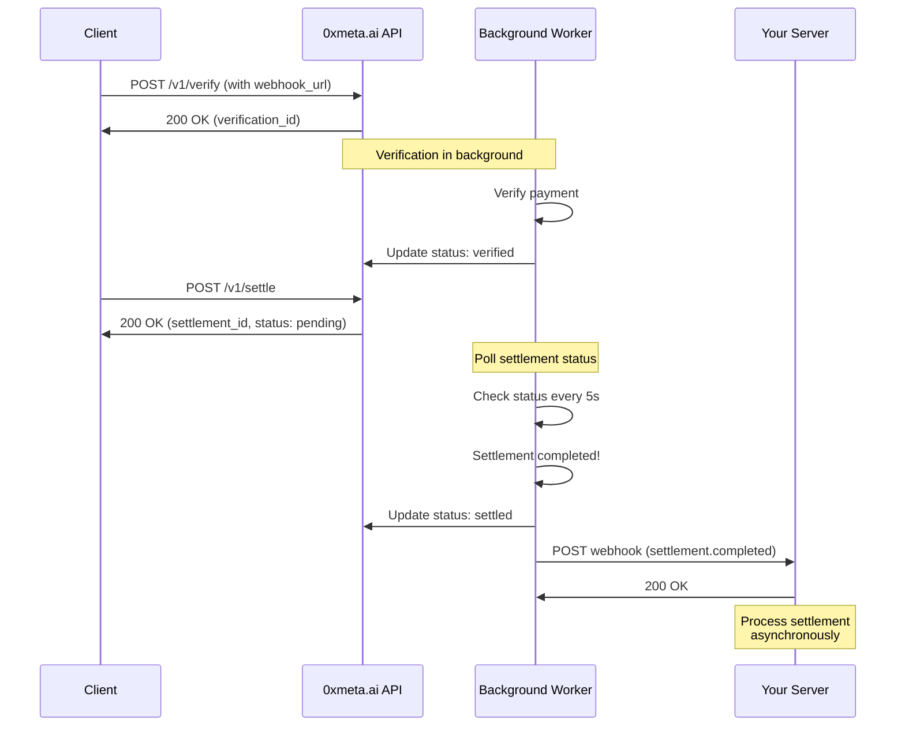

## Overview

Webhooks allow you to receive real-time notifications when settlement status changes, eliminating the need for polling.

## Setup

Provide a `webhook_url` when verifying a payment:

```json
{
  "transaction_hash": "0x...",
  "chain": "base",
  "seller_address": "0x...",
  "expected_amount": "1000000000000000000",
  "webhook_url": "https://your-app.com/webhooks/settlement"
}
```

## Webhook Payload

When settlement completes, we'll POST to your webhook URL:

```json
{
  "event_type": "settlement.completed",
  "event_id": "evt_abc123def456",
  "timestamp": "2025-01-15T10:35:00Z",
  "verification_id": "ver_abc123def456",
  "settlement_id": "set_xyz789ghi012",
  "status": "settled",
  "data": {
    "settlement_tx_hash": "0xabcdef...",
    "settled_amount": "1000000000000000000",
    "fee": "50000000000000000"
  },
  "signature": "hmac_sha256_signature_here"
}
```

## Event Types

<ResponseField name="verification.completed" type="event">
  Payment verification completed successfully
</ResponseField>

<ResponseField name="verification.failed" type="event">
  Payment verification failed
</ResponseField>

<ResponseField name="settlement.completed" type="event">
  Settlement completed successfully
</ResponseField>

<ResponseField name="settlement.rejected" type="event">
  Settlement was rejected
</ResponseField>

<ResponseField name="status.updated" type="event">
  General status update
</ResponseField>

## Signature Verification

**CRITICAL**: Always verify webhook signatures to ensure requests are from 0xmeta.ai

<Steps>
  <Step title="Extract Signature">
    Get the signature from the `X-Webhook-Signature` header
  </Step>

  <Step title="Compute Expected Signature">
    Use HMAC-SHA256 with your webhook secret
  </Step>

  <Step title="Compare Signatures">
    Use constant-time comparison to prevent timing attacks
  </Step>
</Steps>

<CodeGroup>

```javascript Node.js
const crypto = require("crypto");

function verifyWebhook(payload, signature, secret) {
  // Serialize payload to canonical JSON
  const payloadStr = JSON.stringify(payload, Object.keys(payload).sort(), ":");

  // Compute expected signature
  const expected = crypto
    .createHmac("sha256", secret)
    .update(payloadStr)
    .digest("hex");

  // Constant-time comparison
  return crypto.timingSafeEqual(Buffer.from(signature), Buffer.from(expected));
}

// In your webhook handler
app.post("/webhooks/settlement", (req, res) => {
  const signature = req.headers["x-webhook-signature"];
  const payload = req.body;

  if (!verifyWebhook(payload, signature, process.env.WEBHOOK_SECRET)) {
    return res.status(401).json({ error: "Invalid signature" });
  }

  // Process webhook
  console.log("Settlement completed:", payload.settlement_id);

  res.json({ received: true });
});
```

```python Python
import hmac
import hashlib
import json
from flask import Flask, request, jsonify

app = Flask(__name__)

def verify_webhook(payload: dict, signature: str, secret: str) -> bool:
    """Verify webhook signature."""
    # Serialize payload to canonical JSON
    payload_str = json.dumps(payload, sort_keys=True, separators=(',', ':'))

    # Compute expected signature
    expected = hmac.new(
        secret.encode('utf-8'),
        payload_str.encode('utf-8'),
        hashlib.sha256
    ).hexdigest()

    # Constant-time comparison
    return hmac.compare_digest(expected, signature)

@app.route('/webhooks/settlement', methods=['POST'])
def handle_webhook():
    signature = request.headers.get('X-Webhook-Signature')
    payload = request.json

    if not verify_webhook(payload, signature, WEBHOOK_SECRET):
        return jsonify({'error': 'Invalid signature'}), 401

    # Process webhook
    print(f"Settlement completed: {payload['settlement_id']}")

    return jsonify({'received': True})
```

```php PHP
<?php

function verifyWebhook($payload, $signature, $secret) {
    // Serialize payload to canonical JSON
    ksort($payload);
    $payloadStr = json_encode($payload, JSON_UNESCAPED_SLASHES);

    // Compute expected signature
    $expected = hash_hmac('sha256', $payloadStr, $secret);

    // Constant-time comparison
    return hash_equals($expected, $signature);
}

// In your webhook handler
$signature = $_SERVER['HTTP_X_WEBHOOK_SIGNATURE'];
$payload = json_decode(file_get_contents('php://input'), true);

if (!verifyWebhook($payload, $signature, $webhookSecret)) {
    http_response_code(401);
    echo json_encode(['error' => 'Invalid signature']);
    exit;
}

// Process webhook
error_log("Settlement completed: " . $payload['settlement_id']);

echo json_encode(['received' => true]);
?>
```

</CodeGroup>

## Retry Logic

If your webhook endpoint fails, we'll retry with exponential backoff:

| Attempt | Delay      |
| ------- | ---------- |
| 1       | 1 minute   |
| 2       | 5 minutes  |
| 3       | 15 minutes |
| 4       | 30 minutes |
| 5       | 1 hour     |

After 5 failed attempts, the webhook is marked as failed.

## Best Practices

<AccordionGroup>
  <Accordion title="Return 200 Quickly">
    - Acknowledge receipt immediately
    - Process webhook asynchronously
    - Don't perform long operations in webhook handler
    
    ```javascript
    app.post('/webhooks', async (req, res) => {
      // Verify signature
      if (!verifyWebhook(...)) {
        return res.status(401).end();
      }
      
      // Acknowledge immediately
      res.status(200).json({ received: true });
      
      // Process asynchronously
      processWebhook(req.body).catch(console.error);
    });
    ```
  </Accordion>

  <Accordion title="Implement Idempotency">
    Store event IDs to prevent duplicate processing:
    
    ```javascript
    const processedEvents = new Set();
    
    app.post('/webhooks', (req, res) => {
      const eventId = req.body.event_id;
      
      if (processedEvents.has(eventId)) {
        return res.status(200).json({ received: true });
      }
      
      // Process webhook
      processWebhook(req.body);
      processedEvents.add(eventId);
      
      res.status(200).json({ received: true });
    });
    ```
  </Accordion>

{" "}
<Accordion title="Use HTTPS">
  - Webhook URLs must use HTTPS in production - Use valid SSL certificates -
  Don't use self-signed certificates
</Accordion>

  <Accordion title="Monitor Webhook Health">
    - Log all webhook deliveries
    - Alert on failed deliveries
    - Monitor response times
    - Track processing errors
  </Accordion>
</AccordionGroup>

## Testing Webhooks Locally

Use [ngrok](https://ngrok.com) to expose your local server:

```bash
# Start ngrok
ngrok http 3000

# Use the ngrok URL in your API request
{
  "webhook_url": "https://abc123.ngrok.io/webhooks/settlement"
}
```

Or use [webhook.site](https://webhook.site) to inspect payloads:

```bash
# Get a unique URL
https://webhook.site/your-unique-id

# Use it in your request
{
  "webhook_url": "https://webhook.site/your-unique-id"
}
```

## Webhook Flow Diagram



<Warning>
  Never expose your webhook secret in client-side code or version control.
</Warning>

<Info>
  Webhooks timeout after 10 seconds. Ensure your endpoint responds quickly.
</Info>
