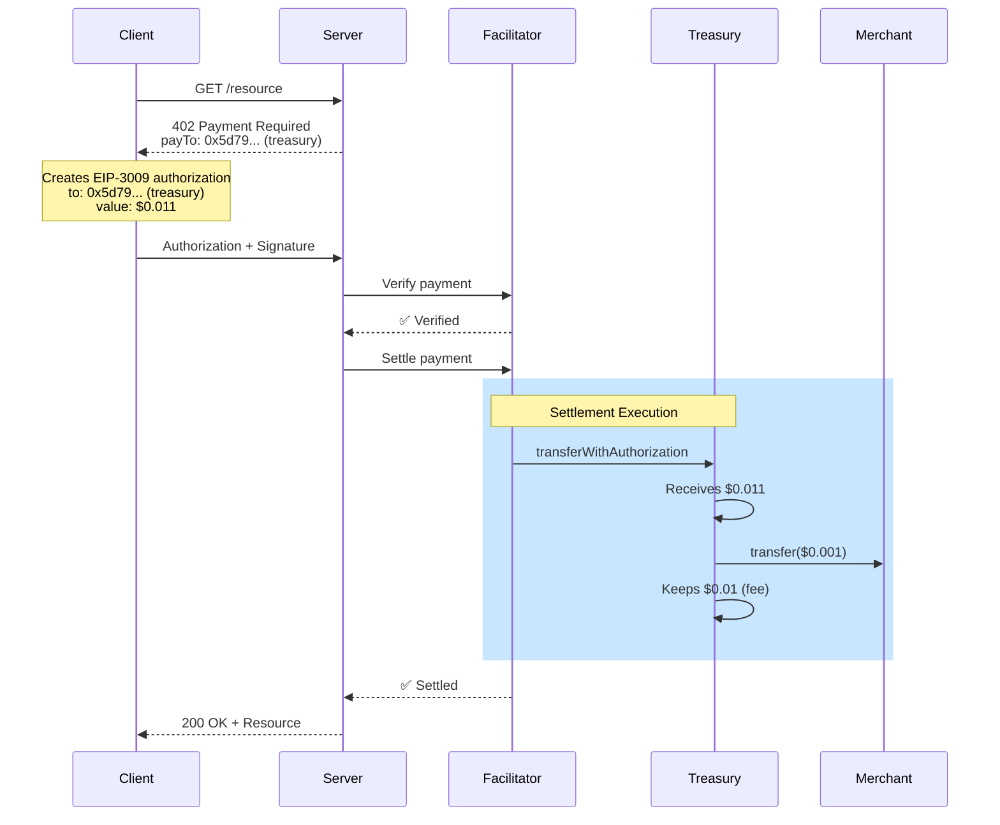

## Overview

0xmeta uses a **treasury-first architecture** where payments flow through 0xmeta's treasury before reaching merchants. This isn't a design choice—it's a **technical requirement** imposed by EIP-3009's cryptographic constraints.

<Note>
**TL;DR:** EIP-3009 signatures can't be split after signing. The only way to collect fees atomically is for clients to authorize payments to the treasury, which then forwards to merchants.
</Note>

---

## The EIP-3009 Constraint

### What is EIP-3009?

EIP-3009 (`transferWithAuthorization`) allows gasless token transfers where:
1. User signs authorization off-chain
2. Anyone can submit the authorization on-chain
3. Transfer executes without user paying gas

###

 The Signature Problem

```solidity
function transferWithAuthorization(
    address from,      // Payer
    address to,        // ❌ Cryptographically bound
    uint256 value,     // ❌ Cryptographically bound
    uint256 validAfter,
    uint256 validBefore,
    bytes32 nonce,
    uint8 v, bytes32 r, bytes32 s  // Signature covers ALL parameters
) external;
```

**Key insight:** The signature cryptographically commits to BOTH the recipient (`to`) and amount (`value`). Once signed, they **cannot be changed**.

### Why This Matters

**Scenario: Client pays merchant directly**
```
❌ Problem:
1. Client authorizes: to = merchant, value = $0.011
2. Facilitator receives authorization
3. Facilitator wants to collect $0.01 fee
4. ❌ IMPOSSIBLE - signature is bound to merchant as recipient
5. ❌ Can't redirect portion to treasury
6. ❌ Can't modify amount
```

**The math doesn't work:**
- Client signed: "Send $0.011 to merchant"
- We need: "Send $0.01 to treasury + $0.001 to merchant"
- **Can't split a single authorization into multiple transfers**

---

## Treasury-First Solution

### How It Works

```
✅ Client → Treasury (full $0.011)
✅ Treasury keeps fee ($0.01)
✅ Treasury → Merchant ($0.001, automatic)
```

**Why this works:**
1. Client authorizes to treasury (single recipient ✅)
2. Treasury receives full amount atomically
3. Treasury immediately forwards merchant portion
4. No signature splitting needed

### Payment Flow



---

## Alternative Approaches Considered

### Option 1: Merchant-First with Approval ❌

```
Client → Merchant ($0.011)
Merchant.approve(treasury, $0.01)
Treasury.transferFrom(merchant, $0.01)
```

**Why rejected:**
- ❌ Requires merchant to approve USDC spending (setup friction)
- ❌ Merchant pays gas for approval (~$0.50 on mainnet)
- ❌ Not atomic (approval can fail)
- ❌ Merchant needs USDC balance for fees
- ❌ Poor developer experience

### Option 2: Smart Contract Proxy ❌

```
Client → Proxy Contract ($0.011)
Proxy splits:
  - $0.001 → Merchant
  - $0.01 → Treasury
```

**Why rejected:**
- ❌ Complex smart contract development
- ❌ Higher gas costs (proxy deployment + operations)
- ❌ Requires security audit
- ❌ Must deploy to every chain
- ❌ Increased attack surface
- ❌ Slower settlement

### Option 3: Treasury-First (Current) ✅

```
Client → Treasury ($0.011)
Treasury → Merchant ($0.001, automatic)
```

**Why chosen:**
- ✅ Simplest implementation
- ✅ Lowest total gas costs
- ✅ No merchant setup required
- ✅ Atomic operation
- ✅ Works with standard EIP-3009
- ✅ Best developer experience

---

## Benefits for Merchants

<CardGroup cols={2}>
  <Card title="Zero Setup" icon="check">
    No USDC approvals needed. Just use treasury address from `/supported`.
  </Card>
  
  <Card title="Zero Gas Costs" icon="gas-pump">
    Treasury pays gas for forwarding. Merchants receive payments without spending ETH.
  </Card>
  
  <Card title="Automatic Payments" icon="bolt">
    Forwarding happens automatically during settlement. No action required.
  </Card>
  
  <Card title="Simple Integration" icon="code">
    One environment variable: `EVM_ADDRESS` (treasury from `/supported`).
  </Card>
</CardGroup>

---

## x402 Compliance

### Treasury Address Discovery

The treasury address is fully discoverable via standard x402 protocol:

```bash
curl https://facilitator.0xmeta.ai/v1/supported
```

```json
{
  "kinds": [
    { "x402Version": 2, "scheme": "exact", "network": "eip155:84532" },
    { "x402Version": 1, "scheme": "exact", "network": "base-sepolia" }
  ],
  "signers": {
    "eip155:*": ["0x5d791e3554d0e83f171126905bda1640bf6f9a8b"]
  },
  "extensions": [
    {
      "name": "treasury_first_forwarding",
      "description": "Payments forwarded to merchants after fee collection",
      "fee": {
        "type": "flat_rate",
        "amount": "10000",
        "currency": "USDC"
      }
    }
  ]
}
```

**Key points:**
✅ Treasury address in `signers["eip155:*"][0]`
✅ Follows standard x402 discovery protocol
✅ Fee structure disclosed in extensions
✅ Fully transparent to clients and servers

---

## Implementation Details

### Server Configuration

<CodeGroup>

```typescript x402 v2
import { HTTPFacilitatorClient } from "@x402/core/server";

// 1. Query facilitator for treasury address
const facilitatorClient = new HTTPFacilitatorClient({ 
  url: "https://facilitator.0xmeta.ai/v1" 
});

const supported = await facilitatorClient.getSupported();
const treasuryAddress = supported.signers["eip155:*"][0];
// ✅ "0x5d791e3554d0e83f171126905bda1640bf6f9a8b"

// 2. Use in middleware
app.use(paymentMiddleware(
  {
    "GET /resource": {
      accepts: [{
        scheme: "exact",
        price: "$0.011",
        network: "eip155:84532",
        payTo: treasuryAddress,  // ✅ Treasury, not merchant
      }]
    }
  },
  facilitatorClient
));
```

```typescript x402 v1
import { paymentMiddleware } from "x402-express";

// 1. Get treasury from /supported
const response = await fetch("https://facilitator.0xmeta.ai/v1/supported");
const supported = await response.json();
const treasuryAddress = supported.signers["eip155:*"][0];

// 2. Use in middleware
app.use(paymentMiddleware(
  treasuryAddress,  // ✅ Treasury address
  {
    "GET /resource": {
      price: "$0.011",
      network: "base-sepolia"
    }
  },
  {
    url: "https://facilitator.0xmeta.ai/v1"
  }
));
```

```env Environment
# ✅ CORRECT: Treasury address from /supported
EVM_ADDRESS=0x5d791e3554d0e83f171126905bda1640bf6f9a8b

# Your merchant address (for reference)
MERCHANT_ADDRESS=0xa821f428ef8cc9f54a9915336a82220853059090

# Facilitator URL
FACILITATOR_URL=https://facilitator.0xmeta.ai/v1
```

</CodeGroup>

### Client Authorization

Client creates authorization to treasury:

```javascript
const authorization = {
  from: clientAddress,
  to: treasuryAddress,      // ✅ Treasury from /supported
  value: "11000",           // Full amount (merchant + fee)
  validAfter: "0",
  validBefore: String(Math.floor(Date.now() / 1000) + 86400),
  nonce: randomNonce(),
  token: "0x036CbD53842c5426634e7929541eC2318f3dCF7e"
};
```

### Settlement Flow

```javascript
// 1. Facilitator receives authorization
POST /v1/verify
{
  paymentPayload: {
    authorization: { to: treasuryAddress, value: "11000", ... },
    signature: "0x..."
  },
  paymentRequirements: {
    payTo: merchantAddress,  // Merchant address for forwarding
    amount: "1000"           // Merchant portion only
  }
}

// 2. Facilitator executes settlement
// Step 1: Client → Treasury via transferWithAuthorization
transferWithAuthorization({
  from: clientAddress,
  to: treasuryAddress,
  value: 11000,  // Full amount
  ...
})

// Step 2: Treasury → Merchant via standard transfer
transfer({
  from: treasuryAddress,
  to: merchantAddress,
  value: 1000  // Merchant amount only
})

// Treasury keeps: 10000 (fee)
```

---

## Security Considerations

### Trust Model

**What merchants trust:**
- ✅ Treasury will forward payments (enforced by settlement response)
- ✅ Fee amount is fixed and disclosed
- ✅ Settlement is atomic (client → treasury → merchant)

**What they don't need to trust:**
- ❌ Treasury spending their USDC (no approval needed)
- ❌ Custody of funds (payments forwarded immediately)
- ❌ Complex smart contracts (standard EIP-3009 only)

### Verification

Merchants can verify payments on-chain:

1. **Check settlement response** for `merchant_forward_tx`
2. **View on block explorer**: 
   ```
   https://sepolia.basescan.org/tx/{merchant_forward_tx}
   ```
3. **Verify transfer amount** matches expected merchant portion

---

## Common Misconceptions

<AccordionGroup>
  <Accordion title="Why can't clients just pay merchants directly?">
    **Technical impossibility:** EIP-3009 signatures are cryptographically bound to a single recipient. Once signed, the recipient cannot be changed. If clients sign to merchants, facilitators cannot intercept fees without requiring merchant USDC approval (poor UX).
  </Accordion>

  <Accordion title="Is this a centralization risk?">
    **No:** Treasury forwarding is enforced by settlement responses and verifiable on-chain. Merchants can audit all payments. The treasury is a pass-through, not a custodian. Funds are forwarded in the same atomic settlement transaction.
  </Accordion>

  <Accordion title="What if treasury doesn't forward payments?">
    **Settlement fails:** The facilitator settlement response includes `merchant_forward_tx`. If forwarding fails, the entire settlement is marked as failed. Additionally, merchants can verify transfers on-chain before providing resources.
  </Accordion>

  <Accordion title="Why not use multi-sig or contracts?">
    **Complexity vs benefit:** Smart contracts add gas costs, deployment complexity, and security audit requirements without solving the core problem. Treasury-first is the simplest solution that works with standard EIP-3009.
  </Accordion>
</AccordionGroup>

---

## Technical Deep-Dive

### EIP-3009 Signature Verification

The signature covers all parameters using EIP-712:

```solidity
bytes32 structHash = keccak256(
    abi.encode(
        TRANSFER_WITH_AUTHORIZATION_TYPEHASH,
        from,        // ✅ Signer
        to,          // ❌ Cannot change after signing
        value,       // ❌ Cannot change after signing
        validAfter,
        validBefore,
        nonce
    )
);

bytes32 digest = keccak256(
    abi.encodePacked("\x19\x01", domainSeparator, structHash)
);

address signer = ecrecover(digest, v, r, s);
require(signer == from, "Invalid signature");
```

**Key insight:** `to` and `value` are inside the signed hash. Changing either invalidates the signature.

### Why Splitting Doesn't Work

```javascript
// What we want (impossible):
Client signs: {
  to: merchantAddress,
  value: 11000
}

// Split into two transfers:
Transfer 1: { to: merchantAddress, value: 1000 }   // ❌ Signature invalid
Transfer 2: { to: treasuryAddress, value: 10000 }  // ❌ Signature invalid

// Why: Original signature covered merchantAddress + 11000
// New transfers have different parameters → signature verification fails
```

**Treasury-first solves this:**
```javascript
// Client signs (valid):
{
  to: treasuryAddress,
  value: 11000  // ✅ Matches signature
}

// After settlement, treasury uses separate transfer (no signature needed):
transfer({
  from: treasuryAddress,
  to: merchantAddress,
  value: 1000
})
```

---

## Next Steps

<CardGroup cols={2}>
  <Card title="Quick Start" icon="rocket" href="/quickstart">
    Get started with treasury-first flow
  </Card>
  
  <Card title="x402 Integration" icon="plug" href="/x402-integration">
    Complete integration guide
  </Card>
  
  <Card title="API Reference" icon="book" href="/api-reference/introduction">
    Explore verify and settle endpoints
  </Card>
  
  <Card title="FAQ" icon="question" href="/faq">
    Common questions answered
  </Card>
</CardGroup>

<Info>
**Key takeaway:** Treasury-first isn't a design preference—it's the only viable solution to EIP-3009's cryptographic constraints while maintaining atomic fee collection and excellent merchant UX.
</Info>