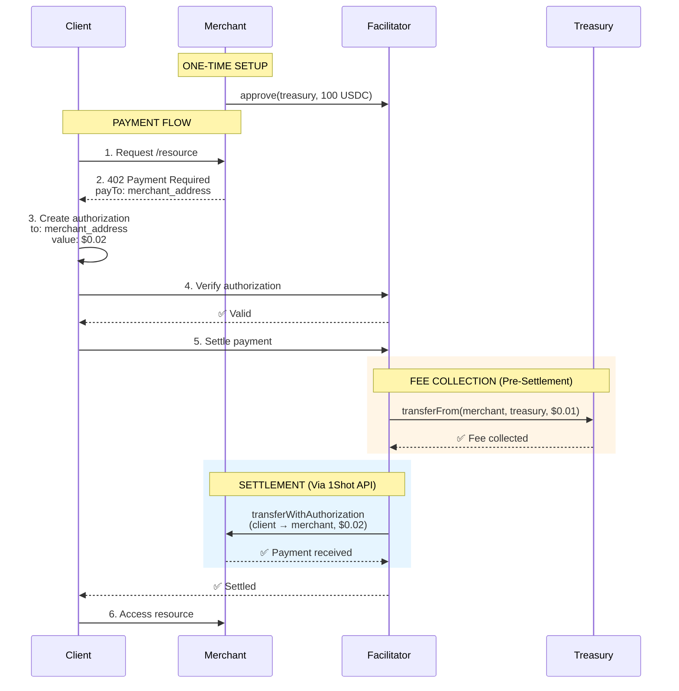

## Overview

0xmeta uses **post-settlement fee collection** to maintain x402's core principle: **trust minimization**. Customer funds flow directly to merchants—never through the facilitator. Fees are collected separately via standard ERC-20 approval patterns.

<Note>
**Trust-Minimized:** Customer payments go DIRECTLY to merchants. The facilitator never touches customer funds and cannot redirect payments.
</Note>

---

## Payment Architecture

### Trust-Minimized Flow



**Key Principle:** Customer funds (blue) go DIRECTLY to merchant. Fee (orange) collected separately from merchant's pre-approved balance.

---

## Why This Architecture?

### x402 Trust-Minimization Requirement

**From x402 specification:**
> "The facilitator must never have custody or control over customer payments. All funds must flow directly from payer to payee."

**Previous approach (REJECTED):**
```
❌ Client → Treasury → Merchant
   Problem: Facilitator custody = trust required
```

**Current approach (APPROVED):**
```
✅ Client → Merchant (direct payment)
✅ Merchant → Treasury (fee only, via approval)
   Solution: No facilitator custody = trust-minimized
```

### ERC-20 Approval Pattern

Standard pattern used across DeFi:

```solidity
// Merchant approves facilitator (one-time)
USDC.approve(facilitatorTreasury, 100 * 10^6); // 100 USDC

// Later, facilitator collects fee
USDC.transferFrom(merchant, treasury, 0.01 * 10^6); // $0.01
```

**Benefits:**
- ✅ Standard ERC-20 pattern (well understood)
- ✅ Merchant controls via approval amount
- ✅ Auditable on-chain
- ✅ Can revoke anytime (settlements will fail)

---

## Payment Flow Details

### Step 1: One-Time Merchant Approval

Merchant approves facilitator treasury for USDC spending:

```bash
# Using provided script
EVM_PRIVATE_KEY=0x... node approve-facilitator.mjs

# Or manually via contract interaction
usdc.approve(
  "0x5D791e3554D0e83f171126905Bda1640Bf6f9A8B", // Treasury
  ethers.parseUnits("100", 6) // 100 USDC = 10,000 settlements
)
```

**Approval amount = settlements * $0.01**

Example: 100 USDC approval = 10,000 settlements

### Step 2: Client Requests Resource

Client makes GET request to protected endpoint:

```bash
GET /premium-content HTTP/1.1
Host: merchant.com
```

### Step 3: Merchant Returns 402

Server responds with payment requirements:

```json
HTTP/1.1 402 Payment Required
x402-accept: exact;price="$0.02";network="eip155:8453";payto="0xMERCHANT"

{
  "scheme": "exact",
  "price": "$0.02",
  "network": "eip155:8453",
  "payTo": "0xA821f428Ef8cC9f54A9915336A82220853059090" // ← Merchant address
}
```

**Critical:** `payTo` must be merchant address, NOT treasury.

### Step 4: Client Creates Authorization

Client signs EIP-3009 authorization to merchant:

```javascript
const authorization = {
  from: clientAddress,
  to: merchantAddress,    // ← MERCHANT, not treasury
  value: "20000",         // $0.02 USDC (6 decimals)
  validAfter: "0",
  validBefore: "1735689600",
  nonce: randomNonce(),
  token: "0x833589fCD6eDb6E08f4c7C32D4f71b54bdA02913" // USDC
};

const signature = await signTypedData(authorization);
```

### Step 5: Facilitator Verification

Facilitator validates authorization cryptographically:

```python
# Verify signature
recovered_address = recover_signer(authorization, signature)
assert recovered_address == authorization['from'], "Invalid signature"

# Verify recipient
assert authorization['to'] == merchant_address, "Must pay to merchant"

# Verify amount
assert authorization['value'] == expected_amount, "Amount mismatch"

# Return verification_id
```

### Step 6: Fee Collection (Pre-Settlement)

**Before executing customer payment**, facilitator collects fee:

```python
# Check merchant allowance
allowance = usdc.allowance(merchant, treasury)
required = 10000  # $0.01 in wei

if allowance < required:
    raise InsufficientAllowanceError(
        f"Merchant must approve {required} wei ($0.01). "
        f"Run: node approve-facilitator.mjs"
    )

# Collect fee
fee_tx = usdc.transferFrom(
    from_=merchant,
    to=treasury,
    value=required
)

# Wait for confirmation
receipt = wait_for_transaction(fee_tx)
assert receipt.status == 1, "Fee collection failed"
```

**If fee collection fails, settlement is blocked.**

This guarantees the facilitator never provides free service.

### Step 7: Settlement Execution

After fee collected, execute customer → merchant payment:

```python
# Execute via 1Shot API
settlement_response = oneshot_api.execute_settlement(
    authorization=authorization,
    signature=signature
)

# Customer → Merchant payment executed on-chain
# Merchant receives 100% of customer payment
```

---

## Trust Model

### What Merchants Trust

✅ **Customer payments arrive directly**
- EIP-3009 authorization cryptographically bound to merchant address
- Facilitator cannot redirect customer funds
- 100% of customer payment received

✅ **Fee collection is explicit and controllable**
- Standard ERC-20 approval (revocable anytime)
- Exact fee amount known upfront ($0.01)
- On-chain auditable

✅ **No custody risk**
- Facilitator never holds customer funds
- Settlement executes customer → merchant directly

### What Merchants Don't Need to Trust

❌ **Facilitator custody**
- Never happens (funds go direct to merchant)

❌ **Fee calculation**
- Flat $0.01, no dynamic pricing or hidden fees

❌ **Arbitrary fund movement**
- Approval limits what facilitator can collect

---

## Security Considerations

### Approval Safety

**Merchant controls:**

1. **Approval amount** - Decide how many settlements to fund
2. **Revocation** - Can revoke approval anytime via:
   ```javascript
   usdc.approve(treasury, 0) // Revoke all access
   ```
3. **Monitoring** - Check remaining allowance:
   ```bash
   node check-allowance.mjs
   ```

**Attack scenarios:**

| Scenario | Protection |
|----------|------------|
| Facilitator drains entire USDC balance | ❌ Impossible - only approved amount accessible |
| Facilitator collects more than $0.01 | ❌ Blocked by smart contract (exact amount hardcoded) |
| Facilitator redirects customer funds | ❌ Impossible - EIP-3009 signature bound to merchant |
| Merchant has insufficient approval | ✅ Settlement fails, customer not charged |

### Settlement Atomicity

**Pre-settlement fee collection ensures:**

1. Fee collected FIRST
2. If fee fails → settlement blocked
3. If settlement fails → fee already collected (payment for attempt)

**Trade-off:** Merchant pays fee even if settlement fails after fee collection.

**Rationale:** Prevents free service exploitation. Merchants can monitor and reduce approval if concerned.

---

## Comparison: Old vs New

| Aspect | Treasury-First (Old) | Post-Settlement (New) |
|--------|---------------------|---------------------|
| **Customer payment** | → Treasury → Merchant | → Merchant (direct) ✅ |
| **Fee collection** | Atomic split | Post-settlement via transferFrom ✅ |
| **Trust required** | High (custody) | Minimal (approval only) ✅ |
| **x402 compliant** | ❌ No | ✅ Yes |
| **Merchant setup** | None | One-time approval |
| **Revocability** | Not applicable | Standard ERC-20 revoke ✅ |

---

## Implementation Details

### On-Chain Transactions

**Setup (One-Time):**
```
Merchant → USDC.approve(treasury, 100 USDC)
Gas cost: ~50,000 gas (~$0.50 on Base)
```

**Per Settlement:**
```
1. Facilitator → USDC.transferFrom(merchant, treasury, $0.01)
   Gas: Paid by facilitator
   
2. Facilitator → 1Shot.executeSettlement(authorization, signature)
   Result: Client → Merchant ($0.02)
   Gas: Paid by 1Shot
```

**Total merchant gas cost: $0** (after initial approval)

### Error Handling

**Insufficient Allowance:**
```json
{
  "error": {
    "code": "insufficient_allowance",
    "message": "Merchant must approve facilitator for USDC spending",
    "details": {
      "required": "10000",
      "available": "0",
      "approval_command": "node approve-facilitator.mjs"
    }
  }
}
```

**Fee Collection Failed:**
```json
{
  "error": {
    "code": "fee_collection_failed",
    "message": "Could not collect $0.01 fee from merchant",
    "details": {
      "reason": "Insufficient USDC balance",
      "merchant_balance": "0"
    }
  }
}
```

---

## Alternatives Considered

### 1. Smart Contract Atomic Split

```solidity
contract AtomicSplit {
    function splitPayment(
        address merchant,
        address treasury,
        uint256 totalAmount
    ) external {
        usdc.transferFrom(msg.sender, merchant, totalAmount - fee);
        usdc.transferFrom(msg.sender, treasury, fee);
    }
}
```

**Why rejected:**
- ❌ Requires custom smart contract deployment
- ❌ Higher gas costs (contract interaction)
- ❌ Still requires customer to authorize contract (not direct to merchant)
- ❌ Violates trust-minimization (contract has custody)

### 2. Merchant Voluntary Fee Payment

Merchant manually pays fees after receiving customer payment.

**Why rejected:**
- ❌ Merchants can skip payment (free service)
- ❌ No enforcement mechanism
- ❌ Unsustainable business model

### 3. Treasury-First (Original)

See [discussion above](#comparison-old-vs-new).

**Why rejected:**
- ❌ Violates x402 trust-minimization
- ❌ Facilitator custody of customer funds
- ❌ Rejected by Coinbase x402 ecosystem

---

## Monitoring & Operations

### Check Allowance

Merchants can monitor remaining allowance:

```bash
node check-allowance.mjs

Output:
📍 Base Mainnet
   USDC Balance: 500.00 USDC
   Fee Allowance: 95.50 USDC
   Settlements: 9,550
   ✅ Good
```

### Top Up Allowance

When allowance runs low:

```bash
# Approve additional 100 USDC
node approve-facilitator.mjs
```

### Revoke Access

To stop allowing settlements:

```bash
# Set allowance to 0
APPROVAL_AMOUNT=0 node approve-facilitator.mjs
```

**Effect:** All future settlements will fail with `insufficient_allowance` error.

---

## Best Practices

<AccordionGroup>
  <Accordion title="Approve Reasonable Amounts">
    **Recommended:** 100-1000 USDC (10,000-100,000 settlements)
    
    **Avoid:** Infinite approval (max uint256)
    
    **Why:** Limits exposure if facilitator compromised
  </Accordion>

  <Accordion title="Monitor Allowance">
    Set up alerts when allowance drops below threshold:
    
    ```javascript
    const allowance = await checkAllowance();
    if (allowance.settlements < 100) {
      alert("Low allowance - top up soon");
    }
    ```
  </Accordion>

  <Accordion title="Test on Sepolia First">
    Always test approval and settlements on Base Sepolia before mainnet:
    
    ```bash
    NETWORK=sepolia node approve-facilitator.mjs
    ```
  </Accordion>

  <Accordion title="Maintain USDC Balance">
    Ensure merchant address has USDC for fee payment:
    
    - Minimum: 1 USDC (100 settlements)
    - Recommended: Match approval amount
  </Accordion>
</AccordionGroup>

---

## FAQ

<AccordionGroup>
  <Accordion title="Why not collect fee from customer?">
    **Technical:** EIP-3009 signatures are bound to exact recipient and amount. Can't split payment atomically.
    
    **Principle:** x402 requires customer pays merchant directly (trust-minimization).
    
    **Solution:** Merchant pays facilitator fee separately (standard approval pattern).
  </Accordion>

  <Accordion title="What if I revoke approval mid-settlement?">
    Settlement will fail with `insufficient_allowance` error. Customer won't be charged.
  </Accordion>

  <Accordion title="Can facilitator drain my USDC balance?">
    **No.** Facilitator can only access approved amount. Approve 100 USDC → max loss is 100 USDC.
  </Accordion>

  <Accordion title="What if settlement fails after fee collected?">
    You paid $0.01 for the settlement attempt. Facilitator keeps fee (payment for service rendered).
    
    **Why:** Prevents free service exploitation via intentional settlement failures.
  </Accordion>

  <Accordion title="How is this different from Stripe?">
    **Stripe:** Holds customer funds, takes 2.9% + $0.30 (custody model)
    
    **0xmeta:** Direct customer → merchant, $0.01 fee via approval (trust-minimized)
  </Accordion>
</AccordionGroup>

---

## Next Steps

<CardGroup cols={2}>
  <Card title="Approve Facilitator" icon="check" href="/guides/getting-started#step-1-approve-facilitator">
    Set up one-time USDC approval
  </Card>
  
  <Card title="Server Integration" icon="code" href="/integration/nodejs">
    Add x402 middleware to your app
  </Card>
  
  <Card title="Test Settlement" icon="flask" href="/guides/getting-started#step-3-test-payment">
    Complete end-to-end payment flow
  </Card>
  
  <Card title="Monitor Allowance" icon="chart-line" href="#monitoring--operations">
    Track remaining settlements
  </Card>
</CardGroup>

<Check>
**Trust-Minimized:** Customer funds go DIRECTLY to merchants. Facilitator collects fee separately via standard ERC-20 approval. No custody, no redirection, fully auditable.
</Check>