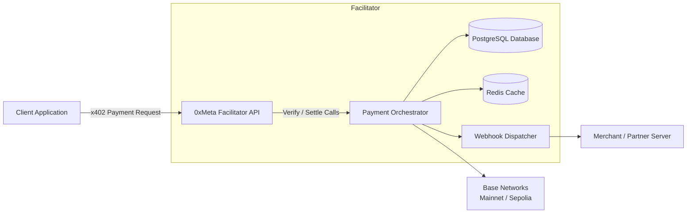

## 0xMeta Architecture Overview

```mermaid
flowchart LR
    Client[Client Application] -->|x402 Payment Request| API[0xMeta Facilitator API]
    API -->|Verify / Settle Calls| Core[Payment Orchestrator]
    Core --> DB[(PostgreSQL Database)]
    Core --> Cache[(Redis Cache)]
    Core --> Blockchain[Base Networks<br/>Mainnet / Sepolia]
    Core --> WebhookSvc[Webhook Dispatcher]
    WebhookSvc --> ExternalService[Merchant / Partner Server]
    subgraph Facilitator
        API
        Core
        WebhookSvc
        DB
        Cache
    end
```
