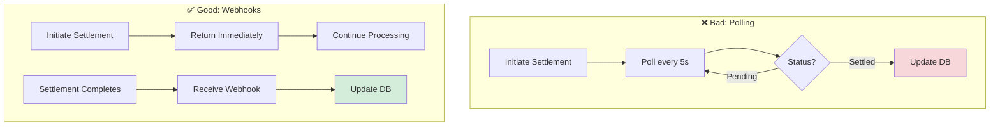

## Core Principles

0xmeta.ai is designed to be simple, but following these practices ensures reliability:

<CardGroup cols={2}>
  <Card title="Use Idempotency" icon="arrows-rotate">
    Always use idempotency keys for safety
  </Card>
  <Card title="Handle Webhooks" icon="webhook">
    Don't poll - use webhooks for updates
  </Card>
  <Card title="Validate Amounts" icon="calculator">
    Double-check amounts before settlement
  </Card>
  <Card title="Monitor Errors" icon="chart-line">
    Track and alert on failures
  </Card>
</CardGroup>

## 1. Idempotency is Critical

**Why**: Network issues can cause retries. Without idempotency, you might create duplicate verifications.

<CodeGroup>

```javascript Good Practice
// Generate unique key per operation
const idempotencyKey = `order_${orderId}_${Date.now()}`;

const response = await fetch("https://facilitator.api.0xmeta.ai/v1/verify", {
  method: "POST",
  headers: {
    "Content-Type": "application/json",
    "Idempotency-Key": idempotencyKey, // Always include!
  },
  body: JSON.stringify(data),
});
```

```javascript Bad Practice
// No idempotency key - dangerous!
const response = await fetch("https://facilitator.api.0xmeta.ai/v1/verify", {
  method: "POST",
  headers: {
    "Content-Type": "application/json",
    // Missing Idempotency-Key ❌
  },
  body: JSON.stringify(data),
});
```

</CodeGroup>

## 2. Webhook-First Architecture

**Why**: Polling wastes resources and adds latency. Webhooks are instant and efficient.



<CodeGroup>

```javascript Good: Webhook Handler
// Set webhook URL during verification
const verifyData = {
  transaction_hash: txHash,
  chain: "base",
  seller_address: sellerAddress,
  expected_amount: amount,
  webhook_url: "https://your-app.com/webhooks/settlement", // ✅
};

// Webhook endpoint
app.post("/webhooks/settlement", async (req, res) => {
  // Verify signature
  if (!verifySignature(req.body, req.headers["x-webhook-signature"])) {
    return res.status(401).send();
  }

  // Acknowledge immediately
  res.status(200).json({ received: true });

  // Process asynchronously
  await processSettlement(req.body);
});
```

```javascript Bad: Polling
// Don't do this! ❌
async function waitForSettlement(settlementId) {
  while (true) {
    const status = await fetch(
      `https://facilitator.api.0xmeta.ai/v1/settlements/${settlementId}`
    );

    const data = await status.json();

    if (data.status === "settled") {
      return data;
    }

    await delay(5000); // Wasteful polling!
  }
}
```

</CodeGroup>

## 3. Amount Validation

**Why**: Blockchain amounts are in wei. Always validate before settlement.

```javascript
// Convert and validate amounts
function validateAmount(humanAmount, decimals = 18) {
  // Parse human-readable amount
  const amount = parseFloat(humanAmount);

  if (isNaN(amount) || amount <= 0) {
    throw new Error("Invalid amount");
  }

  // Convert to wei (or token's smallest unit)
  const weiAmount = BigInt(Math.floor(amount * Math.pow(10, decimals)));

  // Return as string (JSON safe)
  return weiAmount.toString();
}

// Usage
const expectedAmount = validateAmount("1.5", 18); // "1500000000000000000"

// Verify payment
const response = await fetch("https://facilitator.api.0xmeta.ai/v1/verify", {
  method: "POST",
  body: JSON.stringify({
    transaction_hash: txHash,
    expected_amount: expectedAmount, // Validated amount
    // ...
  }),
});
```

## 4. Error Handling & Retries

**Why**: Networks fail. Handle errors gracefully with exponential backoff.

```javascript
async function verifyWithRetry(data, maxRetries = 3) {
  const idempotencyKey = `verify_${data.orderId}_${Date.now()}`;

  for (let attempt = 0; attempt < maxRetries; attempt++) {
    try {
      const response = await fetch(
        "https://facilitator.api.0xmeta.ai/v1/verify",
        {
          method: "POST",
          headers: {
            "Content-Type": "application/json",
            "Idempotency-Key": idempotencyKey, // Same key for retries
          },
          body: JSON.stringify(data),
        }
      );

      if (!response.ok) {
        const error = await response.json();

        // Don't retry on client errors (4xx)
        if (response.status >= 400 && response.status < 500) {
          throw new Error(error.error.message);
        }

        // Retry on server errors (5xx)
        if (attempt < maxRetries - 1) {
          const delay = Math.pow(2, attempt) * 1000; // 1s, 2s, 4s
          await new Promise((resolve) => setTimeout(resolve, delay));
          continue;
        }
      }

      return await response.json();
    } catch (error) {
      if (attempt === maxRetries - 1) {
        throw error;
      }
    }
  }
}
```

## 5. Store Everything

**Why**: You need audit trails and recovery options.

```javascript
async function verifyAndStore(orderId, txHash, amount) {
  // Generate idempotency key
  const idempotencyKey = `order_${orderId}_verify`;

  // Store pending state
  await db.orders.update({
    orderId,
    status: "verifying",
    idempotencyKey,
    txHash,
    timestamp: new Date(),
  });

  try {
    // Verify payment
    const result = await fetch("https://facilitator.api.0xmeta.ai/v1/verify", {
      method: "POST",
      headers: {
        "Idempotency-Key": idempotencyKey,
      },
      body: JSON.stringify({
        transaction_hash: txHash,
        expected_amount: amount,
        // ...
      }),
    });

    const data = await result.json();

    // Store verification result
    await db.orders.update({
      orderId,
      status: "verified",
      verificationId: data.verification_id,
      verifiedAt: new Date(),
    });

    return data;
  } catch (error) {
    // Store error
    await db.orders.update({
      orderId,
      status: "verification_failed",
      error: error.message,
    });

    throw error;
  }
}
```

## 6. Webhook Security

**Why**: Anyone can POST to your endpoint. Verify signatures!

```javascript
import crypto from "crypto";

function verifyWebhookSignature(payload, signature, secret) {
  // Serialize payload (same way 0xmeta.ai does)
  const payloadStr = JSON.stringify(payload, Object.keys(payload).sort());

  // Compute expected signature
  const expected = crypto
    .createHmac("sha256", secret)
    .update(payloadStr)
    .digest("hex");

  // Constant-time comparison
  return crypto.timingSafeEqual(Buffer.from(signature), Buffer.from(expected));
}

app.post("/webhooks/settlement", (req, res) => {
  const signature = req.headers["x-webhook-signature"];
  const payload = req.body;

  // Verify signature FIRST
  if (!verifyWebhookSignature(payload, signature, WEBHOOK_SECRET)) {
    console.error("Invalid webhook signature!");
    return res.status(401).json({ error: "Invalid signature" });
  }

  // Now process webhook
  processSettlement(payload);

  // Acknowledge immediately
  res.status(200).json({ received: true });
});
```

## 7. Monitor & Alert

**Why**: Know when things break before your users complain.

```javascript
// Track metrics
const metrics = {
  verifications: {
    total: 0,
    successful: 0,
    failed: 0,
  },
  settlements: {
    total: 0,
    successful: 0,
    failed: 0,
  },
};

async function verifyWithMonitoring(data) {
  metrics.verifications.total++;

  try {
    const result = await fetch("https://facilitator.api.0xmeta.ai/v1/verify", {
      /* ... */
    });

    if (result.ok) {
      metrics.verifications.successful++;
    } else {
      metrics.verifications.failed++;

      // Alert if failure rate > 5%
      const failureRate =
        metrics.verifications.failed / metrics.verifications.total;
      if (failureRate > 0.05) {
        await alertTeam("High verification failure rate: " + failureRate);
      }
    }

    return result;
  } catch (error) {
    metrics.verifications.failed++;
    throw error;
  }
}
```

## 8. Testing Strategy

```javascript
// Use testnet for development
const config = {
  development: {
    chain: "base-sepolia", // Testnet
    sellerAddress: process.env.DEV_ADDRESS,
  },
  production: {
    chain: "base", // Mainnet
    sellerAddress: process.env.PROD_ADDRESS,
  },
};

const env = process.env.NODE_ENV || "development";
const { chain, sellerAddress } = config[env];
```

## 9. Rate Limiting

**Why**: Protect your application from abuse.

```javascript
import rateLimit from "express-rate-limit";

// Limit verification requests
const verifyLimiter = rateLimit({
  windowMs: 60 * 1000, // 1 minute
  max: 100, // 100 requests per minute
  message: "Too many verification requests",
});

app.post("/api/verify", verifyLimiter, async (req, res) => {
  // Handle verification
});
```

## 10. Documentation for Your Team

```javascript
/**
 * Verify a blockchain payment
 *
 * @param {string} txHash - Transaction hash (0x...)
 * @param {string} amount - Amount in wei as string
 * @param {string} orderId - Your internal order ID
 * @returns {Promise<{verification_id: string, status: string}>}
 *
 * @example
 * const result = await verifyPayment(
 *   '0x123...',
 *   '1000000000000000000',
 *   'ORDER-123'
 * );
 * console.log(result.verification_id);
 */
async function verifyPayment(txHash, amount, orderId) {
  // Implementation
}
```

## Production Checklist

<Steps>
  <Step title="Idempotency Keys">
    ✅ Using unique keys for all operations
    
    ✅ Keys include order/user context
    
    ✅ Same key used on retries
  </Step>

{" "}

<Step title="Webhooks">
  ✅ Webhook URL configured ✅ HTTPS endpoint (not HTTP) ✅ Signature
  verification implemented ✅ Returns 200 quickly ✅ Processes async
</Step>

{" "}

<Step title="Error Handling">
  ✅ Retry logic with exponential backoff ✅ Don't retry 4xx errors ✅ Log all
  errors ✅ Alert on high failure rates
</Step>

{" "}

<Step title="Monitoring">
  ✅ Track success/failure rates ✅ Monitor response times ✅ Alert on anomalies
  ✅ Dashboard for key metrics
</Step>

  <Step title="Data Storage">
    ✅ Store all verification IDs
    
    ✅ Store idempotency keys
    
    ✅ Audit trail complete
    
    ✅ Can recover from failures
  </Step>
</Steps>

## Summary

The three most important practices:

1. **Always use idempotency keys** - Prevents duplicates
2. **Always use webhooks** - Better than polling
3. **Always verify webhook signatures** - Security

Follow these, and you'll have a robust, production-ready integration!
/pricing#payment-verification
