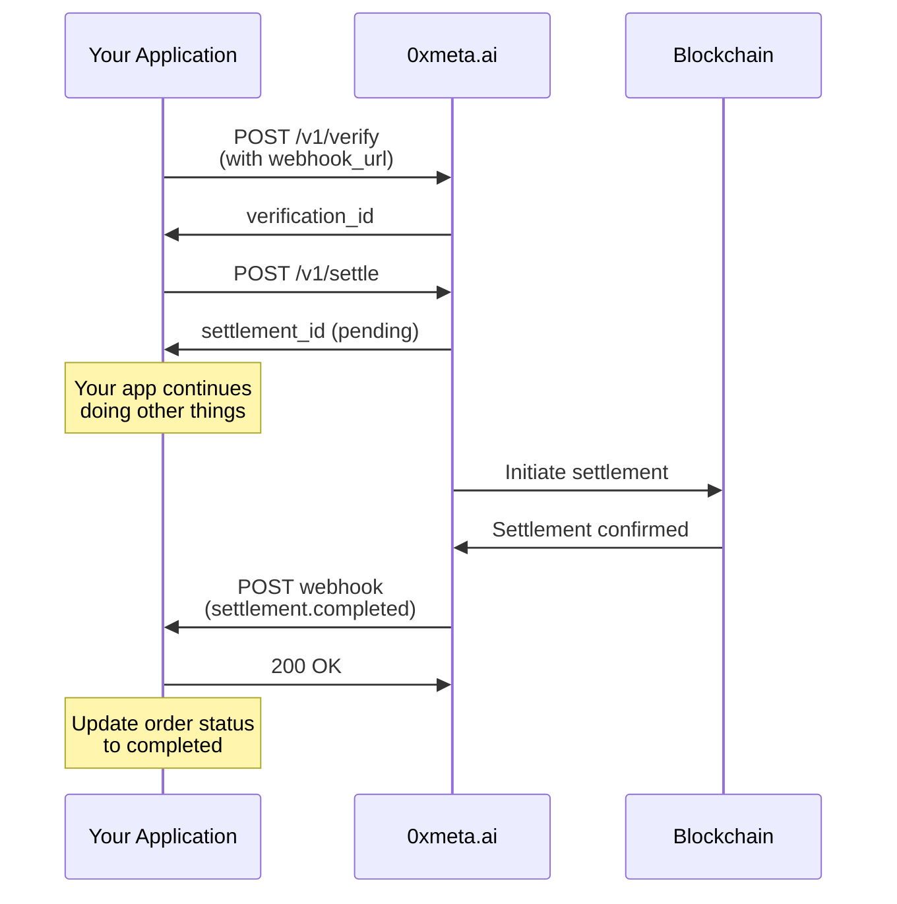

## Why Webhooks?

Webhooks are **essential** for production applications because:

<CardGroup cols={2}>
  <Card title="No Polling" icon="bolt">
    Get instant notifications instead of checking every few seconds
  </Card>
  <Card title="Efficient" icon="gauge">
    Save bandwidth and reduce server load
  </Card>
  <Card title="Real-time" icon="clock">
    Know immediately when settlement completes
  </Card>
  <Card title="Reliable" icon="shield-check">
    Automatic retries if your endpoint is down
  </Card>
</CardGroup>

## How Webhooks Work



## Step 1: Provide Webhook URL

Include `webhook_url` when verifying payment:

```javascript
const response = await fetch("https://facilitator.api.0xmeta.ai/v1/verify", {
  method: "POST",
  headers: {
    "Content-Type": "application/json",
    "Idempotency-Key": `verify_${orderId}`,
  },
  body: JSON.stringify({
    transaction_hash: txHash,
    chain: "base",
    seller_address: sellerAddress,
    expected_amount: amount,
    webhook_url: "https://your-app.com/webhooks/settlement", // Add this!
  }),
});
```

## Step 2: Create Webhook Endpoint

<CodeGroup>

```javascript Node.js + Express
import express from "express";
import crypto from "crypto";

const app = express();
app.use(express.json());

// Webhook endpoint
app.post("/webhooks/settlement", (req, res) => {
  const signature = req.headers["x-webhook-signature"];
  const payload = req.body;

  // 1. Verify signature FIRST
  if (!verifySignature(payload, signature)) {
    console.error("Invalid webhook signature");
    return res.status(401).json({ error: "Invalid signature" });
  }

  // 2. Acknowledge receipt immediately
  res.status(200).json({ received: true });

  // 3. Process webhook asynchronously
  processWebhook(payload).catch(console.error);
});

function verifySignature(payload, signature) {
  // Get from environment
  const secret = process.env.WEBHOOK_SECRET;

  // Serialize payload (same way 0xmeta.ai does)
  const payloadStr = JSON.stringify(payload, Object.keys(payload).sort());

  // Compute expected signature
  const expected = crypto
    .createHmac("sha256", secret)
    .update(payloadStr)
    .digest("hex");

  // Constant-time comparison
  return crypto.timingSafeEqual(Buffer.from(signature), Buffer.from(expected));
}

async function processWebhook(payload) {
  const { event_type, settlement_id, status, data } = payload;

  if (event_type === "settlement.completed" && status === "settled") {
    // Update order in database
    await db.orders.update({
      where: { settlement_id },
      data: {
        status: "completed",
        settlement_tx_hash: data.settlement_tx_hash,
        settled_at: new Date(),
      },
    });

    // Send confirmation email
    await sendConfirmationEmail(settlement_id);

    console.log("Settlement completed:", settlement_id);
  }
}

app.listen(3000);
```

```python Python + Flask
from flask import Flask, request, jsonify
import hmac
import hashlib
import json

app = Flask(__name__)

@app.route('/webhooks/settlement', methods=['POST'])
def handle_webhook():
    signature = request.headers.get('X-Webhook-Signature')
    payload = request.json

    # 1. Verify signature FIRST
    if not verify_signature(payload, signature):
        print('Invalid webhook signature')
        return jsonify({'error': 'Invalid signature'}), 401

    # 2. Acknowledge receipt immediately
    response = jsonify({'received': True})

    # 3. Process webhook asynchronously
    process_webhook(payload)

    return response, 200

def verify_signature(payload, signature):
    # Get from environment
    import os
    secret = os.environ['WEBHOOK_SECRET']

    # Serialize payload
    payload_str = json.dumps(payload, sort_keys=True, separators=(',', ':'))

    # Compute expected signature
    expected = hmac.new(
        secret.encode('utf-8'),
        payload_str.encode('utf-8'),
        hashlib.sha256
    ).hexdigest()

    # Constant-time comparison
    return hmac.compare_digest(expected, signature)

def process_webhook(payload):
    event_type = payload.get('event_type')
    settlement_id = payload.get('settlement_id')
    status = payload.get('status')
    data = payload.get('data', {})

    if event_type == 'settlement.completed' and status == 'settled':
        # Update order in database
        db.orders.update(
            {'settlement_id': settlement_id},
            {
                'status': 'completed',
                'settlement_tx_hash': data.get('settlement_tx_hash'),
                'settled_at': datetime.now()
            }
        )

        # Send confirmation
        send_confirmation_email(settlement_id)

        print(f'Settlement completed: {settlement_id}')

if __name__ == '__main__':
    app.run(port=3000)
```

</CodeGroup>

## Step 3: Test Locally with ngrok

```bash
# Install ngrok
npm install -g ngrok

# Start your server
node server.js  # Port 3000

# In another terminal, start ngrok
ngrok http 3000

# Output will show:
# Forwarding: https://abc123.ngrok.io -> http://localhost:3000

# Use the ngrok URL in your API request
{
  "webhook_url": "https://abc123.ngrok.io/webhooks/settlement"
}
```

## Webhook Payload

When settlement completes, you'll receive:

```json
{
  "event_type": "settlement.completed",
  "event_id": "evt_abc123def456",
  "timestamp": "2025-01-15T10:35:00Z",
  "verification_id": "ver_abc123",
  "settlement_id": "set_xyz789",
  "status": "settled",
  "data": {
    "settlement_tx_hash": "0xabcdef...",
    "settled_amount": "1000000000000000000",
    "fee": "50000000000000000"
  },
  "signature": "hmac_sha256_signature_here"
}
```

## Event Types

| Event Type               | Description            | When              |
| ------------------------ | ---------------------- | ----------------- |
| `verification.completed` | Verification succeeded | Payment verified  |
| `verification.failed`    | Verification failed    | Invalid payment   |
| `settlement.completed`   | Settlement succeeded   | Funds transferred |
| `settlement.rejected`    | Settlement rejected    | Settlement failed |

## Security Checklist

<Steps>
  <Step title="Verify Signatures">
    **ALWAYS** verify the HMAC signature before processing
    
    ```javascript
    if (!verifySignature(payload, signature)) {
      return res.status(401).send();
    }
    ```
  </Step>

{" "}
<Step title="Use HTTPS">
  Webhook URLs must use HTTPS in production ❌ `http://your-app.com/webhooks` ✅
  `https://your-app.com/webhooks`
</Step>

  <Step title="Return 200 Quickly">
    Acknowledge receipt within 5 seconds
    
    ```javascript
    // Do this ✅
    res.status(200).json({ received: true });
    processWebhook(payload);  // Async
    
    // Not this ❌
    await longRunningProcess();  // Takes 30s
    res.status(200).send();
    ```
  </Step>

  <Step title="Handle Idempotency">
    Store event IDs to prevent duplicate processing
    
    ```javascript
    const processedEvents = new Set();
    
    if (processedEvents.has(payload.event_id)) {
      return res.status(200).json({ received: true });
    }
    
    processedEvents.add(payload.event_id);
    processWebhook(payload);
    ```
  </Step>
</Steps>

## Retry Logic

If your endpoint fails, 0xmeta.ai retries with exponential backoff:

| Attempt | Delay      |
| ------- | ---------- |
| 1       | Immediate  |
| 2       | 1 minute   |
| 3       | 5 minutes  |
| 4       | 15 minutes |
| 5       | 30 minutes |
| 6       | 1 hour     |

After 6 attempts, webhook is marked as failed.

## Production Deployment

### 1. Environment Variables

```bash
# .env
WEBHOOK_SECRET=your_webhook_secret_here
WEBHOOK_URL=https://your-app.com/webhooks/settlement
```

### 2. Load Balancer Configuration

If behind a load balancer, ensure:

- Timeout is > 10 seconds
- Keep-alive enabled
- Proper header forwarding

### 3. Monitor Webhooks

```javascript
// Log all webhook deliveries
app.post("/webhooks/settlement", (req, res) => {
  console.log("Webhook received:", {
    event_id: req.body.event_id,
    event_type: req.body.event_type,
    timestamp: new Date(),
  });

  // ... verify and process
});

// Alert on failures
if (failedWebhooks > 5) {
  await alertTeam("Multiple webhook failures detected");
}
```

## Common Issues

<AccordionGroup>
  <Accordion title="Webhook not received">
    **Check**:
    1. Is URL accessible? `curl -X POST https://your-url/webhooks`
    2. Is it HTTPS? (required in production)
    3. Is firewall blocking?
    4. Check webhook logs in dashboard (if available)
  </Accordion>

{" "}
<Accordion title="Signature verification fails">
  **Fix**: 1. Ensure you're using correct secret 2. Serialize payload the same
  way (sorted keys, no spaces) 3. Use constant-time comparison 4. Check for
  encoding issues
</Accordion>

{" "}
<Accordion title="Timeout errors">
  **Fix**: 1. Return 200 immediately 2. Process async 3. Don't do long
  operations in webhook handler
</Accordion>

  <Accordion title="Duplicate processing">
    **Fix**:
    ```javascript
    // Store event IDs
    const processed = await db.webhook_events.findOne({
      event_id: payload.event_id
    });
    
    if (processed) {
      return res.status(200).json({ received: true });
    }
    ```
  </Accordion>
</AccordionGroup>

## Testing Checklist

- [ ] Webhook URL accessible via HTTPS
- [ ] Signature verification working
- [ ] Returns 200 within 5 seconds
- [ ] Processes webhooks asynchronously
- [ ] Handles duplicate event IDs
- [ ] Logs all webhook deliveries
- [ ] Alerts on failures

<Warning>
  Never skip signature verification! Anyone can POST to your webhook URL.
</Warning>

<Tip>
  Use webhooks instead of polling for 100x better performance and user
  experience.
</Tip>
