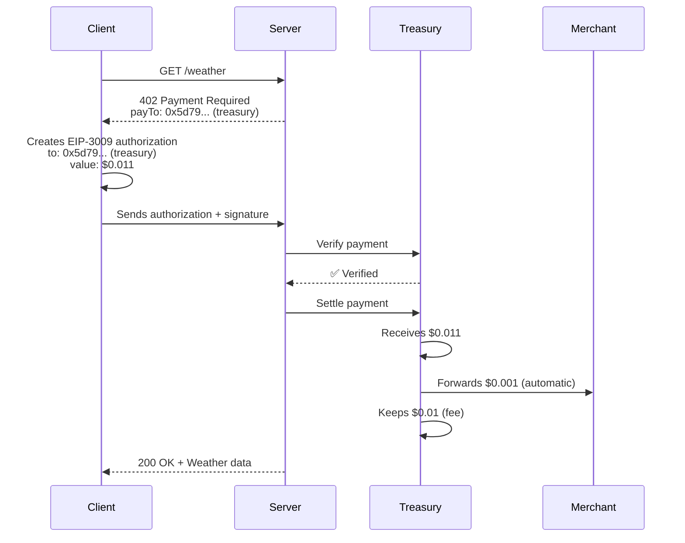

## Overview

0xmeta is an **x402-compliant payment facilitator** that enables gasless payments on Base networks using EIP-3009 transferWithAuthorization.

<Note>
**Treasury-First Architecture:** Payments flow through 0xmeta's treasury for automatic fee collection, then forward to your merchant address. No USDC approvals needed!
</Note>

## What You Need

<Steps>
  <Step title="Your Merchant Address">
    An Ethereum address where you'll receive payments (after fees)
  </Step>
  
  <Step title="Treasury Address">
    0xmeta's treasury address from `/supported` endpoint
    
    **For Base Sepolia:** `0x5d791e3554d0e83f171126905bda1640bf6f9a8b`
  </Step>
  
  <Step title="x402 Express SDK">
    Install the x402 express middleware for your server
    
    ```bash
    npm install @x402/express @x402/evm @x402/core
    ```
  </Step>
</Steps>

---

## Step 1: Get Treasury Address

Query the facilitator to get the treasury address:

```bash
curl https://facilitator.0xmeta.ai/v1/supported
```

**Response:**
```json
{
  "kinds": [
    { "x402Version": 2, "scheme": "exact", "network": "eip155:84532" },
    { "x402Version": 2, "scheme": "exact", "network": "eip155:8453" },
    { "x402Version": 1, "scheme": "exact", "network": "base-sepolia" },
    { "x402Version": 1, "scheme": "exact", "network": "base" }
  ],
  "signers": {
    "eip155:*": ["0x5d791e3554d0e83f171126905bda1640bf6f9a8b"]
  }
}
```

✅ **Use the address from `signers["eip155:*"][0]`** as your `EVM_ADDRESS` (NOT your merchant address!)

---

## Step 2: Setup Server (x402 v2)

<CodeGroup>

```typescript server.ts
import { config } from "dotenv";
import express from "express";
import { paymentMiddleware, x402ResourceServer } from "@x402/express";
import { ExactEvmScheme } from "@x402/evm/exact/server";
import { HTTPFacilitatorClient } from "@x402/core/server";

config();

// ✅ CRITICAL: Use treasury address from /supported endpoint
const evmAddress = process.env.EVM_ADDRESS as `0x${string}`;

if (!evmAddress) {
  console.error("Missing EVM_ADDRESS (treasury address from /supported)");
  process.exit(1);
}

const facilitatorUrl = process.env.FACILITATOR_URL;
if (!facilitatorUrl) {
  console.error("❌ FACILITATOR_URL environment variable is required");
  process.exit(1);
}

const facilitatorClient = new HTTPFacilitatorClient({ url: facilitatorUrl });
const app = express();

app.use(
  paymentMiddleware(
    {
      "GET /weather": {
        accepts: [
          {
            scheme: "exact",
            price: "$0.011",              // Your price + $0.01 fee
            network: "eip155:84532",      // Base Sepolia (CAIP-2 format)
            payTo: evmAddress,            // ✅ Treasury address
          },
        ],
        description: "Weather data",
        mimeType: "application/json",
      },
    },
    new x402ResourceServer(facilitatorClient)
      .register("eip155:84532", new ExactEvmScheme()),
  ),
);

app.get("/weather", (req, res) => {
  res.send({
    report: {
      weather: "sunny",
      temperature: 70,
    },
  });
});

app.listen(4021, () => {
  console.log(`Server listening at http://localhost:4021`);
});
```

```env .env
# ✅ Treasury address from /supported endpoint (NOT your merchant address!)
EVM_ADDRESS=0x5d791e3554d0e83f171126905bda1640bf6f9a8b

# Facilitator URL
FACILITATOR_URL=https://facilitator.0xmeta.ai/v1
```

</CodeGroup>

---

## Step 3: Start Server

```bash
npm install
npm start
```

Your server is now accepting x402 payments! 🎉

---

## Payment Flow



**Key Points:**
- ✅ Client pays to **treasury** ($0.011 USDC)
- ✅ Treasury keeps **fee** ($0.01 USDC)
- ✅ Treasury forwards **payment** to merchant ($0.001 USDC) - **AUTOMATIC**
- ✅ Merchant receives payment with **zero gas costs**

---

## Why Treasury-First?

<AccordionGroup>
  <Accordion title="Why can't clients pay directly to merchants?">
    **Technical Constraint:** EIP-3009 `transferWithAuthorization` signatures are cryptographically bound to a specific recipient. Once signed, they cannot be split or modified.
    
    If clients authorize to merchant addresses, facilitators cannot intercept fees atomically.
  </Accordion>

  <Accordion title="Do I need to approve USDC spending?">
    **No!** That's the benefit of treasury-first flow. 
    
    - Old approach: Merchant approves USDC → Facilitator collects fee
    - New approach: Treasury receives payment → Auto-forwards to merchant
    
    Zero setup required from merchants.
  </Accordion>

  <Accordion title="How do I know payments reach me?">
    Check settlement responses:
    
    ```json
    {
      "settlement_id": "stl_xyz",
      "status": "settled",
      "details": {
        "merchant_forward_tx": "0x...",
        "merchant_forwarded": true,
        "merchant_amount": "1000"
      }
    }
    ```
  </Accordion>
</AccordionGroup>

---

## x402 v1 Support (Legacy)

<CodeGroup>

```typescript server-v1.ts
import { config } from "dotenv";
import express from "express";
import { paymentMiddleware, Resource } from "x402-express";

config(); 

// ✅ Treasury address from /supported
const facilitatorUrl = process.env.FACILITATOR_URL as Resource;
const payTo = process.env.EVM_ADDRESS as `0x${string}`;

if (!facilitatorUrl || !payTo) {
  console.error("Missing required environment variables");
  process.exit(1);
}

const app = express();

app.use(
  paymentMiddleware(
    payTo,  // ✅ Treasury address
    {
      "GET /weather": {
        price: "$0.011",
        network: "base-sepolia",
      },
    },
    {
      url: facilitatorUrl,
    },
  ),
);

app.get("/weather", (req, res) => {
  res.send({
    report: {
      weather: "sunny",
      temperature: 70,
    },
  });
});

app.listen(4021, () => {
  console.log(`Server listening at http://localhost:4021`);
});
```

```env .env
# Same config as v2
EVM_ADDRESS=0x5d791e3554d0e83f171126905bda1640bf6f9a8b
FACILITATOR_URL=https://facilitator.0xmeta.ai/v1
```

</CodeGroup>

---

## Testing

### Get Testnet Assets

<CardGroup cols={2}>
  <Card title="Base Sepolia ETH" icon="ethereum" href="https://www.coinbase.com/faucets/base-ethereum-sepolia-faucet">
    Free testnet ETH from Coinbase faucet
  </Card>
  
  <Card title="Base Sepolia USDC" icon="dollar-sign" href="https://faucet.circle.com/">
    Free testnet USDC from Circle faucet
  </Card>
</CardGroup>

### Test Payment Flow

```bash
# 1. Start your server
npm start

# 2. Use x402 client to make request
npm run test:client
```

Expected flow:
```
✅ Client requests /weather
✅ Server returns 402 with treasury address
✅ Client authorizes payment to treasury
✅ Facilitator verifies authorization
✅ Facilitator settles (client → treasury → merchant)
✅ Server returns 200 + weather data
✅ Merchant receives payment automatically
```

---

## Network Configuration

### Base Sepolia (Testnet)

| Resource | Value |
|----------|-------|
| **Chain ID** | `84532` |
| **CAIP-2** | `eip155:84532` |
| **USDC** | `0x036CbD53842c5426634e7929541eC2318f3dCF7e` |
| **Treasury** | `0x5d791e3554d0e83f171126905bda1640bf6f9a8b` |
| **RPC** | `https://sepolia.base.org` |

### Base Mainnet (Production)

| Resource | Value |
|----------|-------|
| **Chain ID** | `8453` |
| **CAIP-2** | `eip155:8453` |
| **USDC** | `0x833589fCD6eDb6E08f4c7C32D4f71b54bdA02913` |
| **Treasury** | `0x5d791e3554d0e83f171126905bda1640bf6f9a8b` |
| **RPC** | `https://mainnet.base.org` |

---

## Next Steps

<CardGroup cols={2}>
  <Card title="x402 Integration Guide" icon="book" href="/x402-integration">
    Complete x402 v1 and v2 integration
  </Card>
  
  <Card title="API Reference" icon="code" href="/api-reference/introduction">
    Explore all endpoints
  </Card>
  
  <Card title="Pricing Details" icon="dollar-sign" href="/pricing">
    Understand fee structure
  </Card>
  
  <Card title="Architecture" icon="diagram-project" href="/architecture">
    Learn how it works
  </Card>
</CardGroup>

<Check>
**You're ready!** Start accepting x402 payments with treasury-first flow.
</Check>