--- 
title: "Quick Start"
description: "Get started with 0xmeta x402 facilitator in 5 minutes"
---

## Overview

0xmeta is an **x402-compliant payment facilitator** that enables gasless payments on Base networks using EIP-3009 with **pre-settlement fee collection**.

<Note>
**Pre-Settlement Fees:** The facilitator collects a $0.01 fee from your pre-approved USDC balance BEFORE executing the settlement. Customer payments then go directly to your address. No fee collection = no settlement.
</Note>

## What You Need

<Steps>
  <Step title="Your Merchant Address">
    An Ethereum address where you'll receive customer payments
  </Step>
  
  <Step title="USDC for Fees">
    ~100 USDC for facilitator fees (covers ~10,000 settlements)
  </Step>
  
  <Step title="ETH for Gas">
    ~0.001 ETH for one-time approval transaction
  </Step>
</Steps>

---

## Three-Step Setup

### Step 1: Approve Facilitator

The facilitator collects fees from your USDC balance via `transferFrom` **before** executing settlements. This requires one-time approval:

```bash
# Install dependencies
npm install ethers dotenv

# Configure
export EVM_PRIVATE_KEY=0x...
export NETWORK=sepolia  # or mainnet

# Run approval
node approve-facilitator.mjs
```

**What this does:**
```solidity
USDC.approve(treasury, 100 * 10^6);  // Approve 100 USDC
```

**Script:** See [approve-facilitator.mjs](/guides/getting-started#approval-script-reference)

<Check>
**Expected:** Approval of 100 USDC = 10,000 settlements
</Check>

---

### Step 2: Setup Server

Install x402 middleware and configure with YOUR merchant address:

<CodeGroup>

```typescript server.ts (x402 v2)
import { config } from "dotenv";
import express from "express";
import { paymentMiddleware, x402ResourceServer } from "@x402/express";
import { ExactEvmScheme } from "@x402/evm/exact/server";
import { HTTPFacilitatorClient } from "@x402/core/server";

config();

const evmAddress = process.env.EVM_ADDRESS as `0x${string}`;
const facilitatorUrl = "https://facilitator.0xmeta.ai/v1";

const facilitatorClient = new HTTPFacilitatorClient({ url: facilitatorUrl });
const app = express();

app.use(
  paymentMiddleware(
    {
      "GET /weather": {
        accepts: [{
          scheme: "exact",
          price: "$0.02",              // Your price + $0.01 fee
          network: "eip155:84532",      // Base Sepolia
          payTo: evmAddress,            // YOUR address
        }],
        description: "Weather data"
      }
    },
    new x402ResourceServer(facilitatorClient)
      .register("eip155:84532", new ExactEvmScheme())
  )
);

app.get("/weather", (req, res) => {
  res.send({ weather: "sunny", temperature: 70 });
});

app.listen(4021, () => {
  console.log(`Server ready at http://localhost:4021`);
});
```

```typescript server.ts (x402 v1)
import { config } from "dotenv";
import express from "express";
import { paymentMiddleware } from "x402-express";

config();

const evmAddress = process.env.EVM_ADDRESS as `0x${string}`;
const facilitatorUrl = "https://facilitator.0xmeta.ai/v1";

const app = express();

app.use(
  paymentMiddleware(
    evmAddress,  // YOUR address
    {
      "GET /weather": {
        price: "$0.02",
        network: "base-sepolia",
      }
    },
    { url: facilitatorUrl }
  )
);

app.get("/weather", (req, res) => {
  res.send({ weather: "sunny", temperature: 70 });
});

app.listen(4021);
```

```env .env
# YOUR merchant address (receives customer payments)
EVM_ADDRESS=0xA821f428Ef8cC9f54A9915336A82220853059090

# Facilitator URL
FACILITATOR_URL=https://facilitator.0xmeta.ai/v1
```

```bash Install (v2)
npm install @x402/express @x402/evm @x402/core express dotenv
```

```bash Install (v1)
npm install x402-express express dotenv
```

</CodeGroup>

<Warning>
**Critical:** Use YOUR merchant address in `payTo`, not the facilitator treasury. Customer payments must go directly to you.
</Warning>

---

### Step 3: Start Server

```bash
npm start
```

Your server is now accepting x402 payments! 🎉

---

## Payment Flow

```mermaid
sequenceDiagram
    participant Client
    participant Server
    participant Facilitator
    participant Merchant

    Note over Merchant: ONE-TIME SETUP
    Merchant->>Facilitator: approve(treasury, 100 USDC)
    
    Client->>Server: GET /weather
    Server-->>Client: 402 Payment Required<br/>payTo: merchant_address
    
    Client->>Client: Create authorization<br/>to: merchant_address<br/>value: $0.02
    
    Client->>Facilitator: Verify + Settle
    
    rect rgb(255, 245, 230)
        Note over Facilitator: PRE-SETTLEMENT Fee Collection
        Facilitator->>Merchant: transferFrom(merchant, treasury, $0.01)
    end
    
    rect rgb(230, 245, 255)
        Note over Facilitator,Merchant: Settlement (AFTER Fee)
        Facilitator->>Merchant: Client → Merchant ($0.02)
    end
    
    Server-->>Client: 200 OK + Weather data
```



**Key Points:**
- ✅ Facilitator collects $0.01 fee from merchant's approved balance **FIRST**
- ✅ **Then** executes customer → merchant payment ($0.02)
- ✅ Client authorizes payment to **YOUR address**
- ✅ You receive 100% of customer payment
- ✅ No facilitator custody of customer funds
- ⚠️ **If fee collection fails, settlement is blocked** (no free rides)

---

## Network Configuration

### Base Sepolia (Testnet)

| Resource | Value |
|----------|-------|
| **Chain ID** | `84532` |
| **CAIP-2** | `eip155:84532` |
| **USDC** | `0x036CbD53842c5426634e7929541eC2318f3dCF7e` |
| **Treasury** | `0x5D791e3554D0e83f171126905Bda1640Bf6f9A8B` |
| **RPC** | `https://sepolia.base.org` |

### Base Mainnet (Production)

| Resource | Value |
|----------|-------|
| **Chain ID** | `8453` |
| **CAIP-2** | `eip155:8453` |
| **USDC** | `0x833589fCD6eDb6E08f4c7C32D4f71b54bdA02913` |
| **Treasury** | `0x5D791e3554D0e83f171126905Bda1640Bf6f9A8B` |
| **RPC** | `https://mainnet.base.org` |

---

## Testing

### Get Testnet Assets

<CardGroup cols={2}>
  <Card title="Base Sepolia ETH" icon="ethereum" href="https://www.coinbase.com/faucets/base-ethereum-sepolia-faucet">
    Free testnet ETH
  </Card>
  
  <Card title="Base Sepolia USDC" icon="dollar-sign" href="https://faucet.circle.com/">
    Free testnet USDC
  </Card>
</CardGroup>

### Test Payment Flow

```bash
# 1. Start server
npm start

# 2. Use x402 client (or curl)
# Client will:
# - Request /weather
# - Receive 402 with your address
# - Create authorization to your address
# - Submit to facilitator
# - Receive weather data
```

Expected flow:
```
✅ Client requests /weather
✅ Server returns 402 with YOUR address
✅ Client authorizes payment to YOUR address
✅ Facilitator verifies authorization
✅ Facilitator collects $0.01 from YOUR approved balance (PRE-SETTLEMENT)
✅ Facilitator settles: Client → YOU ($0.02)
✅ Server returns 200 + weather data
```

---

## Monitoring

### Check Remaining Settlements

```bash
node check-allowance.mjs

# Output:
# 📍 Base Sepolia
#    USDC Balance: 500.00 USDC
#    Fee Allowance: 95.50 USDC
#    Settlements: 9,550
#    ✅ Good
```

**Script:** See [check-allowance.mjs](/guides/getting-started#monitoring-script-reference)

### Top Up When Low

```bash
# When allowance runs low, approve more
node approve-facilitator.mjs
```

---

## Production Deployment

### Switch to Base Mainnet

```typescript
// v2
network: "eip155:8453"  // Base Mainnet

// v1
network: "base"
```

### Run Approval on Mainnet

```bash
# Get real USDC and ETH first!
NETWORK=mainnet node approve-facilitator.mjs
```

<Warning>
**Production checklist:**
- ✅ Tested on Sepolia thoroughly
- ✅ Approved USDC on mainnet
- ✅ Verified merchant address receives payments
- ✅ Monitoring setup for allowance
- ✅ Private keys secured
</Warning>

---

## Common Issues

<AccordionGroup>
  <Accordion title="Error: insufficient_allowance">
    **Cause:** You haven't approved facilitator
    
    **Solution:**
    ```bash
    node approve-facilitator.mjs
    ```
  </Accordion>

  <Accordion title="Customer payments not arriving">
    **Cause:** Wrong address in `payTo`
    
    **Solution:** Verify you're using YOUR merchant address (not treasury):
    ```typescript
    payTo: process.env.EVM_ADDRESS  // ✅ Your address
    ```
  </Accordion>

  <Accordion title="Settlement fails">
    **Causes:**
    - Insufficient USDC balance for fees
    - Insufficient allowance
    - Authorization expired
    - Nonce already used
    
    **Solution:** Check facilitator error response for specific reason
  </Accordion>
</AccordionGroup>

---

## Next Steps

<CardGroup cols={2}>
  <Card title="Complete Guide" icon="book" href="/guides/getting-started">
    Full setup documentation
  </Card>
  
  <Card title="Architecture" icon="diagram-project" href="/architecture">
    Understand pre-settlement fee collection
  </Card>
  
  <Card title="x402 Integration" icon="plug" href="/x402-integration">
    Both v1 and v2 examples
  </Card>
  
  <Card title="API Reference" icon="code" href="/api-reference/introduction">
    Explore endpoints
  </Card>
</CardGroup>

<Check>
**You're ready!** Approve facilitator, configure your server with YOUR address, and start accepting payments.
</Check>