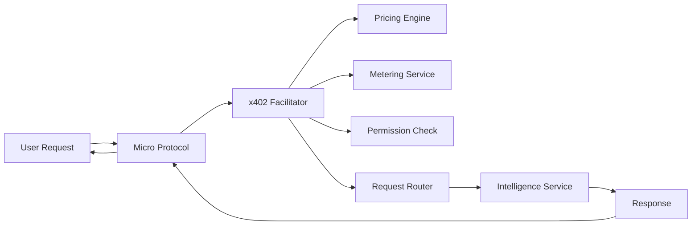

## Overview

Micro Protocols are standalone products and services built internally by the 0xMETA team. Their purpose is to demonstrate high-value, real-world use cases that can be built on top of **0xMETA's x402 facilitator**.

They show users and developers exactly what is possible when intelligence, analysis, automation, and economic execution flow through 0xMETA.

> **Info**
> At their core, Micro Protocols are focused, functional, and built to prove one
> clear use case extremely well.

If a Micro Protocol gains traction, it can grow into a larger, fully fledged product. Some Micro Protocols will be open sourced so that developers can fork, extend, and build new innovations directly on top of 0xMETA.

---

## Why We Build Micro Protocols

### Demonstrate Real Use Cases

Turn the abstract capabilities of 0xMETA into actual working products, giving users immediate clarity on platform capabilities.

### Accelerate Understanding

Help builders understand new platforms faster through working examples instead of long explanations.

### Provide Reference Implementations

Serve as blueprints for structuring workflows, designing payment flows, and scaling data-driven tools.

### Stress Test the Facilitator

Provide real-world feedback on pricing, load characteristics, routing logic, and settlement accuracy.

### Grow the Ecosystem

Drive usage through the facilitator, increasing liquidity and demonstrating platform flexibility.

### Pathway to Larger Products

Enable evolution from focused prototypes to larger standalone projects with strong product-market fit.

---

## Key Benefits

### 1. Demonstrate Real Use Cases

Micro Protocols turn the abstract capabilities of 0xMETA into actual working products. This gives users immediate clarity on what the platform can do.

### 2. Accelerate Understanding

Builders understand new platforms faster when they can see working examples instead of reading long explanations.

### 3. Provide Reference Implementations

Every Micro Protocol serves as a blueprint for how to:

1. **Structure intelligence workflows** - Learn how to organize and orchestrate AI-driven processes
2. **Design pay-per-request flows** - Implement flexible payment models for API access
3. **Use the facilitator** - Leverage 0xMETA for pricing and settlement
4. **Package insights** - Transform data into usable products
5. **Scale data-driven tools** - Build systems that grow with demand

These examples guide developers who want to build their own products on 0xMETA.

### 4. Stress Test the Facilitator

Micro Protocols give the 0xMETA team real-world feedback on:

- Pricing behavior
- Load characteristics
- Routing logic
- Request lifecycle
- Settlement accuracy
- Strategies for scaling

> **Note**
> These insights help refine the platform faster and more reliably.

### 5. Grow the Ecosystem

The more Micro Protocols exist, the more usage flows through the facilitator, increasing liquidity and demonstrating the platform's flexibility.

### 6. Pathway to Larger Products

If a Micro Protocol gains usage and demonstrates strong product-market fit, it can evolve into a larger standalone project.

> **Tip**
> This is intentional. Micro Protocols are stepping stones for bigger ideas.

---

## What Defines a Micro Protocol

A Micro Protocol is any focused, self-contained product built internally by the 0xMETA team that:

- **Solves a Specific Problem** - Addresses a particular intelligence or analysis challenge with a focused solution
- **Shows Real Workflows** - Demonstrates how actual processes run on 0xMETA in production environments
- **Uses the Facilitator** - Leverages 0xMETA's facilitator for pricing, access control, and settlement
- **Demonstrates Unique Value** - Showcases a distinct category of value creation or use case
- **Developer-Friendly** - Can be used directly by end users or studied by developers as a reference
- **Flexible Licensing** - May be open source or closed source depending on its purpose and goals

> **Info**
> They are small by design, but built with enough depth to prove a real-world
> concept.

---

## Open Source and Developer Extensions

Some Micro Protocols will be open sourced.

### What This Enables

- **Fork the Code** - Start with a proven foundation
- **Modify Workflows** - Customize to your needs
- **New Intelligence Models** - Integrate different AI approaches
- **Build New Versions** - Create your own products
- **Custom Pricing** - Experiment with pricing flows
- **Contribute Back** - Improve the ecosystem

> **Note**
> Open source Micro Protocols become starting points for innovation, not just
> demos. Closed source Micro Protocols still serve as reference products and
> proof of capability.

---

## Architecture Integration

### How Micro Protocols Fit Into 0xMETA

0xMETA is the **x402 facilitator**. It handles:

- **Pricing** - Dynamic pricing based on resource usage and demand
- **Metering** - Accurate tracking of API calls and resource consumption
- **Permissioning** - Access control and authorization management
- **Request Routing** - Intelligent routing of requests to appropriate services

### Integration Flow

