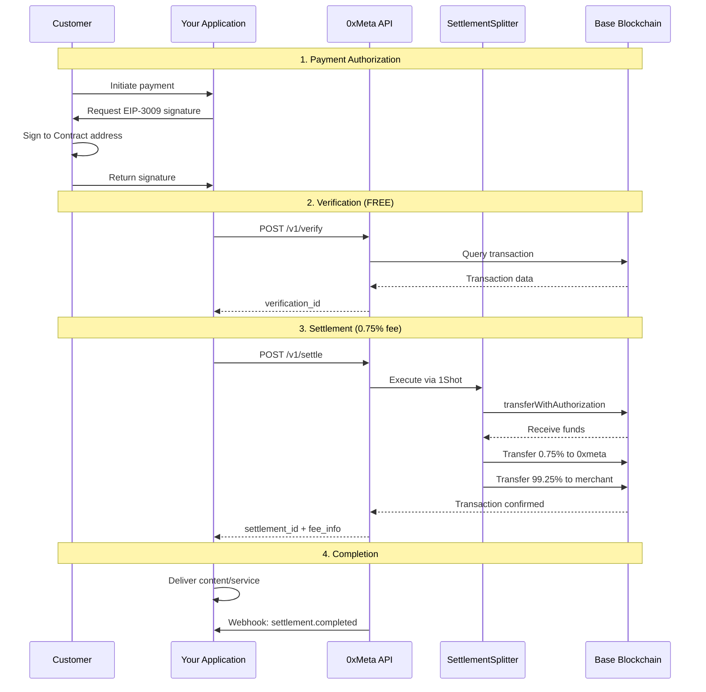

## What is 0xMeta

0xMeta is the **Permissionless Facilitator Infrastructure Layer** that powers how developers build payment services on top of the **x402 protocol**.

It acts as the coordination fabric between **data**, **capital**, and **logic**, giving developers a programmable runtime to create payment flows, automations, and integrations that leverage x402's primitives.

Instead of writing complex glue code or managing authentication infrastructure, you define your payment logic once — and the 0xMeta facilitator handles orchestration, settlement, and execution behind the scenes.

**No signup. No API keys. No barriers.**

:::info
**In short:**  
x402 provides the base protocol (accounts, liquidity, and data).  
0xMeta provides the **permissionless facilitator runtime** that makes those capabilities accessible to everyone.
:::

---

## Why 0xMeta Exists

x402 exposes powerful protocol primitives — EIP-3009 transfers, on-chain settlements, and payment verification — but using them directly requires deep technical coordination and infrastructure management.

0xMeta abstracts that complexity by introducing a **facilitator layer** that manages:

- Payment verification across blockchain networks
- Transaction routing and orchestration via smart contracts
- Automatic fee splitting through on-chain execution
- Event-driven logic and webhook management
- State persistence, retries, and job recovery

Developers can focus on **what to build**, not **how to wire payment infrastructure together**.

### The Permissionless Difference

Unlike traditional payment processors that require:

- Account registration and KYC
- API key management and authentication
- Monthly fees and minimum volumes
- Account review periods and approval processes

**0xMeta is completely open:**

- ✅ No signup required
- ✅ No API keys to manage
- ✅ No authentication needed
- ✅ No account freezes or holds
- ✅ No monthly fees
- ✅ Start building immediately

---

## Our Approach

We take a **build-to-prove** approach.  
Instead of publishing abstract whitepapers or static documentation, we demonstrate 0xMeta's capabilities through **production-ready infrastructure** and **live reference implementations**.

Our facilitator infrastructure is designed to:

- Handle production payment volumes in real-time
- Provide transparent, on-chain fee collection via smart contracts
- Enable developers to integrate payment acceptance in minutes
- Showcase how permissionless coordination works at scale
- Continuously evolve through field testing and community feedback

By building this infrastructure and making it freely accessible, we shorten the feedback loop between protocol design and real-world usage.  
Developers learn by doing, while the facilitator infrastructure continuously improves through production usage.

---

## The Facilitator Model

A **facilitator** is the core runtime unit within 0xMeta.  
It listens to events from x402, triggers actions based on defined logic, and exposes clean APIs for your services to consume.

Each facilitator can:

- React to blockchain events or external triggers
- Execute multi-step flows (verification → settlement)
- Maintain state and ensure deterministic outcomes
- Expose REST endpoints for external access
- Handle fee collection automatically via smart contracts

```
[x402 Protocol Layer]
(EIP-3009 | Payments | On-Chain Settlements)
        ↓
  [0xMeta Facilitator Infrastructure]
 (Verification | Settlement | Fee Collection)
        ↓
   [Your Application]
(Accept payments without infrastructure)
```

---

## How It Works: Smart Contract Fee Collection

0xMeta uses a novel approach to fee collection that maintains permissionless access while ensuring fair compensation:

### Traditional Approach (Doesn't Work)

```
❌ Require API keys for authentication
❌ Track usage per account
❌ Bill monthly or per-transaction
❌ Risk of account freezes
```

### 0xMeta's Approach (Smart Contract)

```
✅ Customer signs EIP-3009 to SettlementSplitter contract
✅ Smart contract receives payment
✅ Contract automatically splits:
   - 99.25% to merchant
   - 0.75% to 0xmeta
✅ All in single atomic transaction
✅ No authentication required
✅ Fully transparent on-chain
```

### Benefits

1. **Permissionless**: No accounts, no API keys, no authentication
2. **Trustless**: Smart contract enforces the split automatically
3. **Atomic**: Either entire settlement succeeds or it fails
4. **Transparent**: Every fee is visible on BaseScan
5. **Fair**: Pay only when settlement succeeds (0.75% + $1 min)

---

## End-to-End Sequence (Client → Server → 0xMeta → Chain)



### Key Points

1. **Customer signs to contract** (not to merchant directly)
2. **Verification is free** (no fees for checking validity)
3. **Settlement is atomic** (all transfers succeed or all fail)
4. **Fees are on-chain** (visible and transparent)
5. **No authentication** (fully permissionless)

---

## Core Features

### 1. Payment Verification (Free)

Verify that a payment transaction meets your requirements:

```bash
POST /v1/verify
{
  "transaction_hash": "0x...",
  "chain": "base",
  "seller_address": "0xYourAddress",
  "expected_amount": "1000000",
  "expected_token": "0x833589fCD6eDb6E08f4c7C32D4f71b54bdA02913"
}
```

**Response:**

```json
{
  "verification_id": "vrf_...",
  "status": "verified",
  "verified_amount": "1000000",
  "verified_at": "2025-01-15T10:30:00Z"
}
```

### 2. Payment Settlement (0.75% fee)

Settle the verified payment and receive funds:

```bash
POST /v1/settle
{
  "verification_id": "vrf_...",
  "destination_address": "0xYourAddress",
  "payment_payload": {
    "from": "0xCustomer",
    "v": 28, "r": "0x...", "s": "0x...",
    ...
  }
}
```

**Response:**

```json
{
  "settlement_id": "stl_...",
  "status": "pending",
  "transaction_hash": "0x...",
  "fee_info": {
    "fee_amount_usd": 7.5,
    "net_amount_usd": 992.5,
    "rate": 0.75,
    "settlement_method": "smart_contract"
  }
}
```

### 3. Status Tracking

Monitor settlement progress in real-time:

```bash
GET /v1/settlements/{settlement_id}
```

### 4. Webhook Notifications

Receive real-time updates when settlements complete:

```json
{
  "event": "settlement.completed",
  "settlement_id": "stl_...",
  "transaction_hash": "0x...",
  "fee_info": {
    "fee_amount_usd": 7.5,
    "net_amount_usd": 992.5
  },
  "settled_at": "2025-01-15T10:32:15Z"
}
```

---

## Supported Networks

| Network      | Status        | Fee Collection |
| ------------ | ------------- | -------------- |
| Base Mainnet | ✅ Production | Smart Contract |
| Base Sepolia | ✅ Testing    | Smart Contract |

<Note>More networks coming soon based on community demand!</Note>

---

## Pricing Philosophy

### Why 0.75%?

- **74% cheaper than Stripe** (2.9% + $0.30)
- **25% cheaper than Coinbase** (1.0%)
- **Sustainable for infrastructure** (gas fees, smart contracts, API hosting)
- **Fair for all users** (no hidden fees, no monthly minimums)

### Transparent Fee Collection

Every fee is:

- ✅ Calculated on-chain by smart contract
- ✅ Visible on BaseScan
- ✅ Only charged on successful settlements
- ✅ Automatically deducted (no invoices or billing)

View our smart contract: [BaseScan →](https://basescan.org/address/0x...)

---

## Use Cases

### E-Commerce

Accept crypto payments for digital goods:

```typescript
// 1. Customer pays
// 2. Verify payment (free)
await verify(txHash);
// 3. Settle and deliver
const { net_amount } = await settle(verificationId);
deliverDigitalGood();
```

### SaaS Subscriptions

Process recurring payments:

```typescript
// Monthly billing
for (const customer of activeSubscriptions) {
  if (hasValidSignature(customer)) {
    await settle(customer.verificationId);
  }
}
```

### Marketplaces

Handle peer-to-peer transactions:

```typescript
// Buyer → SettlementSplitter → Seller (minus 0.75%)
await settle({
  verification_id: buyerPayment,
  destination_address: sellerAddress,
});
```

### Gaming

In-game purchases and rewards:

```typescript
// Player buys item
const { verification_id } = await verify(playerTx);
await settle(verification_id);
unlockInGameItem(playerId);
```

---

## Technical Architecture

### Smart Contract Layer

```solidity
contract SettlementSplitter {
  // Receives EIP-3009 authorized transfer
  function executeTransferWithSplit(
    address from,      // Customer
    address to,        // Merchant
    uint256 value,     // Full amount
    bytes32 nonce,
    uint8 v, bytes32 r, bytes32 s
  ) external {
    // 1. Receive funds from customer
    USDC.transferWithAuthorization(...);

    // 2. Calculate 0.75% fee
    uint256 fee = calculateFee(value);

    // 3. Split funds
    USDC.transfer(facilitatorAddress, fee);
    USDC.transfer(to, value - fee);
  }
}
```

### API Layer

- **FastAPI** backend with async processing
- **PostgreSQL** for state persistence
- **Redis** for caching and rate limiting
- **1Shot API** for smart contract execution

### Blockchain Layer

- **Base network** for low fees and fast finality
- **EIP-3009** for gasless user transfers
- **OpenZeppelin** contracts for security

---

## Security & Trust

### Smart Contract Security

- ✅ Built with OpenZeppelin libraries
- ✅ ReentrancyGuard on all transfers
- ✅ No custodial holdings (instant pass-through)
- ✅ Open-source and verifiable

### API Security

- ✅ HTTPS/TLS encryption
- ✅ HMAC webhook signatures
- ✅ Idempotency key support
- ✅ DDoS protection

### No Authentication = No Attack Surface

By removing authentication requirements:

- ❌ No API keys to leak
- ❌ No accounts to compromise
- ❌ No user databases to protect
- ✅ Simpler, more secure architecture

---

## Getting Started

<Steps>
  <Step title="No Setup Required">
    There's no account to create or API keys to manage. Just start making requests!
  </Step>

  <Step title="Verify a Payment">
    ```bash
    curl -X POST https://facilitator.api.0xmeta.ai/v1/verify \
      -H "Content-Type: application/json" \
      -d '{"transaction_hash": "0x...", "chain": "base", ...}'
    ```
  </Step>

  <Step title="Settle and Receive">
    ```bash
    curl -X POST https://facilitator.api.0xmeta.ai/v1/settle \
      -H "Content-Type: application/json" \
      -d '{"verification_id": "vrf_...", ...}'
    ```
  </Step>

  <Step title="Monitor On-Chain">
    View your settlement on BaseScan to see the automatic fee split in action.
  </Step>
</Steps>

---

## What's Next?

<CardGroup cols={2}>
  <Card title="Quickstart Guide" icon="rocket" href="/quickstart">
    Build your first integration in 5 minutes
  </Card>
  <Card title="API Reference" icon="book" href="/api-reference/introduction">
    Complete API documentation
  </Card>
  <Card title="Pricing Details" icon="dollar-sign" href="/pricing">
    Understand fees and smart contract splits
  </Card>
  <Card
    title="Smart Contracts"
    icon="file-contract"
    href="https://github.com/0xmeta/contracts"
  >
    View our open-source contracts
  </Card>
</CardGroup>

---

## Join the Community

<CardGroup cols={2}>
  <Card title="Discord" icon="discord" href="https://discord.gg/0xmeta">
    Get help and share feedback
  </Card>
  <Card title="GitHub" icon="github" href="https://github.com/0xmeta">
    Contribute to our open-source stack
  </Card>
  <Card title="Twitter" icon="twitter" href="https://twitter.com/0xmetaai">
    Follow for updates and announcements
  </Card>
  <Card title="Blog" icon="newspaper" href="https://blog.0xmeta.ai">
    Learn about x402 and payment infrastructure
  </Card>
</CardGroup>

---

<Check>
  **Ready to accept payments?** No signup needed - start building with 0xmeta.ai
  today!
</Check>
