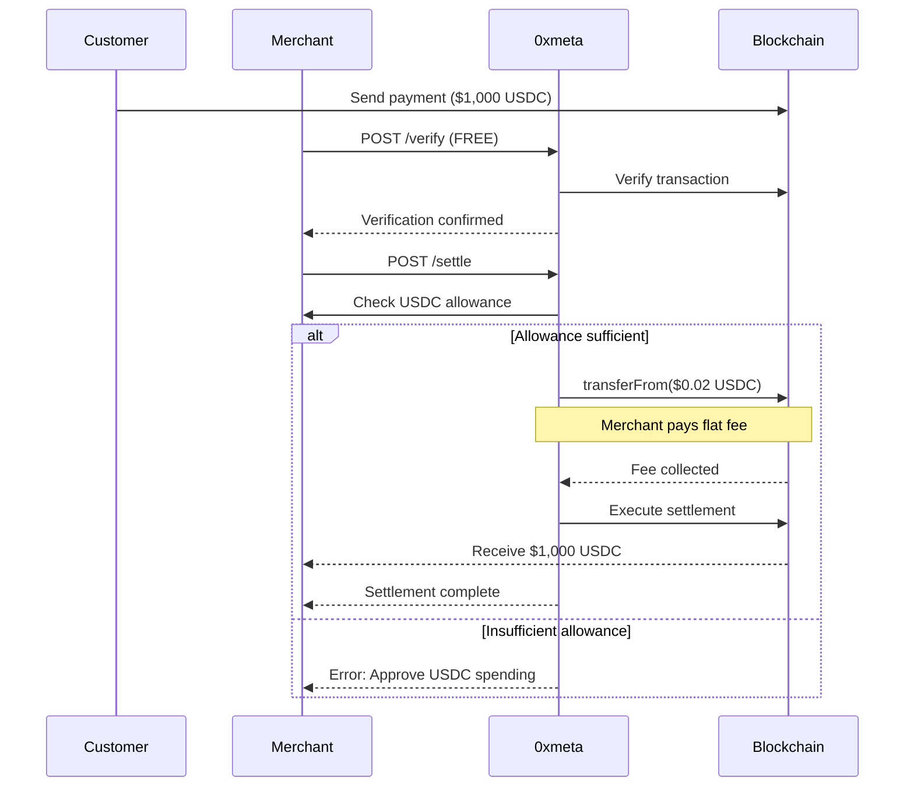

# Pricing

## Simple Flat-Rate Pricing

0xmeta.ai charges a **simple flat fee per settlement** based on your monthly volume. No percentages, no surprises.

```
POST https://facilitator.0xmeta.ai/v1/verify  → FREE
POST https://facilitator.0xmeta.ai/v1/settle  → Flat fee based on volume
```

## Flat Rate Model

We charge a **fixed amount per settlement**, not a percentage. Whether you settle $100 or $10,000, you pay the same flat fee based on your monthly volume tier.

<CardGroup cols={2}>
  <Card title="Flat Fee" icon="coins">
    **$0.01 - $0.05** per settlement  
    *Based on monthly volume*
  </Card>
  <Card title="Predictable Costs" icon="chart-line">
    **Know exactly** what you'll pay  
    *No percentage calculations*
  </Card>
</CardGroup>

<Info>
**Why flat rate?** Processing a settlement costs us the same whether it's $100 or $10,000. We charge based on our actual infrastructure costs, not transaction value.
</Info>

## Pricing Tiers

Tiers are calculated automatically based on your monthly settlement count. Lower rates unlock as your volume grows.

| Monthly Settlements | Flat Fee | Example Monthly Cost | Your Cost Basis |
|---------------------|----------|----------------------|-----------------|
| 0 - 100 | **$0.05** | $5 (100 × $0.05) | $0.05 per settlement |
| 101 - 500 | **$0.03** | $15 (500 × $0.03) | $0.03 per settlement |
| 501 - 2,500 | **$0.02** | $50 (2,500 × $0.02) | $0.02 per settlement |
| 2,501 - 10,000 | **$0.01** | $100 (10,000 × $0.01) | $0.01 per settlement |
| 10,001+ | **Custom** | Contact us | Enterprise pricing |

<Note>
Tiers update automatically each month based on your settlement count. No manual upgrades needed!
</Note>

## Payment Flow



## How It Works

### 1. Verification (FREE)
```bash
curl -X POST https://facilitator.0xmeta.ai/v1/verify \
  -H "Content-Type: application/json" \
  -d '{
    "transaction_hash": "0x...",
    "chain": "base",
    "seller_address": "0x...",
    "expected_amount": "1000000000",
    "expected_token": "0x833589fCD6eDb6E08f4c7C32D4f71b54bdA02913"
  }'
```

**Cost: $0.00** - Verification is always free!

### 2. One-Time USDC Approval

Before your first settlement, approve 0xmeta to collect fees:

```javascript
// Approve USDC spending (one-time setup)
const USDC = "0x833589fCD6eDb6E08f4c7C32D4f71b54bdA02913"; // Base
const TREASURY = "0x742d35Cc6634C0532925a3b844Bc9e7595f0bEb";

await usdcContract.approve(
  TREASURY,
  ethers.parseUnits("1000", 6) // Approve $1,000 worth of fees
);
```

<Warning>
**Important:** Merchants must approve USDC spending before settlements can be processed. This is a one-time setup step.
</Warning>

### 3. Settlement (Flat Fee)

```bash
curl -X POST https://facilitator.0xmeta.ai/v1/settle \
  -H "Content-Type: application/json" \
  -d '{
    "verification_id": "vrf_abc123",
    "destination_address": "0x...",
    "amount": "1000000000"
  }'
```

**Cost:** Based on your tier (e.g., $0.02 for Tier 3)

The settlement flow:
1. We check your USDC allowance
2. We charge the flat fee via `transferFrom` 
3. We execute the settlement from customer to you
4. You receive the full customer payment amount

## Cost Examples

### Example 1: Small Business (Tier 1)
```
Monthly settlements: 50
Flat fee per settlement: $0.05
Average transaction: $1,000

Monthly cost: 50 × $0.05 = $2.50
Total volume: 50 × $1,000 = $50,000
Effective rate: $2.50 / $50,000 = 0.005%
```

### Example 2: Growing Company (Tier 3)
```
Monthly settlements: 1,000
Flat fee per settlement: $0.02
Average transaction: $5,000

Monthly cost: 1,000 × $0.02 = $20
Total volume: 1,000 × $5,000 = $5,000,000
Effective rate: $20 / $5,000,000 = 0.0004%
```

### Example 3: High-Volume (Tier 4)
```
Monthly settlements: 5,000
Flat fee per settlement: $0.01
Average transaction: $10,000

Monthly cost: 5,000 × $0.01 = $50
Total volume: 5,000 × $10,000 = $50,000,000
Effective rate: $50 / $50,000,000 = 0.0001%
```

## Fee Collection Method

### Smart Contract Pay-Per-Settlement

We use ERC-20 `transferFrom` to collect flat fees in USDC:

<Steps>
  <Step title="Merchant Approves">
    One-time approval of USDC spending to our treasury address.
  </Step>
  
  <Step title="Settlement Requested">
    Merchant calls `/v1/settle` endpoint.
  </Step>
  
  <Step title="Fee Collected">
    We execute `transferFrom` to collect the flat fee (e.g., $0.02).
    ```solidity
    USDC.transferFrom(merchant, treasury, flatFee);
    ```
  </Step>
  
  <Step title="Settlement Executes">
    Customer's payment is settled to merchant's address.
  </Step>
</Steps>

All in real-time, no batching or delayed billing.

## What's Included

<AccordionGroup>
  <Accordion title="Payment Verification" icon="check-circle">
    - Unlimited verification requests
    - Base network support (Mainnet + Sepolia)
    - Real-time transaction validation
    - **100% Free - No charges**
  </Accordion>

  <Accordion title="Settlement Processing" icon="arrow-right-arrow-left">
    - Automated settlement execution
    - Smart contract fee collection
    - Background status polling
    - Webhook notifications
    - Retry logic & error handling
    - **Flat fee only on success**
  </Accordion>

  <Accordion title="Infrastructure" icon="server">
    - 99.9% uptime SLA
    - Sub-2 second response times
    - Global CDN
    - DDoS protection
    - Gas fees covered
    - **All included in flat fee**
  </Accordion>

  <Accordion title="Support" icon="headset">
    - Comprehensive documentation
    - Community Discord
    - Open-source examples
    - Email support
    - **Free for all users**
  </Accordion>
</AccordionGroup>

## Transparent Cost Structure

### Our Infrastructure Costs

We're transparent about our costs so you understand the value:

**Per settlement, our costs are:**
- 1Shot API operations: 3 reads + 1 write = **~$0.01**
  - Read operations: 3 × $0.0025 = $0.0075
  - Write operations: 1 × $0.0025 = $0.0025
- Database & hosting: **~$0.003**
- Smart contract gas: **~$0.002**
- **Total cost per settlement: ~$0.015**

Our pricing:
- Tier 1 ($0.05): 233% markup - covers customer acquisition
- Tier 2 ($0.03): 100% markup - sustainable margin
- Tier 3 ($0.02): 33% markup - volume efficiency
- Tier 4 ($0.01): Break-even - enterprise retention

<Check>
We're profitable at scale while keeping your costs predictable and fair.
</Check>

## Why Flat Rate Works Better

### 1. Your Costs Don't Scale With Transaction Value

```
Processing a $100 settlement:
- 1Shot API calls: $0.01
- Database writes: $0.003
- Total: $0.013

Processing a $10,000 settlement:
- 1Shot API calls: $0.01
- Database writes: $0.003
- Total: $0.013
```

Same infrastructure cost = same fee. That's fair.

### 2. Better for High-Value Transactions

**Example: $10,000 USDC settlement**

| Model | Fee | You Receive | Effective % |
|-------|-----|-------------|-------------|
| Traditional 2.9% + $0.30 | $290.30 | $9,709.70 | 2.903% |
| Percentage 1% | $100.00 | $9,900.00 | 1.000% |
| **0xmeta Flat $0.02** | **$0.02** | **$9,999.98** | **0.0002%** |

You save $290.28 per transaction.

### 3. Predictable Budgeting

**Traditional percentage model:**
```
Month 1: $100K revenue → $2,900 fees
Month 2: $500K revenue → $14,500 fees ⬆️ 400%
Month 3: $1M revenue → $29,000 fees ⬆️ 900%
```

**0xmeta flat rate model:**
```
Month 1: 1,000 settlements → $20 fees
Month 2: 1,000 settlements → $20 fees ➡️ Same
Month 3: 1,000 settlements → $20 fees ➡️ Same
```

Your costs stay consistent as your business grows.

## Automatic Tier Progression

Check your current tier anytime:

```bash
GET https://facilitator.0xmeta.ai/v1/pricing/my-tier
Authorization: Bearer your_api_key

Response:
{
  "seller_address": "0x...",
  "current_tier": 3,
  "flat_fee_usd": 0.02,
  "monthly_settlements": 1250,
  "next_tier_threshold": 2501,
  "settlements_until_next_tier": 1251,
  "estimated_monthly_cost": 25.00,
  "period_start": "2025-11-01T00:00:00Z"
}
```

### Tier Calculation Logic

```typescript
function calculateTier(monthlySettlements: number): Tier {
  if (monthlySettlements <= 100) return { tier: 1, fee: 0.05 };
  if (monthlySettlements <= 500) return { tier: 2, fee: 0.03 };
  if (monthlySettlements <= 2500) return { tier: 3, fee: 0.02 };
  if (monthlySettlements <= 10000) return { tier: 4, fee: 0.01 };
  return { tier: 5, fee: "contact_us" };
}
```

Tiers reset monthly and are calculated in real-time based on your usage.

## No Hidden Fees

<Check>✅ No signup required</Check>
<Check>✅ No monthly minimums</Check>
<Check>✅ No setup fees</Check>
<Check>✅ No API key costs</Check>
<Check>✅ No account maintenance</Check>
<Check>✅ No gas fee markups</Check>
<Check>✅ No revenue sharing</Check>
<Check>✅ No early termination fees</Check>

**Only charge:** Flat fee per successful settlement, based on your monthly volume.

## Smart Contracts

Our fee collection is fully on-chain and transparent:

### Base Mainnet
- **USDC Contract:** `0x833589fCD6eDb6E08f4c7C32D4f71b54bdA02913`
- **Treasury Address:** `0x742d35Cc6634C0532925a3b844Bc9e7595f0bEb`

### Base Sepolia (Testnet)
- **USDC Contract:** `0x036CbD53842c5426634e7929541eC2318f3dCF7e`
- **Treasury Address:** `0x742d35Cc6634C0532925a3b844Bc9e7595f0bEb`

<CardGroup cols={2}>
  <Card title="View on BaseScan" icon="link" href="https://basescan.org/address/0x742d35Cc6634C0532925a3b844Bc9e7595f0bEb">
    Verify our treasury address
  </Card>
  <Card title="Open Source" icon="code" href="https://github.com/0xmeta/facilitator">
    Review the code
  </Card>
</CardGroup>

## Volume Discounts Summary

| Tier | Settlements/Month | Flat Fee | Monthly Cost | Savings vs Tier 1 |
|------|-------------------|----------|--------------|-------------------|
| 1 | 0-100 | $0.05 | $5 | - |
| 2 | 101-500 | $0.03 | $15 | $10/month |
| 3 | 501-2,500 | $0.02 | $50 | $75/month |
| 4 | 2,501-10,000 | $0.01 | $100 | $400/month |
| 5 | 10,001+ | Custom | Contact us | Custom pricing |

## Enterprise Pricing

For 10,000+ monthly settlements:

<CardGroup cols={2}>
  <Card title="Custom Rates" icon="handshake">
    Rates below $0.01 per settlement
  </Card>
  <Card title="Annual Contracts" icon="file-contract">
    Lock in rates for 12+ months
  </Card>
  <Card title="Dedicated Support" icon="headset">
    Priority support channel
  </Card>
  <Card title="SLA Guarantees" icon="shield">
    99.99% uptime commitment
  </Card>
</CardGroup>

**Contact:** enterprise@0xmeta.ai

## Fee Analytics

Track your spending with our analytics API:

```bash
GET https://facilitator.0xmeta.ai/v1/analytics/fees?days=30
Authorization: Bearer your_api_key

Response:
{
  "period_days": 30,
  "settlement_count": 1250,
  "current_tier": 3,
  "flat_fee_per_settlement": 0.02,
  "total_fees_paid_usd": 25.00,
  "total_volume_usd": 1250000.00,
  "average_transaction_usd": 1000.00,
  "effective_percentage": 0.002,
  "projected_monthly_cost": 25.00
}
```

## Frequently Asked Questions

<AccordionGroup>
  <Accordion title="What if my transaction is smaller than the fee?">
    Our flat fees are designed to be negligible even for small transactions:
    
    - Tier 1 ($0.05): Suitable for transactions $5+
    - Tier 4 ($0.01): Suitable for transactions $1+
    
    Most crypto transactions are well above these minimums. Contact us if you need to process micro-transactions.
  </Accordion>

  <Accordion title="How is my tier calculated?">
    Based on successful settlements in the current calendar month:
    
    - Count resets on the 1st of each month
    - Failed settlements don't count
    - Only successful settlements affect your tier
    
    Check anytime: `GET /v1/pricing/my-tier`
  </Accordion>

  <Accordion title="When is the flat fee charged?">
    **Before settlement execution:**
    
    1. You call `/v1/settle`
    2. We check your USDC allowance
    3. We collect the flat fee via `transferFrom`
    4. We execute the settlement
    
    If fee collection fails, settlement doesn't proceed.
  </Accordion>

  <Accordion title="Can I get a refund if settlement fails?">
    Yes! If settlement fails after we've collected the fee, we automatically refund it within 24 hours.
    
    Track refund status: `GET /v1/settlements/{settlement_id}`
  </Accordion>

  <Accordion title="Why flat rate instead of percentage?">
    **Our costs are fixed per settlement:**
    
    - API operations cost the same regardless of amount
    - Database writes cost the same
    - Smart contract gas costs the same
    
    Percentage fees make sense for credit cards (fraud, chargebacks). Crypto doesn't have these issues.
  </Accordion>

  <Accordion title="How much USDC should I approve?">
    Approve enough for your expected monthly volume:
    
    ```
    Example (Tier 3, 1,000 settlements/month):
    1,000 × $0.02 = $20 per month
    
    Recommended approval: $50-$100
    (enough for 2-5 months of fees)
    ```
    
    Check allowance: `GET /v1/pricing/allowance`
  </Accordion>

  <Accordion title="Are there any other fees?">
    **No other fees whatsoever:**
    
    - ✅ Verification: FREE
    - ✅ Status checks: FREE
    - ✅ Webhooks: FREE
    - ✅ API usage: FREE
    - ✅ Gas fees: Included
    - ✅ 1Shot operations: Included
    
    **Only charge:** Flat fee per successful settlement.
  </Accordion>

  <Accordion title="Can I lock in a specific tier?">
    Enterprise customers (Tier 5) can lock in custom rates via annual contracts.
    
    Contact: enterprise@0xmeta.ai
  </Accordion>
</AccordionGroup>

## Get Started

No signup required. Start processing settlements immediately:

```bash
# 1. Verify payment (FREE)
curl -X POST https://facilitator.0xmeta.ai/v1/verify \
  -H "Content-Type: application/json" \
  -d '{
    "transaction_hash": "0x...",
    "chain": "base",
    "seller_address": "0x...",
    "expected_amount": "1000000000",
    "expected_token": "0x833589fCD6eDb6E08f4c7C32D4f71b54bdA02913"
  }'

# 2. Approve USDC (one-time)
# Use your wallet or web3 library

# 3. Settle payment (flat fee)
curl -X POST https://facilitator.0xmeta.ai/v1/settle \
  -H "Content-Type: application/json" \
  -d '{
    "verification_id": "vrf_...",
    "destination_address": "0x...",
    "amount": "1000000000"
  }'
```

**First 100 settlements:** Use Tier 1 pricing ($0.05)

---

## Need Help?

<CardGroup cols={2}>
  <Card title="Documentation" icon="book" href="/api-reference/introduction">
    Complete API reference
  </Card>
  <Card title="Discord Community" icon="discord" href="https://discord.gg/0xmeta">
    Get community support
  </Card>
  <Card title="GitHub" icon="code" href="https://github.com/0xmeta/facilitator">
    View source code
  </Card>
  <Card title="Enterprise Sales" icon="envelope" href="mailto:enterprise@0xmeta.ai">
    Custom pricing inquiries
  </Card>
</CardGroup>