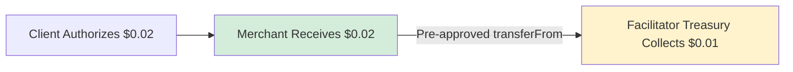

## Overview

0xmeta uses a **flat $0.01 USDC fee** per settlement with **post-settlement collection** via standard ERC-20 approval. No setup fees, no merchant accounts, zero surprises.

**Verification is FREE** - only successful settlements incur the $0.01 fee.

---

## Fee Structure

| Service | Cost | Notes |
|---------|------|-------|
| **Payment Verification** | FREE | Unlimited verifications |
| **Settlement Execution** | **$0.01 USDC** | Per successful settlement |
| **Failed Settlements** | $0 | No charge if settlement fails |

### Example Pricing

```typescript
// $0.01 Resource
// Merchant wants: $0.01
// Add facilitator fee: $0.01
// Customer pays: $0.02

{
  "GET /data": {
    accepts: [{
      price: "$0.02", // $0.01 resource + $0.01 fee
    }]
  }
}

// Flow:
// 1. Customer → Merchant ($0.02, direct)
// 2. Facilitator → Merchant ($0.01 fee via transferFrom)
// Net: Merchant receives $0.01
```

```typescript
// $0.10 Resource
// Merchant wants: $0.10
// Add facilitator fee: $0.01
// Customer pays: $0.11

{
  "GET /premium-data": {
    accepts: [{
      price: "$0.11", // $0.10 resource + $0.01 fee
    }]
  }
}

// Net: Merchant receives $0.10
```

```typescript
// $1 Resource
// Merchant wants: $1.00
// Add facilitator fee: $0.01
// Customer pays: $1.01

{
  "GET /analysis": {
    accepts: [{
      price: "$1.01", // $1.00 resource + $0.01 fee
    }]
  }
}

// Net: Merchant receives $1.00
```

---

## How Fee Collection Works

### Post-Settlement via transferFrom



**Flow:**

1. **Customer authorizes** payment to merchant address ($0.02)
2. **Merchant receives** 100% of customer payment ($0.02)
3. **Facilitator collects** $0.01 fee from merchant's pre-approved USDC balance

**Merchant Setup:** One-time USDC approval allows facilitator to collect fees via `transferFrom`.

---

## Fee Collection Method

### Standard ERC-20 Approval Pattern

**One-time merchant setup:**

```bash
# Approve facilitator treasury for USDC spending
node approve-facilitator.mjs

# This executes:
USDC.approve(treasury, 100 * 10^6); // 100 USDC = 10,000 settlements
```

**Per settlement:**

```solidity
// 1. Verify customer authorization (FREE)
verifySignature(authorization, signature);

// 2. Collect fee from merchant (via approved transferFrom)
USDC.transferFrom(merchant, treasury, 0.01 * 10^6); // $0.01

// 3. Execute customer → merchant payment
executeSettlement(authorization, signature);
```

**Key points:**

- ✅ Customer payment goes directly to merchant
- ✅ Fee collected separately from merchant's approved balance
- ✅ No facilitator custody of customer funds
- ✅ Merchant controls via approval amount

---

## Comparison: 0xmeta vs Traditional

| Feature | 0xmeta | Stripe | PayPal | Crypto Direct |
|---------|--------|--------|--------|---------------|
| **Fee** | $0.01 flat | 2.9% + $0.30 | 3.49% + $0.49 | Gas fees |
| **Setup** | 1 approval tx | KYC required | Business account | Wallet setup |
| **Settlement** | 35-70 seconds | 2-7 days | 1-3 days | Minutes |
| **Custody** | None | Full custody | Full custody | Self-custody |
| **Merchant Setup** | Approve USDC | Complex onboarding | Moderate | Manual |
| **Gas Costs** | $0 (facilitator pays) | N/A | N/A | ~$1-5 per tx |

### Cost Examples

| Transaction | 0xmeta | Stripe | PayPal | Savings |
|-------------|--------|--------|--------|---------|
| $0.10 | **$0.01** | $0.31 | $0.50 | 96.7% |
| $1.00 | **$0.01** | $0.33 | $0.53 | 97.0% |
| $10.00 | **$0.01** | $0.59 | $0.84 | 98.3% |
| $100.00 | **$0.01** | $3.20 | $3.98 | 99.7% |

**For micropayments (less than $1), 0xmeta is 96-99% cheaper than traditional processors.**

---

## Pricing Details

### What's Included

**Verification (FREE):**

- EIP-3009 signature validation
- Amount verification
- Token verification
- Address validation
- Unlimited verifications

**Settlement ($0.01):**

- Fee collection from merchant
- On-chain settlement execution
- Gas fees paid by facilitator
- Settlement status tracking
- Webhook notifications

### Merchant Economics

**Calculate your net revenue:**

```typescript
// Example: $0.01 resource
const resourcePrice = 0.01;  // What you want
const facilitatorFee = 0.01; // Fixed fee
const customerPrice = 0.02;  // What customer pays

// Per settlement:
merchantReceives = 0.02; // From customer
merchantPays = 0.01;     // To facilitator
netRevenue = 0.01;       // Your profit

// At 1000 settlements:
grossRevenue = 0.02 * 1000; // $20.00
totalFees = 0.01 * 1000;    // $10.00
netRevenue = 0.01 * 1000;   // $10.00
```

**Important:** For very low-priced resources (less than $0.01), you need significant volume or higher pricing. The $0.01 fee is constant.

### Recommended Pricing Strategies

**$0.01 - $0.10**

- API calls
- Data queries
- Simple computations

Fee impact: 10-100%

**$0.10 - $1.00**

- Analysis reports
- Generated content
- Premium features

Fee impact: 1-10%

**$1.00 - $10.00**

- Research reports
- AI-generated media
- Complex computations

Fee impact: 0.1-1%

**$10.00+**

- Enterprise features
- Bulk data access
- Subscription equivalents

Fee impact: less than 0.1%

---

## Approval Requirements

### How Much to Approve

**Calculation:**

```
Approval Amount = Expected Settlements × $0.01
```

**Examples:**

- 100 USDC = 10,000 settlements
- 500 USDC = 50,000 settlements
- 1000 USDC = 100,000 settlements

**Best practice:** Approve 100-1000 USDC (avoid infinite approval)

### Managing Approval

**Check allowance:**

```bash
node check-allowance.mjs

# Output:
# Settlements Remaining: 9,550
```

**Top up allowance:**

```bash
node approve-facilitator.mjs
```

**Revoke access:**

```bash
APPROVAL_AMOUNT=0 node approve-facilitator.mjs
```

---

## Volume Pricing

### Custom Rates for High Volume

If you process **10,000+ settlements per month**, contact us for custom pricing:

**Email:** sales@0xmeta.ai

**Volume tiers:**

- 10K-100K settlements/month
- 100K-1M settlements/month
- 1M+ settlements/month

We offer discounted rates for high-volume merchants. Minimum $0.001 per settlement for enterprise customers.

---

## Fee Transparency

### On-Chain Verification

Every fee collection is a standard blockchain transaction:

```bash
# View fee collection transaction
https://basescan.org/tx/{fee_tx_hash}

# View your merchant address activity
https://basescan.org/address/{your_merchant_address}
```

### Settlement Response

Every settlement response includes complete fee breakdown:

```json
{
  "success": true,
  "details": {
    "settlement_id": "stl_abc123",
    "settled_amount": "20000", // $0.02 customer payment
    "merchant_received": 20000, // Merchant gets 100%
    "fee_amount_wei": 10000, // $0.01 fee
    "fee_tx_hash": "0x...",
    "fee_collection_status": "collected"
  }
}
```

---

## FAQ

<AccordionGroup>

<Accordion title="Why flat fees instead of percentage-based?">
Flat fees work better for micropayments:

- 2.9% of $0.10 = $0.003 (unsustainable)
- Plus fixed $0.30 = totally uneconomical for small payments

$0.01 is the minimum viable fee for on-chain operations while keeping micropayments feasible.
</Accordion>

<Accordion title="Who pays the facilitator fee?">
Merchant pays the fee.

**Why:** x402 requires customers pay merchants directly (trust-minimization). We can't split customer payments.

**Solution:** Add fee to your prices. Customer pays $0.02, you receive $0.02, facilitator collects $0.01 from your approved balance.
</Accordion>

<Accordion title="Are there volume discounts?">
Yes, for high volume:

- 10K+ settlements/month: Custom pricing
- 100K+ settlements/month: Significant discounts
- Enterprise contracts: sales@0xmeta.ai
</Accordion>

<Accordion title="Are there any hidden fees?">
No:

- No monthly fees
- No setup fees
- No gas fees (facilitator pays)
- No withdrawal fees
- No percentage fees

Just $0.01 per successful settlement.
</Accordion>

<Accordion title="What if my settlement fails?">
You paid $0.01 for the settlement attempt.

**Why:** Prevents free service exploitation. If we didn't charge for failed attempts, merchants could intentionally cause failures for free verification service.

**Mitigation:** Test thoroughly on Sepolia testnet first.
</Accordion>

<Accordion title="How can I track my fees?">
Options:

1. **Settlement responses:** Include full fee breakdown
2. **On-chain:** View transactions on BaseScan
3. **Monitoring script:** `check-allowance.mjs` shows remaining settlements
</Accordion>

</AccordionGroup>

---

## Next Steps

<CardGroup cols={2}>

<Card title="Set Up Merchant Approval" icon="check" href="/guides/merchant-setup">
Configure USDC approval for fee collection
</Card>

<Card title="Understand Fee Collection" icon="dollar-sign" href="/guides/fee-collection">
Learn how post-settlement fees work
</Card>

<Card title="Complete Integration Guide" icon="rocket" href="/integration">
Build your first payment flow
</Card>

<Card title="FAQs" icon="question" href="/faq">
Common questions
</Card>

</CardGroup>

---

**Simple, transparent, post-settlement** - $0.01 per settlement, collected from merchant's pre-approved USDC balance. No custody, fully auditable.