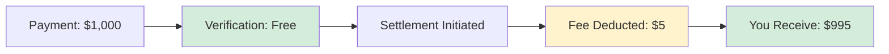

## No Signup Required

0xmeta.ai is **completely free to use** - no account creation, no API keys, no barriers.

Just start making requests to our endpoints:

```
POST https://facilitator.api.0xmeta.ai/v1/verify
POST https://facilitator.api.0xmeta.ai/v1/settle
```

## Settlement Fees

We charge a **simple flat fee per successful settlement**:

<CardGroup cols={2}>
  <Card title="Standard Settlement" icon="coins">
    **0.5%** per settlement *Minimum: $1*
  </Card>
  <Card title="High Volume" icon="chart-line">
    **0.3%** per settlement *>1000 settlements/month*
  </Card>
</CardGroup>

## Fee Structure

| Volume/Month | Fee per Settlement | Example (on $1,000) |
| ------------ | ------------------ | ------------------- |
| 0 - 100      | 0.5% (min $1)      | $5.00               |
| 101 - 1,000  | 0.5% (min $1)      | $5.00               |
| 1,001+       | 0.3% (min $1)      | $3.00               |

## What's Included

<AccordionGroup>
  <Accordion title="Payment Verification" icon="check-circle">
    - Unlimited verification requests
    - Base network support (Mainnet and Sepolia)
    - Real-time transaction validation
    - **100% Free**
  </Accordion>

{" "}

<Accordion title="Settlement Processing" icon="arrow-right-arrow-left">
  - Automated settlement execution - Background status polling - Webhook
  notifications - Retry logic & error handling - **0.5% fee only on success**
</Accordion>

{" "}

<Accordion title="Infrastructure" icon="server">
  - 99.9% uptime - Sub-2 second response times - Global CDN - DDoS protection -
  **All included**
</Accordion>

  <Accordion title="Support" icon="headset">
    - Documentation
    - Community Discord
    - **Free for all users**
  </Accordion>
</AccordionGroup>

## Fee Calculation Examples

### Example 1: Standard Transaction

```
Payment Amount: $1,000 USDC
Settlement Fee: $1,000 × 0.5% = $5.00
You Receive: $995.00 USDC

Total Cost: $5.00 (0.5%)
```

### Example 2: Small Transaction

```
Payment Amount: $50 DAI
Settlement Fee: $50 × 0.5% = $0.25 → $1.00 (minimum)
You Receive: $49.00 DAI

Total Cost: $1.00 (2%)
```

### Example 3: High Volume (1000+ settlements)

```
Payment Amount: $1,000 ETH
Settlement Fee: $1,000 × 0.3% = $3.00
You Receive: $997.00 ETH

Total Cost: $3.00 (0.3%)
```

## Pricing Comparison

| Feature         | 0xmeta.ai   | Traditional Payment Gateway |
| --------------- | ----------- | --------------------------- |
| Verification    | Free        | Free                        |
| Settlement Fee  | 0.5%        | 2.9% + $0.30                |
| Signup Required | ❌ No       | ✅ Yes                      |
| Monthly Fees    | $0          | $10-30                      |
| Payout Speed    | 1-5 minutes | 2-7 days                    |
| Crypto Native   | ✅ Yes      | ❌ No                       |

## How Fees Are Deducted

Fees are **automatically deducted** during settlement:



The settlement process:

1. Customer pays $1,000
2. You verify (free)
3. You initiate settlement
4. We deduct 0.5% ($5)
5. You receive $995

## No Hidden Fees

<Check>✅ No monthly fees</Check>
<Check>✅ No setup fees</Check>
<Check>✅ No integration fees</Check>
<Check>✅ No API call fees</Check>
<Check>✅ No account fees</Check>
<Check>✅ No minimum volume</Check>

## Blockchain Gas Fees

**Gas fees are included** in the settlement fee. You don't need to worry about:

- Fluctuating gas prices
- Failed transactions
- Transaction monitoring
- Nonce management

We handle all blockchain complexity.

## Volume Discounts

High-volume users automatically get better rates:

| Monthly Volume | Rate   | Annual Savings\* |
| -------------- | ------ | ---------------- |
| 0-100          | 0.5%   | -                |
| 101-1,000      | 0.5%   | -                |
| 1,001-10,000   | 0.3%   | $24,000          |
| 10,000+        | Custom | Contact us       |

\*Based on $1M monthly volume

## Fair & Transparent

Unlike traditional payment processors, we:

<CardGroup cols={2}>
  <Card title="No Account Lockup" icon="unlock">
    No signup means no account freezes or holds
  </Card>
  <Card title="Instant Settlement" icon="bolt">
    Funds settle in minutes, not days
  </Card>
  <Card title="No Chargebacks" icon="shield-check">
    Blockchain payments are final
  </Card>
  <Card title="True Ownership" icon="wallet">
    You control your keys and funds
  </Card>
</CardGroup>

## When You Pay

You only pay when settlement **completes successfully**:

- ✅ Verification fails → **$0 charged**
- ✅ Settlement fails → **$0 charged**
- ✅ Settlement succeeds → **0.5% fee applied**
