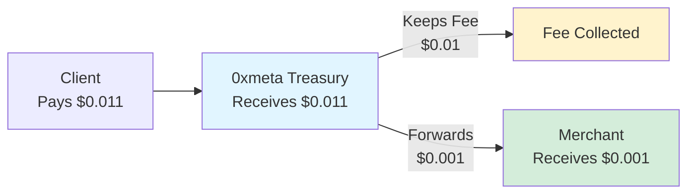

## Overview

0xmeta uses a **flat $0.01 USDC fee** per settlement with **automatic collection** via treasury-first architecture. No setup required, no merchant USDC approvals, zero surprises.

<Check>
**Verification is FREE** - only successful settlements incur the $0.01 fee.
</Check>

---

## Fee Structure

| Service | Cost | Notes |
|---------|------|-------|
| **Payment Verification** | FREE | Unlimited verifications |
| **Settlement Execution** | **$0.01 USDC** | Per successful settlement |
| **Failed Settlements** | $0 | No charge if settlement fails |

### Example Pricing

<CodeGroup>

```typescript $0.001 Resource
// Client pays: $0.011 USDC total
// Merchant receives: $0.001 USDC
// 0xmeta fee: $0.01 USDC

{
  "GET /weather": {
    accepts: [{
      price: "$0.011",  // Total: merchant price + fee
    }]
  }
}
```

```typescript $0.10 Resource
// Client pays: $0.11 USDC total
// Merchant receives: $0.10 USDC
// 0xmeta fee: $0.01 USDC

{
  "GET /premium-data": {
    accepts: [{
      price: "$0.11",  // Total: $0.10 + $0.01 fee
    }]
  }
}
```

```typescript $1 Resource
// Client pays: $1.01 USDC total
// Merchant receives: $1.00 USDC
// 0xmeta fee: $0.01 USDC

{
  "GET /analysis": {
    accepts: [{
      price: "$1.01",  // Total: $1.00 + $0.01 fee
    }]
  }
}
```

</CodeGroup>

---

## How Fee Collection Works

### Treasury-First Architecture

0xmeta collects fees **automatically** through treasury-first payment flow:



**Flow:**
1. Client authorizes payment to **0xmeta treasury** ($0.011 total)
2. Treasury receives full amount
3. Treasury **keeps fee** ($0.01 USDC)
4. Treasury **forwards payment** to merchant ($0.001 USDC)

<Info>
**No merchant setup required!** Fee collection is automatic. Merchants receive payments with **zero gas costs**.
</Info>

---

## Comparison: 0xmeta vs Traditional

| Feature | 0xmeta | Stripe | PayPal | Crypto Direct |
|---------|--------|--------|--------|---------------|
| **Base Fee** | $0.01 flat | 2.9% + $0.30 | 3.49% + $0.49 | Gas fees |
| **Setup** | None | KYC required | Business account | Wallet setup |
| **Settlement Time** | 30-60 seconds | 2-7 days | 1-3 days | Minutes |
| **Merchant Setup** | None | Complex | Moderate | Manual |
| **Gas Costs** | $0 (paid by treasury) | N/A | N/A | ~$1-5 |

### Cost Examples

| Transaction | 0xmeta | Stripe | PayPal | Difference |
|-------------|--------|--------|--------|-----------|
| $0.10 | **$0.01** | $0.31 | $0.50 | 96.7% savings |
| $1.00 | **$0.01** | $0.33 | $0.53 | 97.0% savings |
| $10.00 | **$0.01** | $0.59 | $0.84 | 98.3% savings |
| $100.00 | **$0.01** | $3.20 | $3.98 | 99.7% savings |

<Check>
**For micropayments (<$1), 0xmeta is 96-99% cheaper than traditional processors.**
</Check>

---

## Pricing Details

### What's Included

✅ **Verification (FREE)**
- EIP-3009 signature validation
- Amount verification
- Token verification
- Address validation
- Unlimited verifications

✅ **Settlement ($0.01)**
- On-chain settlement execution
- Automatic fee collection
- Merchant payment forwarding
- Gas fees paid by treasury
- Settlement status tracking

### What You Pay

<Steps>
  <Step title="Set Your Price">
    Decide how much you want to charge customers
    
    Example: $0.001 for weather data
  </Step>
  
  <Step title="Add 0xmeta Fee">
    Add $0.01 to your price
    
    Total: $0.001 + $0.01 = $0.011
  </Step>
  
  <Step title="Configure Middleware">
    ```typescript
    {
      "GET /weather": {
        accepts: [{
          price: "$0.011",  // Your price + fee
        }]
      }
    }
    ```
  </Step>
  
  <Step title="Receive Payment">
    You receive your portion ($0.001)
    
    0xmeta keeps fee ($0.01)
  </Step>
</Steps>

---

## Fee Collection Process

### Technical Flow

```typescript
// 1. Client Authorization
const authorization = {
  from: clientAddress,
  to: treasuryAddress,      // 0xmeta treasury
  value: "11000",           // $0.011 (1000 wei merchant + 10000 wei fee)
  token: USDC_ADDRESS
};

// 2. Settlement Execution
// Step 1: Client → Treasury
await transferWithAuthorization({
  from: clientAddress,
  to: treasuryAddress,
  value: 11000  // Full amount
});
// Treasury balance: +11000 wei ($0.011)

// Step 2: Treasury → Merchant (automatic)
await transfer({
  from: treasuryAddress,
  to: merchantAddress,
  value: 1000  // Merchant portion
});
// Merchant balance: +1000 wei ($0.001)
// Treasury balance: +10000 wei ($0.01) - fee kept
```

### Settlement Response

```json
{
  "settlement_id": "stl_xyz",
  "status": "settled",
  "details": {
    "client_payment": "11000",        // What client paid
    "merchant_amount": "1000",        // What you received
    "facilitator_fee": "10000",       // 0xmeta fee
    "merchant_forward_tx": "0x...",   // Forwarding transaction
    "merchant_forwarded": true        // ✅ Payment delivered
  }
}
```

---

## Why This Pricing Model?

### Flat Fee Advantages

<AccordionGroup>
  <Accordion title="Predictable Costs">
    **Always $0.01 per settlement**, regardless of amount:
    - $0.10 transaction → $0.01 fee (10%)
    - $1.00 transaction → $0.01 fee (1%)
    - $10.00 transaction → $0.01 fee (0.1%)
    
    Perfect for **micropayments** where percentage fees don't make sense.
  </Accordion>

  <Accordion title="No Hidden Fees">
    **What you see is what you pay:**
    - No monthly fees
    - No setup fees
    - No minimum volume
    - No percentage fees
    - No gas fees (paid by treasury)
    - No withdrawal fees
  </Accordion>

  <Accordion title="Simple Math">
    **Easy to calculate:**
    ```
    Client pays = Your price + $0.01
    You receive = Your price
    0xmeta receives = $0.01
    ```
    
    No complex percentage calculations.
  </Accordion>

  <Accordion title="Microtransaction Optimized">
    **Designed for small payments:**
    
    Traditional processors charge 2.9% + $0.30:
    - $0.10 item → $0.30 fee (300% markup!)
    - $1.00 item → $0.33 fee (33% markup)
    
    0xmeta charges $0.01:
    - $0.10 item → $0.01 fee (10% markup)
    - $1.00 item → $0.01 fee (1% markup)
  </Accordion>
</AccordionGroup>

---

## Merchant Economics

### Calculate Your Net Revenue

```typescript
// Example: Weather API
const yourPrice = 0.001;      // $0.001 per request
const facilitatorFee = 0.01;  // $0.01 per settlement
const clientPays = 0.011;     // $0.011 total

// At 1000 requests/day:
const dailyRevenue = yourPrice * 1000;         // $1.00
const dailyFees = facilitatorFee * 1000;       // $10.00
const netRevenue = dailyRevenue - dailyFees;   // -$9.00 ❌

// You need ~10,000 req/day to be profitable with $0.001 pricing
```

<Warning>
**Important:** For very low-priced resources (<$0.01), you need significant volume to be profitable. Consider bundling or higher pricing.
</Warning>

### Recommended Pricing Strategies

<CardGroup cols={2}>
  <Card title="Micropayments" icon="coins">
    **$0.01 - $0.10**
    
    Good for:
    - API calls
    - Data queries
    - Simple computations
    
    Break-even: ~100-1000 requests
  </Card>
  
  <Card title="Standard Resources" icon="file">
    **$0.10 - $1.00**
    
    Good for:
    - Analysis reports
    - Generated content
    - Premium features
    
    Break-even: 10-100 requests
  </Card>
  
  <Card title="Premium Content" icon="star">
    **$1.00 - $10.00**
    
    Good for:
    - Research reports
    - AI-generated art
    - Complex computations
    
    Fee impact: <1-10%
  </Card>
  
  <Card title="High-Value Services" icon="gem">
    **$10.00+**
    
    Good for:
    - Enterprise features
    - Bulk data access
    - Subscription equivalents
    
    Fee impact: <0.1%
  </Card>
</CardGroup>

---

## Volume Pricing

### Custom Rates for High Volume

If you process **10,000+ settlements per month**, contact us for custom pricing:

**Email:** sales@0xmeta.ai

**Volume tiers:**
- 10K-100K settlements/month
- 100K-1M settlements/month
- 1M+ settlements/month

<Info>
We offer discounted rates for high-volume merchants. Minimum $0.001 per settlement for enterprise customers.
</Info>

---

## Billing & Payments

### How It Works

<Steps>
  <Step title="No Invoices">
    Fees are collected automatically during settlement. No invoices, no billing cycles.
  </Step>
  
  <Step title="Real-Time Collection">
    Fee is deducted from each settlement as it happens. No delayed billing.
  </Step>
  
  <Step title="Transparent Tracking">
    Settlement responses show exact fee amounts:
    
    ```json
    {
      "facilitator_fee": "10000",  // $0.01 in wei
      "merchant_amount": "1000"    // What you received
    }
    ```
  </Step>
  
  <Step title="No Credit Risk">
    Since fees are collected upfront, there's no payment terms or credit risk.
  </Step>
</Steps>

---

## Fee Transparency

### Settlement Breakdown

Every settlement response includes complete fee breakdown:

```json
{
  "settlement_id": "stl_abc123",
  "status": "settled",
  "client_payment": "11000",       // $0.011 USDC (6 decimals)
  "merchant_amount": "1000",       // $0.001 USDC
  "facilitator_fee": "10000",      // $0.01 USDC
  "merchant_forward_tx": "0x...",
  "fee_percentage": "90.9%",       // Of total payment
  "merchant_percentage": "9.1%"    // Of total payment
}
```

### On-Chain Verification

All transactions are verifiable on-chain:

**Settlement Transaction:**
```
https://sepolia.basescan.org/tx/{settlement_tx_hash}
```

**Merchant Forward:**
```
https://sepolia.basescan.org/tx/{merchant_forward_tx}
```

---

## FAQ

<AccordionGroup>
  <Accordion title="Why $0.01 instead of percentage?">
    **Flat fees work better for micropayments:**
    - 2.9% of $0.10 = $0.003 (too low to be sustainable)
    - Plus fixed $0.30 = totally uneconomical
    
    $0.01 is the minimum viable fee for on-chain operations while keeping micropayments feasible.
  </Accordion>

  <Accordion title="Can I negotiate lower fees?">
    **Yes, for high volume:**
    - 10K+ settlements/month: Custom pricing available
    - 100K+ settlements/month: Significant discounts
    - Enterprise contracts: Contact sales@0xmeta.ai
  </Accordion>

  <Accordion title="Are there any hidden fees?">
    **No:**
    - No monthly fees
    - No setup fees
    - No gas fees (treasury pays)
    - No withdrawal fees
    - Just $0.01 per successful settlement
  </Accordion>

  <Accordion title="What if settlement fails?">
    **You pay $0.00:**
    - Verification is always free
    - Only successful settlements incur the $0.01 fee
    - Failed settlements cost nothing
  </Accordion>

  <Accordion title="How do I track my fees?">
    **Settlement responses include full breakdown:**
    ```json
    {
      "facilitator_fee": "10000",
      "merchant_amount": "1000"
    }
    ```
    
    You can also verify on-chain via block explorers.
  </Accordion>
</AccordionGroup>

---

## Next Steps

<CardGroup cols={2}>
  <Card title="Quick Start" icon="rocket" href="/quickstart">
    Get started in 5 minutes
  </Card>
  
  <Card title="Treasury-First Guide" icon="building-columns" href="/treasury-first">
    Understand the architecture
  </Card>
  
  <Card title="x402 Integration" icon="plug" href="/x402-integration">
    Complete integration guide
  </Card>
  
  <Card title="API Reference" icon="book" href="/api-reference/introduction">
    Explore endpoints
  </Card>
</CardGroup>

<Check>
**Simple, transparent, automatic** - $0.01 per settlement, collected during payment flow. No setup required.
</Check>