## Overview

0xmeta uses a **flat $0.01 USDC fee** per settlement with **pre-settlement collection** via standard ERC-20 approval. No setup fees, no merchant accounts, zero surprises.

**Verification is FREE** - only successful settlements incur the $0.01 fee, collected BEFORE the settlement executes.

---

## Fee Structure

| Service | Cost | Timing | Notes |
|---------|------|--------|-------|
| **Payment Verification** | FREE | Immediate | Unlimited verifications |
| **Settlement Execution** | **$0.01 USDC** | Pre-settlement | Fee collected BEFORE executing customer payment |
| **Failed Fee Collection** | $0 | Pre-settlement | Settlement blocked, customer not charged |

### Pre-Settlement Fee Collection Flow

```
1. Customer authorizes $0.02 to merchant
2. Facilitator collects $0.01 from merchant (PRE-SETTLEMENT)
3. IF fee collection succeeds → Execute customer → merchant ($0.02)
4. IF fee collection fails → Block settlement, customer not charged
```

**Critical:** Fee is collected FIRST. No fee = no settlement.

### Example Pricing

```typescript
// $0.01 Resource
// Merchant wants: $0.01
// Add facilitator fee: $0.01
// Customer pays: $0.02

{
  "GET /data": {
    accepts: [{
      price: "$0.02", // $0.01 resource + $0.01 fee
    }]
  }
}

// Flow:
// 1. Facilitator collects $0.01 from merchant (PRE-SETTLEMENT)
// 2. Customer → Merchant ($0.02, direct)
// Net: Merchant receives $0.01
```

```typescript
// $0.10 Resource
// Merchant wants: $0.10
// Add facilitator fee: $0.01
// Customer pays: $0.11

{
  "GET /premium-data": {
    accepts: [{
      price: "$0.11", // $0.10 resource + $0.01 fee
    }]
  }
}

// Net: Merchant receives $0.10 (after $0.01 fee)
```

```typescript
// $1 Resource
// Merchant wants: $1.00
// Add facilitator fee: $0.01
// Customer pays: $1.01

{
  "GET /analysis": {
    accepts: [{
      price: "$1.01", // $1.00 resource + $0.01 fee
    }]
  }
}

// Net: Merchant receives $1.00 (after $0.01 fee)
```

---

## How Fee Collection Works

### Pre-Settlement via transferFrom

```mermaid
flowchart LR
    Verify[Verify Authorization] --> CollectFee[Collect $0.01 Fee<br/>PRE-SETTLEMENT]
    CollectFee --> |Success| Execute[Execute Customer → Merchant $0.02]
    CollectFee --> |Fail| Block[Block Settlement<br/>Customer Not Charged]
    
    style CollectFee fill:#fff3cd
    style Execute fill:#d4edda
    style Block fill:#f8d7da
```



**Flow:**

1. **Facilitator verifies** customer authorization (FREE)
2. **Facilitator collects** $0.01 fee from merchant's pre-approved USDC balance (PRE-SETTLEMENT)
3. **IF successful:** Facilitator executes customer → merchant payment ($0.02)
4. **IF failed:** Settlement blocked, customer never charged

**Merchant Setup:** One-time USDC approval allows facilitator to collect fees via `transferFrom` before each settlement.

---

## Fee Collection Method

### Standard ERC-20 Approval Pattern with Pre-Settlement

**One-time merchant setup:**

```bash
# Approve facilitator treasury for USDC spending
node approve-facilitator.mjs

# This executes:
USDC.approve(treasury, 100 * 10^6); // 100 USDC = 10,000 settlements
```

**Per settlement (pre-settlement order):**

```solidity
// 1. Verify customer authorization (FREE)
verifySignature(authorization, signature);

// 2. Collect fee from merchant FIRST (PRE-SETTLEMENT)
USDC.transferFrom(merchant, treasury, 0.01 * 10^6); // $0.01

// 3. IF fee collection succeeded, execute customer → merchant payment
if (feeCollected) {
    executeSettlement(authorization, signature);
} else {
    revert("Settlement blocked - customer not charged");
}
```

**Key points:**

- ✅ Fee collected BEFORE settlement executes
- ✅ If fee collection fails → settlement blocked
- ✅ Customer payment only executes after fee is paid
- ✅ No facilitator custody of customer funds
- ✅ Merchant controls via approval amount
- ⚠️ Merchant pays for settlement attempts (prevents free service)

---

**For micropayments (less than $1), 0xmeta is 96-99% cheaper than traditional processors.**

**Plus:** Pre-settlement fee collection eliminates free service exploitation risk.

---

## Pricing Details

### What's Included

**Verification (FREE):**

- EIP-3009 signature validation
- Amount verification
- Token verification
- Address validation
- Unlimited verifications

**Settlement ($0.01, pre-settlement):**

- **Pre-settlement fee collection** from merchant
- On-chain settlement execution
- Gas fees paid by facilitator
- Settlement status tracking
- Webhook notifications

**Pre-Settlement Protection:**
- Customer never charged if fee collection fails
- Settlement blocked if merchant has insufficient approval
- No free service exploitation possible

### Merchant Economics

**Calculate your net revenue:**

```typescript
// Example: $0.01 resource
const resourcePrice = 0.01;  // What you want
const facilitatorFee = 0.01; // Fixed fee (PRE-SETTLEMENT)
const customerPrice = 0.02;  // What customer pays

// Per settlement:
merchantReceives = 0.02; // From customer (if settlement executes)
merchantPays = 0.01;     // To facilitator (BEFORE settlement)
netRevenue = 0.01;       // Your profit

// At 1000 successful settlements:
grossRevenue = 0.02 * 1000; // $20.00
totalFees = 0.01 * 1000;    // $10.00 (paid pre-settlement)
netRevenue = 0.01 * 1000;   // $10.00
```

**Important:** 
- Fee is collected BEFORE each settlement
- If settlement fails after fee collection, you paid $0.01 for the attempt
- Test thoroughly on testnet to minimize failed settlements

### Recommended Pricing Strategies

**$0.01 - $0.10**

- API calls
- Data queries
- Simple computations

Fee impact: 10-100%
Pre-settlement: Essential for preventing free API abuse

**$0.10 - $1.00**

- Analysis reports
- Generated content
- Premium features

Fee impact: 1-10%
Pre-settlement: Good protection against exploitation

**$1.00 - $10.00**

- Research reports
- AI-generated media
- Complex computations

Fee impact: 0.1-1%
Pre-settlement: Minimal overhead, strong protection

**$10.00+**

- Enterprise features
- Bulk data access
- Subscription equivalents

Fee impact: less than 0.1%
Pre-settlement: Negligible overhead, excellent protection

---

## Approval Requirements

### How Much to Approve

**Calculation:**

```
Approval Amount = Expected Settlements × $0.01
```

**Examples:**

- 100 USDC = 10,000 settlements
- 500 USDC = 50,000 settlements
- 1000 USDC = 100,000 settlements

**Best practice:** Approve 100-1000 USDC (avoid infinite approval)

**Pre-settlement consideration:** Ensure you have sufficient USDC balance, as fees are collected before settlements execute.

### Managing Approval

**Check allowance:**

```bash
node check-allowance.mjs

# Output:
# Settlements Remaining: 9,550
# Note: Fee collected pre-settlement
```

**Top up allowance:**

```bash
node approve-facilitator.mjs
```

**Revoke access:**

```bash
APPROVAL_AMOUNT=0 node approve-facilitator.mjs

# Effect: All settlements blocked at pre-settlement fee collection
```

---

## Pre-Settlement Fee Collection Scenarios

### Scenario 1: Normal Operation

```
1. Customer authorizes $0.02 to merchant
2. Facilitator collects $0.01 from merchant ✅
3. Facilitator executes customer → merchant $0.02 ✅
4. Merchant net: +$0.01 ✅
```

### Scenario 2: Insufficient Allowance

```
1. Customer authorizes $0.02 to merchant
2. Facilitator attempts fee collection ❌ (no approval)
3. Settlement BLOCKED 🚫
4. Customer NOT charged ✅
5. Merchant NOT charged ✅
```

### Scenario 3: Insufficient USDC Balance

```
1. Customer authorizes $0.02 to merchant
2. Facilitator attempts fee collection ❌ (no balance)
3. Settlement BLOCKED 🚫
4. Customer NOT charged ✅
5. Merchant NOT charged ✅
```

### Scenario 4: Fee Succeeds, Settlement Fails

```
1. Customer authorizes $0.02 to merchant
2. Facilitator collects $0.01 from merchant ✅
3. Facilitator attempts settlement ❌ (expired auth, etc.)
4. Merchant paid: -$0.01 (for the attempt)
5. Customer NOT charged ✅
```

**Why scenario 4 is fair:** Merchant received verification and settlement attempt services worth $0.01. Pre-settlement prevents free service exploitation.

---

## Volume Pricing

### Custom Rates for High Volume

If you process **10,000+ settlements per month**, contact us for custom pricing:

**Email:** sales@0xmeta.ai

**Volume tiers:**

- 10K-100K settlements/month
- 100K-1M settlements/month
- 1M+ settlements/month

We offer discounted rates for high-volume merchants. Minimum $0.001 per settlement for enterprise customers.

**Note:** All volume pricing uses pre-settlement fee collection for consistency and protection.

---

## Fee Transparency

### On-Chain Verification

Every fee collection is a standard blockchain transaction:

```bash
# View pre-settlement fee collection transaction
https://basescan.org/tx/{fee_tx_hash}

# View settlement transaction (executed AFTER fee)
https://basescan.org/tx/{settlement_tx_hash}

# Verify timing: fee_tx timestamp < settlement_tx timestamp
```

### Settlement Response

Every settlement response includes complete fee breakdown:

```json
{
  "success": true,
  "details": {
    "settlement_id": "stl_abc123",
    "fee_amount_wei": 10000, // $0.01 fee
    "fee_tx_hash": "0x...",
    "fee_collection_status": "collected",
    "fee_collection_timestamp": "2025-01-29T10:15:00Z",
    "settled_amount": "20000", // $0.02 customer payment
    "settlement_tx_hash": "0x...",
    "settlement_timestamp": "2025-01-29T10:15:45Z",
    "merchant_received": 20000,
    "description": "$0.01 fee collected pre-settlement, then $0.02 customer payment executed"
  }
}
```

**Verify pre-settlement:** `fee_collection_timestamp` is before `settlement_timestamp`.

---

## FAQ

<AccordionGroup>

<Accordion title="Why flat fees instead of percentage-based?">
Flat fees work better for micropayments:

- 2.9% of $0.10 = $0.003 (unsustainable)
- Plus fixed $0.30 = totally uneconomical for small payments

$0.01 is the minimum viable fee for on-chain operations while keeping micropayments feasible.

**Pre-settlement:** Guarantees we get paid for service, enabling sustainable flat-rate pricing.
</Accordion>

<Accordion title="Who pays the facilitator fee?">
Merchant pays the fee via pre-settlement collection.

**Why:** x402 requires customers pay merchants directly (trust-minimization). We can't split customer payments.

**Solution:** Merchant pays fee BEFORE settlement via pre-approved transferFrom. Add fee to your prices.

**Customer pays:** $0.02
**You receive:** $0.02 (from customer)
**You pay:** $0.01 (to facilitator, pre-settlement)
**Net:** $0.01
</Accordion>

<Accordion title="Are there volume discounts?">
Yes, for high volume:

- 10K+ settlements/month: Custom pricing
- 100K+ settlements/month: Significant discounts
- Enterprise contracts: sales@0xmeta.ai

**All tiers:** Pre-settlement fee collection for protection and consistency.
</Accordion>

<Accordion title="Are there any hidden fees?">
No:

- No monthly fees
- No setup fees
- No gas fees (facilitator pays)
- No withdrawal fees
- No percentage fees

Just $0.01 per settlement, collected pre-settlement.
</Accordion>

<Accordion title="What if my settlement fails after fee collection?">
You paid $0.01 for the settlement attempt.

**Services rendered:**
- Customer authorization verification
- Fee collection transaction (gas paid)
- Settlement attempt (gas estimation, RPC calls)
- Error handling and status updates

**Why pre-settlement prevents exploitation:** Without collecting fee first, merchants could intentionally cause settlement failures to get free verification service.

**Mitigation:** Test thoroughly on Sepolia testnet first.
</Accordion>

<Accordion title="How can I track my fees?">
Options:

1. **Settlement responses:** Include full fee breakdown with timestamps
2. **On-chain:** View transactions on BaseScan, verify pre-settlement timing
3. **Monitoring script:** `check-allowance.mjs` shows remaining settlements
</Accordion>

<Accordion title="What's the benefit of pre-settlement fee collection?">
**For you (merchant):**
- Prevents customer charges when you have insufficient fees
- Transparent fee structure
- Predictable costs

**For customers:**
- Never charged if merchant can't pay fee
- Protected from failed settlement attempts

**For facilitator:**
- Guaranteed payment for service
- No free service exploitation
- Sustainable business model

**Trade-off:** You pay $0.01 even if settlement fails after fee collection, but this prevents free service abuse.
</Accordion>

</AccordionGroup>

---

## Next Steps

<CardGroup cols={2}>

<Card title="Set Up Merchant Approval" icon="check" href="/guides/merchant-setup">
Configure USDC approval for pre-settlement fee collection
</Card>

<Card title="Understand Fee Collection" icon="dollar-sign" href="/guides/fee-collection">
Learn how pre-settlement fees work
</Card>

<Card title="Complete Integration Guide" icon="rocket" href="/integration">
Build your first payment flow
</Card>

<Card title="FAQs" icon="question" href="/faq">
Common questions about pre-settlement
</Card>

</CardGroup>

---

**Simple, transparent, pre-settlement** - $0.01 per settlement, collected from merchant's pre-approved USDC balance BEFORE executing the customer payment. No custody, fully auditable, economically sustainable.