## 🚀 Start Building Immediately

0xmeta.ai requires **zero setup**. No account creation, no API keys, no complicated onboarding.

Just start making requests to facilitate x402 payments on Base network!

<Note>
  **Truly permissionless**: Verify and settle x402 payments without any
  authentication. Our API is as open as the blockchain itself.
</Note>

---

## Understanding the Flow

0xmeta facilitates **EIP-3009 transferWithAuthorization** payments - a gasless payment method where users sign authorizations instead of sending transactions.

```mermaid
sequenceDiagram
    participant User
    participant Merchant
    participant 0xmeta
    participant Provider
    participant Blockchain

    User->>User: Sign EIP-3009 Authorization<br/>(NO gas required)
    User->>Merchant: Send authorization + signature

    Merchant->>0xmeta: POST /v1/verify<br/>(Validate signature)
    0xmeta-->>Merchant: ✅ Verified

    Merchant->>0xmeta: POST /v1/settle<br/>(Execute payment)
    0xmeta->>0xmeta: Collect $0.001 fee<br/>(via USDC allowance)
    0xmeta->>Provider: Execute transferWithAuthorization
    Provider->>Blockchain: Submit transaction
    Blockchain-->>Provider: ✅ Confirmed
    Provider-->>0xmeta: Settlement complete
    0xmeta-->>Merchant: ✅ Payment settled

    Note over Merchant: Merchant receives funds
```



---

## Step 1: User Creates Authorization

Your user signs an EIP-3009 authorization (client-side, no gas):

```javascript
// Client-side: User signs authorization
const authorization = {
  from: userAddress,
  to: merchantAddress,
  value: "10000", // 0.01 USDC (6 decimals)
  validAfter: "0",
  validBefore: String(Math.floor(Date.now() / 1000) + 86400), // 24h validity
  nonce: generateRandomNonce(), // Unique per payment
};

// User signs with MetaMask (NO gas required)
const signature = await ethereum.request({
  method: "eth_signTypedData_v4",
  params: [userAddress, JSON.stringify(typedData)],
});
```

<Tip>
  See our [merchant demo](https://github.com/0xmetaHQ/merchant_demo) for
  complete client-side implementation.
</Tip>

---

## Step 2: Verify the Authorization

Validate that the authorization is properly signed:

```bash
curl -X POST https://facilitator.0xmeta.ai/v1/verify \
  -H "Content-Type: application/json" \
  -d '{
    "transaction_hash": "NONCE_HASH",
    "chain": "base-sepolia",
    "seller_address": "0xYourMerchantAddress",
    "expected_amount": "10000",
    "expected_token": "0x036CbD53842c5426634e7929541eC2318f3dCF7e",
    "metadata": {
      "source": "your_app",
      "paymentPayload": {
        "x402Version": 1,
        "scheme": "exact",
        "network": "base-sepolia",
        "payload": {
          "authorization": { /* ... */ },
          "signature": "0x..."
        }
      }
    }
  }'
```

### Response

```json
{
  "verification_id": "vrf_abc123xyz",
  "status": "verified",
  "transaction_hash": "0x...",
  "chain": "base-sepolia",
  "verified_amount": "10000",
  "verified_token": "0x036CbD53842c5426634e7929541eC2318f3dCF7e",
  "seller_address": "0xYourMerchantAddress",
  "verified_at": "2025-11-24T10:30:00Z"
}
```

<Check>**Verification is FREE** - no fees charged</Check>

---

## Step 3: Settle the Payment

Execute the on-chain settlement via Provider:

```bash
curl -X POST https://facilitator.0xmeta.ai/v1/settle \
  -H "Content-Type: application/json" \
  -d '{
    "verification_id": "vrf_abc123xyz",
    "destination_address": "0xYourMerchantAddress"
  }'
```

### Response

```json
{
  "settlement_id": "stl_def456uvw",
  "verification_id": "vrf_abc123xyz",
  "status": "pending",
  "transaction_hash": null,
  "destination_address": "0xYourMerchantAddress",
  "created_at": "2025-11-24T10:31:00Z"
}
```

<Info>
  **Settlement Fee**: $0.001 flat fee (0.001 USDC) collected automatically via
  USDC allowance. You must approve 0xmeta to spend USDC before settlements can
  process.
</Info>

---

## Step 4: Check Settlement Status

Monitor settlement progress:

```bash
curl https://facilitator.0xmeta.ai/v1/settlements/stl_def456uvw
```

### Response

```json
{
  "id": "stl_def456uvw",
  "status": "settled",
  "transaction_hash": "0xabcdef123...",
  "settled_at": "2025-11-24T10:32:15Z",
  "details": {
    "verification_id": "vrf_abc123xyz",
    "destination_address": "0xYourMerchantAddress",
    "settled_amount": "10000",
    "fee_collection_status": "success"
  }
}
```

<Check>
  Settlements typically complete in **30-60 seconds** on Base network
</Check>

---

## One-Time Setup: Approve Fee Collection

Before your first settlement, approve 0xmeta to collect fees:

```javascript
// One-time setup: Approve USDC spending
const USDC_ADDRESS = "0x036CbD53842c5426634e7929541eC2318f3dCF7e"; // Base Sepolia
const TREASURY_ADDRESS = "0xa92560dcaf2fb556dfee4d2599f021a511b94aae";

const usdcContract = new ethers.Contract(USDC_ADDRESS, USDCAbi, signer);

// Approve $10 worth of fees (~10,000 settlements)
await usdcContract.approve(TREASURY_ADDRESS, ethers.parseUnits("10", 6));
```

<Warning>
  **Important:** Merchants must approve USDC spending before settlements.
  Without approval, settlements will fail at the fee collection step.
</Warning>

---

## Settlement Flow Diagram

```mermaid
sequenceDiagram
    participant Merchant
    participant 0xmeta
    participant Treasury
    participant Provider
    participant Blockchain

    Merchant->>0xmeta: POST /v1/settle
    Note over 0xmeta: Status: pending

    0xmeta->>Treasury: transferFrom(merchant, $0.001)

    alt Fee Collection Success
        Treasury-->>0xmeta: ✅ Fee collected
        0xmeta->>Provider: Execute transferWithAuthorization
        Provider->>Blockchain: Submit transaction
        Blockchain-->>Provider: ✅ Confirmed
        Provider-->>0xmeta: Settlement complete
        Note over 0xmeta: Status: settled
        0xmeta-->>Merchant: ✅ Settlement successful
    else Insufficient Allowance
        Treasury-->>0xmeta: ❌ Insufficient allowance
        Note over 0xmeta: Status: failed<br/>fee_collection_status: failed_insufficient_allowance
        0xmeta-->>Merchant: ❌ Approval required
    end
```



---

## No Authentication Required

<CardGroup cols={2}>
  <Card title="No Signup" icon="user-slash">
    Start using the API immediately without creating an account
  </Card>

{" "}

<Card title="No API Keys" icon="key-slash">
  All endpoints are publicly accessible
</Card>

{" "}

<Card title="No Rate Limits" icon="infinity">
  Use as much as you need (reasonable use)
</Card>

  <Card title="No Lock-In" icon="unlock">
    No accounts means no platform restrictions
  </Card>
</CardGroup>

<Note>
  **Why no authentication?** Payment facilitation should be as permissionless as
  the blockchain itself. Anyone should be able to accept x402 payments without
  barriers.
</Note>

---

## Supported Networks

Currently supporting Base networks:

| Network      | Chain ID | USDC Address                                 | Status        |
| ------------ | -------- | -------------------------------------------- | ------------- |
| Base Mainnet | 8453     | `0x833589fCD6eDb6E08f4c7C32D4f71b54bdA02913` | ✅ Production |
| Base Sepolia | 84532    | `0x036CbD53842c5426634e7929541eC2318f3dCF7e` | ✅ Testing    |

---

## Example: Complete Integration

```typescript
// 1. Verify EIP-3009 authorization
const verifyResponse = await fetch("https://facilitator.0xmeta.ai/v1/verify", {
  method: "POST",
  headers: { "Content-Type": "application/json" },
  body: JSON.stringify({
    transaction_hash: authorization.nonce,
    chain: "base-sepolia",
    seller_address: merchantAddress,
    expected_amount: "10000",
    expected_token: "0x036CbD53842c5426634e7929541eC2318f3dCF7e",
    metadata: {
      source: "my_app",
      paymentPayload: {
        x402Version: 1,
        scheme: "exact",
        network: "base-sepolia",
        payload: { authorization, signature },
      },
    },
  }),
});

const { verification_id } = await verifyResponse.json();

// 2. Settle payment
const settleResponse = await fetch("https://facilitator.0xmeta.ai/v1/settle", {
  method: "POST",
  headers: { "Content-Type": "application/json" },
  body: JSON.stringify({
    verification_id,
    destination_address: merchantAddress,
  }),
});

const settlement = await settleResponse.json();

// 3. Check status
const statusResponse = await fetch(
  `https://facilitator.0xmeta.ai/v1/settlements/${settlement.settlement_id}`
);

const status = await statusResponse.json();
console.log("Settlement status:", status.status);
```

---

## What's Next?

<CardGroup cols={2}>
  <Card title="API Reference" icon="book" href="/api-reference/introduction">
    Complete API documentation
  </Card>

{" "}

<Card title="Merchant Setup" icon="store" href="/guides/getting-started">
  Set up USDC approval for fees
</Card>

{" "}

<Card title="Pricing Details" icon="dollar-sign" href="/pricing">
  Learn about the $0.001 flat fee
</Card>

  <Card title="Best Practices" icon="lightbulb" href="/guides/best-practices">
    Production tips and tricks
  </Card>
</CardGroup>

---

## Need Help?

<CardGroup cols={2}>
  <Card title="View Examples" icon="code" href="https://github.com/0xmetaHQ/examples">
    Check out code examples
  </Card>

{" "}

<Card
  title="Merchant Demo"
  icon="store"
  href="https://merchant-demo-six.vercel.app/"
>
  Complete working example
</Card>

{" "}

<Card title="x402 Protocol" icon="link" href="https://www.x402.org">
  Learn about x402 payments
</Card>

  <Card title="Contact Support" icon="envelope" href="mailto:support@0xmeta.ai">
    Email us your questions
  </Card>
</CardGroup>

<Check>
  **You're ready!** No signup needed - just start building with 0xmeta.ai today.
</Check>
