## Overview 

0xmeta supports both **x402 v1** (legacy) and **x402 v2** (current) protocols with **pre-settlement fee collection** to maintain trust-minimization and prevent free service exploitation.

<Note>
**Trust-Minimized with Pre-Settlement:** Customer payments go DIRECTLY to your address. The $0.01 fee is collected from your pre-approved USDC balance BEFORE the settlement executes. If fee collection fails, settlement is blocked and customer is never charged.
</Note>

---

## Quick Start

### Prerequisites

1. **Merchant wallet** with USDC on Base
2. **Approve facilitator** for USDC spending (one-time setup)
3. **x402 express middleware** installed

### Three-Step Setup

<Steps>
  <Step title="Approve Facilitator">
    ```bash
    # One-time setup
    EVM_PRIVATE_KEY=0x... node approve-facilitator.mjs
    ```
    
    Approves facilitator treasury to collect $0.01 fees from your USDC balance BEFORE each settlement.
  </Step>
  
  <Step title="Configure Server">
    ```typescript
    // Use YOUR address in payTo (not treasury)
    {
      "GET /resource": {
        accepts: [{
          price: "$0.02",
          payTo: "0xYOUR_MERCHANT_ADDRESS" // ← Your address
        }]
      }
    }
    ```
  </Step>
  
  <Step title="Start Accepting Payments">
    ```bash
    npm start
    ```
    
    Facilitator collects fee FIRST, then executes customer → merchant payment.
  </Step>
</Steps>

---

## Payment Flow

```mermaid
sequenceDiagram
    participant Client
    participant Merchant
    participant Facilitator

    Note over Merchant: ONE-TIME SETUP
    Merchant->>Facilitator: approve(treasury, 100 USDC)
    
    Client->>Merchant: 1. GET /resource
    Merchant-->>Client: 2. 402 Payment Required<br/>payTo: merchant_address
    
    Client->>Client: 3. Sign authorization<br/>to: merchant_address
    
    Client->>Facilitator: 4. Verify + Settle
    
    rect rgb(255, 245, 230)
        Note over Facilitator: PRE-SETTLEMENT Fee Collection
        Facilitator->>Facilitator: 5. Collect $0.01 fee<br/>from merchant (FIRST)
    end
    
    rect rgb(230, 245, 255)
        Note over Facilitator,Merchant: Settlement (AFTER Fee)
        Facilitator->>Merchant: 6. Execute settlement<br/>client → merchant
    end
    
    Merchant-->>Client: 7. 200 OK + Resource
```



**Key Points:**
- ✅ Facilitator collects $0.01 fee from merchant FIRST (pre-settlement)
- ✅ **Then** executes customer → merchant payment ($0.02)
- ✅ Client pays DIRECTLY to merchant (no facilitator custody)
- ✅ Merchant receives 100% of customer payment
- ⚠️ **If fee collection fails, settlement is blocked** (customer not charged)

---

## x402 v2 Integration (Recommended)

### Installation

```bash
npm install @x402/express @x402/evm @x402/core
```

### Complete Server Example

<CodeGroup>

```typescript server.ts
import { config } from "dotenv";
import express from "express";
import { paymentMiddleware, x402ResourceServer } from "@x402/express";
import { ExactEvmScheme } from "@x402/evm/exact/server";
import { HTTPFacilitatorClient } from "@x402/core/server";

config();

const evmAddress = process.env.EVM_ADDRESS as `0x${string}`;

if (!evmAddress) {
  console.error("Missing EVM_ADDRESS environment variable");
  process.exit(1);
}

const facilitatorUrl = process.env.FACILITATOR_URL;
if (!facilitatorUrl) {
  console.error("❌ FACILITATOR_URL environment variable is required");
  process.exit(1);
}

const facilitatorClient = new HTTPFacilitatorClient({ url: facilitatorUrl });
const app = express();

// Apply x402 payment middleware
app.use(
  paymentMiddleware(
    {
      "GET /weather": {
        accepts: [
          {
            scheme: "exact",
            price: "$0.02",                // Your price: $0.01 resource + $0.01 fee
            network: "eip155:8453",         // Base Mainnet
            payTo: evmAddress,              // ✅ YOUR merchant address
          },
        ],
        description: "Weather data",
        mimeType: "application/json",
      },
    },
    new x402ResourceServer(facilitatorClient)
      .register("eip155:8453", new ExactEvmScheme()),
  ),
);

app.get("/weather", (req, res) => {
  res.send({
    report: {
      weather: "sunny",
      temperature: 70,
    },
  });
});

app.listen(4021, () => {
  console.log(`🚀 Server listening at http://localhost:4021`);
  console.log(`💰 Pre-settlement fee collection enabled`);
});
```

```env .env
# ✅ YOUR merchant address (receives customer payments)
EVM_ADDRESS=0xA821f428Ef8cC9f54A9915336A82220853059090

# ✅ Private key (for one-time approval setup only)
EVM_PRIVATE_KEY=0x...

# Facilitator endpoint
FACILITATOR_URL=https://facilitator.0xmeta.ai/v1
```

</CodeGroup>

---

## x402 v1 Integration (Legacy)

### Installation

```bash
npm install x402-express
```

### Complete Server Example

<CodeGroup>

```typescript server-v1.ts
import { config } from "dotenv";
import express from "express";
import { paymentMiddleware, Resource, type SolanaAddress } from "x402-express";

config(); 

const facilitatorUrl = process.env.FACILITATOR_URL as Resource;
const payTo = process.env.EVM_ADDRESS as `0x${string}` | SolanaAddress;

if (!facilitatorUrl || !payTo) {
  console.error("Missing required environment variables");
  process.exit(1);
}

const app = express();

app.use(
  paymentMiddleware(
    payTo,  // ✅ YOUR merchant address
    {
      "GET /weather": {
        price: "$0.02",          // $0.01 resource + $0.01 fee
        network: "base",         // Base Mainnet
      },
      "/premium/*": {
        // Or define atomic amounts
        price: {
          amount: "20000",       // 0.02 USDC (6 decimals)
          asset: {
            address: "0x833589fCD6eDb6E08f4c7C32D4f71b54bdA02913",
            decimals: 6,
            eip712: {
              name: "USDC",
              version: "2",
            },
          },
        },
        network: "base",
      },
    },
    {
      url: facilitatorUrl,
    },
  ),
);

app.get("/weather", (req, res) => {
  res.send({
    report: {
      weather: "sunny",
      temperature: 70,
    },
  });
});

app.get("/premium/content", (req, res) => {
  res.send({
    content: "This is premium content",
  });
});

app.listen(4021, () => {
  console.log(`Server listening at http://localhost:4021`);
  console.log(`💰 Pre-settlement fee collection enabled`);
});
```

```env .env
# ✅ YOUR merchant address
EVM_ADDRESS=0xA821f428Ef8cC9f54A9915336A82220853059090

# ✅ Private key (one-time approval setup)
EVM_PRIVATE_KEY=0x...

# Facilitator URL
FACILITATOR_URL=https://facilitator.0xmeta.ai/v1

# Network
NETWORK=base
```

</CodeGroup>

---

## Merchant Approval Setup

### Why Approval Is Required

The facilitator collects a $0.01 fee per settlement from your USDC balance via `transferFrom` **BEFORE** executing the customer payment. This requires one-time approval.

**Technical details:**
```solidity
// You approve facilitator treasury (one-time)
USDC.approve(treasury, 100 * 10^6); // 100 USDC

// Before each settlement, facilitator collects fee FIRST
USDC.transferFrom(merchant, treasury, 0.01 * 10^6); // $0.01

// Then (and only then) executes settlement
transferWithAuthorization(...);
```

### approve-facilitator.mjs

<CodeGroup>

```javascript approve-facilitator.mjs
import { ethers } from "ethers";
import dotenv from "dotenv";
dotenv.config();

const NETWORKS = {
  sepolia: {
    name: "Base Sepolia",
    rpc: "https://sepolia.base.org",
    chainId: 84532,
    usdc: "0x036CbD53842c5426634e7929541eC2318f3dCF7e",
  },
  mainnet: {
    name: "Base Mainnet",
    rpc: "https://mainnet.base.org",
    chainId: 8453,
    usdc: "0x833589fCD6eDb6E08f4c7C32D4f71b54bdA02913",
  },
};

const OXMETA_TREASURY = "0x5D791e3554D0e83f171126905Bda1640Bf6f9A8B";

const USDC_ABI = [
  "function approve(address spender, uint256 amount) external returns (bool)",
  "function allowance(address owner, address spender) external view returns (uint256)",
];

async function approveFacilitator() {
  const networkKey = process.env.NETWORK || "sepolia";
  const network = NETWORKS[networkKey];
  
  const privateKey = process.env.EVM_PRIVATE_KEY;
  if (!privateKey) {
    console.error("❌ EVM_PRIVATE_KEY required in .env");
    process.exit(1);
  }
  
  const provider = new ethers.JsonRpcProvider(network.rpc);
  const merchant = new ethers.Wallet(privateKey, provider);
  
  console.log(`\n📍 ${network.name}`);
  console.log(`   Merchant: ${merchant.address}`);
  console.log(`   Treasury: ${OXMETA_TREASURY}`);
  
  const usdc = new ethers.Contract(network.usdc, USDC_ABI, merchant);
  
  // Approve 100 USDC (10,000 settlements)
  const approvalAmount = ethers.parseUnits("100", 6);
  
  console.log(`\n💰 Approving 100 USDC for pre-settlement fee collection...`);
  console.log(`   ⚠️  Fee will be collected BEFORE each settlement`);
  
  const tx = await usdc.approve(OXMETA_TREASURY, approvalAmount);
  console.log(`   Transaction: ${tx.hash}`);
  
  await tx.wait();
  console.log(`✅ Approval successful!`);
  
  // Verify
  const allowance = await usdc.allowance(merchant.address, OXMETA_TREASURY);
  console.log(`   Allowance: ${ethers.formatUnits(allowance, 6)} USDC`);
  console.log(`   Settlements: ~${Math.floor(Number(ethers.formatUnits(allowance, 6)) / 0.01)}`);
  console.log(`\n   Note: $0.01 collected BEFORE each settlement execution`);
}

approveFacilitator().catch(console.error);
```

```bash Usage
# Approve on Base Sepolia (testnet)
NETWORK=sepolia node approve-facilitator.mjs

# Approve on Base Mainnet (production)
NETWORK=mainnet node approve-facilitator.mjs
```

</CodeGroup>

**Expected Output:**
```
📍 Base Sepolia
   Merchant: 0xA821f428Ef8cC9f54A9915336A82220853059090
   Treasury: 0x5D791e3554D0e83f171126905Bda1640Bf6f9A8B

💰 Approving 100 USDC for pre-settlement fee collection...
   ⚠️  Fee will be collected BEFORE each settlement
   Transaction: 0x123...
✅ Approval successful!
   Allowance: 100.0 USDC
   Settlements: ~10000

   Note: $0.01 collected BEFORE each settlement execution
```

---

## Monitoring Allowance

### check-allowance.mjs

<CodeGroup>

```javascript check-allowance.mjs
import { ethers } from "ethers";
import dotenv from "dotenv";
dotenv.config();

const NETWORKS = {
  sepolia: {
    name: "Base Sepolia",
    rpc: "https://sepolia.base.org",
    usdc: "0x036CbD53842c5426634e7929541eC2318f3dCF7e",
  },
  mainnet: {
    name: "Base Mainnet",
    rpc: "https://mainnet.base.org",
    usdc: "0x833589fCD6eDb6E08f4c7C32D4f71b54bdA02913",
  },
};

const OXMETA_TREASURY = "0x5D791e3554D0e83f171126905Bda1640Bf6f9A8B";

const USDC_ABI = [
  "function allowance(address owner, address spender) external view returns (uint256)",
  "function balanceOf(address account) external view returns (uint256)",
];

async function checkNetwork(networkKey, merchantAddress) {
  const network = NETWORKS[networkKey];
  const provider = new ethers.JsonRpcProvider(network.rpc);
  const usdc = new ethers.Contract(network.usdc, USDC_ABI, provider);
  
  const [allowance, balance] = await Promise.all([
    usdc.allowance(merchantAddress, OXMETA_TREASURY),
    usdc.balanceOf(merchantAddress),
  ]);
  
  const allowanceFormatted = ethers.formatUnits(allowance, 6);
  const balanceFormatted = ethers.formatUnits(balance, 6);
  const settlements = Math.floor(Number(allowanceFormatted) / 0.01);
  
  console.log(`\n📍 ${network.name}`);
  console.log(`   USDC Balance: ${balanceFormatted} USDC`);
  console.log(`   Fee Allowance: ${allowanceFormatted} USDC`);
  console.log(`   Settlements Remaining: ${settlements}`);
  console.log(`   Fee Collection: PRE-SETTLEMENT`);
  
  if (settlements < 10) {
    console.log(`   ⚠️  Low - run: NETWORK=${networkKey} node approve-facilitator.mjs`);
  } else if (settlements < 50) {
    console.log(`   ⚠️  Getting low`);
  } else {
    console.log(`   ✅ Good`);
  }
  
  // Check if balance is sufficient for fees
  if (Number(balanceFormatted) < Number(allowanceFormatted)) {
    console.log(`   ⚠️  Warning: Balance < Allowance (pre-settlement will fail)`);
  }
}

async function main() {
  const merchantAddress = process.env.EVM_ADDRESS;
  
  if (!merchantAddress) {
    console.error("❌ Set EVM_ADDRESS in .env");
    process.exit(1);
  }
  
  console.log("=".repeat(60));
  console.log("0xmeta Facilitator Pre-Settlement Fee Allowance Check");
  console.log("=".repeat(60));
  console.log(`\n👤 Merchant: ${merchantAddress}`);
  console.log(`🏦 Treasury: ${OXMETA_TREASURY}`);
  console.log(`⏰ Fee Timing: PRE-SETTLEMENT (before customer payment)`);
  
  const networkArg = process.argv[2] || "both";
  
  if (networkArg === "both") {
    await checkNetwork("sepolia", merchantAddress);
    await checkNetwork("mainnet", merchantAddress);
  } else {
    await checkNetwork(networkArg, merchantAddress);
  }
  
  console.log("\n" + "=".repeat(60));
}

main().catch(console.error);
```

```bash Usage
# Check both networks
node check-allowance.mjs

# Check specific network
node check-allowance.mjs sepolia
node check-allowance.mjs mainnet
```

</CodeGroup>

**Expected Output:**
```
============================================================
0xmeta Facilitator Pre-Settlement Fee Allowance Check
============================================================

👤 Merchant: 0xA821f428Ef8cC9f54A9915336A82220853059090
🏦 Treasury: 0x5D791e3554D0e83f171126905Bda1640Bf6f9A8B
⏰ Fee Timing: PRE-SETTLEMENT (before customer payment)

📍 Base Sepolia
   USDC Balance: 500.00 USDC
   Fee Allowance: 95.50 USDC
   Settlements Remaining: 9550
   Fee Collection: PRE-SETTLEMENT
   ✅ Good

📍 Base Mainnet
   USDC Balance: 10.00 USDC
   Fee Allowance: 100.00 USDC
   Settlements Remaining: 10000
   Fee Collection: PRE-SETTLEMENT
   ⚠️  Warning: Balance < Allowance (pre-settlement will fail)

============================================================
```

---

## Network Configuration

### Base Sepolia (Testnet)

| Resource | Value |
|----------|-------|
| **Chain ID** | `84532` |
| **CAIP-2** | `eip155:84532` |
| **USDC** | `0x036CbD53842c5426634e7929541eC2318f3dCF7e` |
| **Treasury** | `0x5D791e3554D0e83f171126905Bda1640Bf6f9A8B` |
| **RPC** | `https://sepolia.base.org` |

### Base Mainnet (Production)

| Resource | Value |
|----------|-------|
| **Chain ID** | `8453` |
| **CAIP-2** | `eip155:8453` |
| **USDC** | `0x833589fCD6eDb6E08f4c7C32D4f71b54bdA02913` |
| **Treasury** | `0x5D791e3554D0e83f171126905Bda1640Bf6f9A8B` |
| **RPC** | `https://mainnet.base.org` |

---

## Error Handling

### Insufficient Allowance (Pre-Settlement)

If merchant hasn't approved facilitator:

```json
{
  "error": {
    "code": "insufficient_allowance",
    "message": "Merchant must approve facilitator for USDC spending",
    "details": {
      "required": "10000",
      "available": "0",
      "approval_command": "node approve-facilitator.mjs",
      "timing": "pre-settlement",
      "impact": "Settlement blocked - customer not charged"
    }
  }
}
```

**Solution:**
```bash
EVM_PRIVATE_KEY=0x... node approve-facilitator.mjs
```

**Customer impact:** None - they are never charged when pre-settlement fee collection fails.

### Fee Collection Failed (Pre-Settlement)

If merchant has insufficient USDC balance:

```json
{
  "error": {
    "code": "fee_collection_failed",
    "message": "Could not collect $0.01 fee from merchant before settlement",
    "details": {
      "reason": "Insufficient USDC balance",
      "required_balance": "10000",
      "current_balance": "0",
      "timing": "pre-settlement",
      "impact": "Settlement blocked - customer not charged"
    }
  }
}
```

**Solution:** Add USDC to merchant address.

**Customer impact:** None - settlement never executes if pre-settlement fee collection fails.

### Settlement Failed (After Pre-Settlement Fee)

If settlement fails AFTER fee was collected:

```json
{
  "error": {
    "code": "settlement_failed",
    "message": "Settlement execution failed",
    "details": {
      "fee_status": "collected",
      "fee_amount": "10000",
      "fee_tx_hash": "0x...",
      "settlement_error": "Authorization expired",
      "merchant_charged": true,
      "customer_charged": false,
      "note": "Merchant paid for settlement attempt"
    }
  }
}
```

**Merchant impact:** Paid $0.01 for the settlement attempt.
**Customer impact:** Never charged.

**Why this is fair:** Merchant received verification and settlement attempt services. Pre-settlement prevents free service exploitation.

---

## Best Practices

<AccordionGroup>
  <Accordion title="Approve Reasonable Amounts">
    **Recommended:** 100-1000 USDC (10,000-100,000 settlements)
    
    **Avoid:** Infinite approval (max uint256)
    
    **Why:** Limits exposure if facilitator compromised. Pre-settlement means fees are collected before settlement, so your risk is limited to the approved amount.
  </Accordion>

  <Accordion title="Monitor Allowance Regularly">
    Set up automated checks:
    
    ```bash
    # Cron job to check daily
    0 9 * * * node check-allowance.mjs
    ```
    
    Pre-settlement means settlements fail immediately when allowance depleted - good for you and customers.
  </Accordion>

  <Accordion title="Test on Sepolia First">
    Always test on testnet before mainnet:
    
    ```bash
    # 1. Approve on Sepolia
    NETWORK=sepolia node approve-facilitator.mjs
    
    # 2. Test pre-settlement flow
    npm run test
    
    # 3. Verify fee collected BEFORE settlement
    # Check transaction timestamps on BaseScan
    
    # 4. Then approve on mainnet
    NETWORK=mainnet node approve-facilitator.mjs
    ```
  </Accordion>

  <Accordion title="Maintain USDC Balance">
    Ensure sufficient USDC for fees:
    
    - Minimum: Match your allowance
    - Recommended: 2x allowance (safety buffer)
    
    **Pre-settlement requirement:** You need actual USDC balance, not just approval. Fee is collected BEFORE settlement executes.
  </Accordion>

  <Accordion title="Monitor Failed Settlements">
    Track settlement success rate:
    
    ```javascript
    const successRate = successful_settlements / total_attempts;
    
    // If low, investigate:
    // - Expired authorizations
    // - Invalid signatures
    // - Network issues
    
    // Remember: With pre-settlement, you pay for attempts
    ```
  </Accordion>
</AccordionGroup>

---

## FAQ

<AccordionGroup>
  <Accordion title="Why do I need to approve the facilitator?">
    The facilitator collects a $0.01 fee per settlement from your USDC balance via `transferFrom` **BEFORE** executing the customer payment. This is a standard ERC-20 pattern that requires approval.
    
    **Pre-settlement means:** Fee must be collectible before settlement can execute.
  </Accordion>

  <Accordion title="Can the facilitator access all my USDC?">
    **No.** Only the approved amount is accessible. Pre-settlement doesn't change this.
    
    Approve 100 USDC → max risk is 100 USDC.
  </Accordion>

  <Accordion title="What if I revoke approval?">
    Future settlements will fail at the pre-settlement fee collection step with `insufficient_allowance` error. Customers won't be charged because settlement never executes.
  </Accordion>

  <Accordion title="Why not collect fee from customer?">
    x402 requires customer payments go directly to merchants (trust-minimization). We can't split customer payments, so merchants pay the fee separately via pre-settlement collection.
  </Accordion>

  <Accordion title="What happens if settlement fails after fee?">
    You paid $0.01 for the settlement attempt. This prevents free service exploitation.
    
    **Pre-settlement rationale:** Without collecting fee first, merchants could intentionally fail settlements for free verification service.
  </Accordion>

  <Accordion title="How does pre-settlement protect customers?">
    If your fee collection fails (insufficient allowance or balance), settlement NEVER executes. Customer is never charged.
    
    **Order:** Fee collection → Settlement execution
    
    No fee = no settlement = customer safe.
  </Accordion>

  <Accordion title="Can I see pre-settlement on-chain?">
    Yes! Every fee collection is a blockchain transaction:
    
    ```bash
    # View pre-settlement fee collection
    https://basescan.org/tx/{fee_tx_hash}
    
    # View settlement (executed after fee)
    https://basescan.org/tx/{settlement_tx_hash}
    
    # Verify timing: fee_tx before settlement_tx
    ```
  </Accordion>
</AccordionGroup>

---

## Next Steps

<CardGroup cols={2}>
  <Card title="Architecture" icon="diagram-project" href="/architecture">
    Understand pre-settlement payment flow
  </Card>
  
  <Card title="API Reference" icon="book" href="/api-reference/introduction">
    Explore endpoints
  </Card>
  
  <Card title="Pricing" icon="dollar-sign" href="/pricing">
    Pre-settlement fee structure details
  </Card>
  
  <Card title="FAQ" icon="question" href="/faq">
    Common questions about pre-settlement
  </Card>
</CardGroup>

<Check>
**You're ready!** Approve the facilitator for pre-settlement fee collection, configure your server with YOUR merchant address, and start accepting payments.

**Remember:** Fee is collected BEFORE settlement. If fee collection fails, settlement is blocked and customer is never charged. This protects customers and prevents free service exploitation.
</Check>